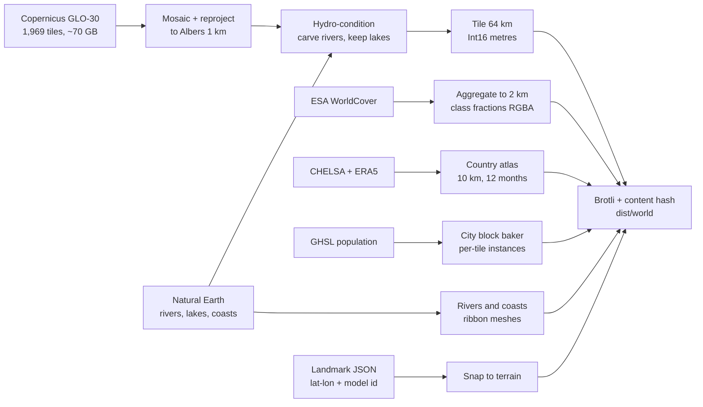
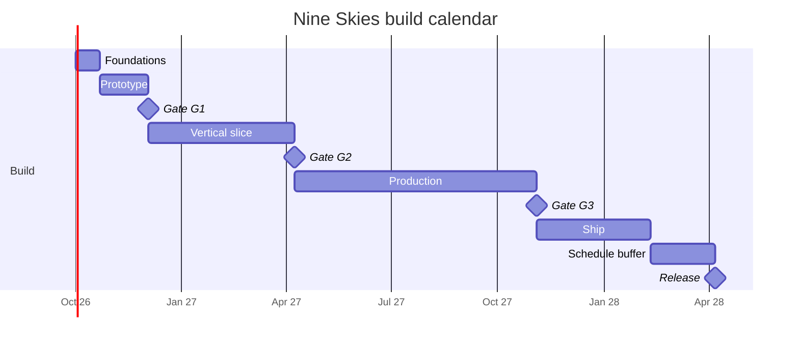
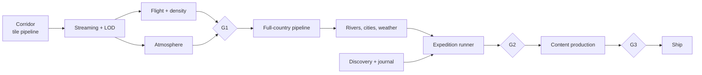

# Nine Skies — Build Plan

2026-09-20 · @Someone

Companion to *Nine Skies — Game Design Document*. The GDD says what the game is; this says how it gets built, in what order, at what cost, and what has to be true before each stage is allowed to continue. Where this plan overrides a GDD decision it says so explicitly and gives the reason.

## Progress — 23 September 2026

Phase 0 is complete and phase 1's engineering is built; G1 waits on a cohort, not on code.
This is the state only — what each item measured is in `docs/prototype-findings.md` (F1–F62)
and in the decisions table.

| Built | |
| --- | --- |
| Pipeline | Shanghai–Lhasa corridor cut, 331 tiles / 13.9 GB, digests and signatures, both corridor probes pass (F10–F12, D21–D24) — and the report now prints what the river one's pass covers: 175 cells of 4.7 M, the same verdict at every search radius including none, a chord that is 54 % of the river's length (D45, F48), and the sill between each two of its cells — five of its six reaches are dammed on the 1 km grid, the Three Gorges by 287 m (F58). Named places are one table checked against the ground, after the anchor called `tiger-leaping-gorge` turned out to be 71 km from it — and then, once moved, 1,260 m up the gorge wall, which relief could not see and a 2 km search was quietly covering for (D46, D48, F49, F50). **Stage 6 is built** (D47, F50): 90 m hero areas on a lattice that deliberately does not nest, and the seventh golden probe passes on it — at the two cells it reads, and on no path between them: every path crosses a sill 119 m over the upstream cell on the 90 m grid, and 52 m on the source it was cut from, which the report prints beside the pass (F57, F58). **Stage 3's measurement half is built too, and it needed no download** (D55, F56): the lake bullet was already true — six of eight lakes in the corridor are a single float32 value across their whole surface, Namtso 1,808 km² of it, so the flatness the Qinghai probe asks for has been there since stage 2 first ran and a recalled lake table would only move the level. The river bullet is worse than the number standing in for it: **12.64 % of the corridor has no outlet**, the middle Yangtze is sealed over 98,062 km², and the grid's own drainage tree yields a **5,335 km centreline** that passes four of five channel places within 1.5 km and finds 1,980 uphill kilometres where the seven-waypoint chord finds none. **Its first river source is fetched** (D60, D61, F59, F60): HydroSHEDS turned out to be a bespoke agreement an open-source project cannot meet, so stage 3 reads Natural Earth, whose lines sit within a cell of the grid's valleys in the mountains and decide the 214,935 km² of basins its rivers cross — and which touches 3,000 of the 3,436 basins that need a map nowhere. **Stage 3 is built and every world is cut from it** (D63, F61): each Natural Earth river over measured ground is followed down its own valley and cut until it runs downhill, the Yangtze probe's five dammed reaches are none, the grid's own river climbs 5 m where it climbed 90,841, and 0.75 % of the corridor has no outlet where 12.64 % had — all of it the basins of 50 kept lakes. The fill D62 chose for the rest is the largest thing the stage does, 387,919 cells raised by up to 542 m, and was kept with that price known. **The hero areas are carved too, as stage 6 cuts them** (D64, F63): Tiger Leaping Gorge's 1,935 m sill is gone, so the seventh probe's reach is no longer dammed on the grid it reads, and the Yangtze through the Three Gorges needed no cut. **The full country is built** (D65, F64): 1,969 tiles and 68 GB of source, a 6,721 × 4,417 grid reading −154 to 8,418 m, 7,245 tiles of which 4,665 hold land, 61 MB — stage 2 in 15:17 and stage 3 in 14:29 at 1.78 GB, nowhere near the risk register's six hours. Closed ground falls from 10.46 % to 3.25 % and every basin left is kept on purpose, two of them by a **short list of named sinks the map cannot name**: the Turpan probe reads −153.1 m where D62's fill alone would have raised its 79,575 km² basin by up to 1,303 m (F68; F64 found it from the map edge alone and read 494,979 km² and 1,361 m). **All seven golden probes now run, each on the artefact it belongs to, and all seven pass** (D66, D67, F65) — which took one 4.9 MB public-domain boundary and two probes rewritten rather than retuned. The area-ratio probe had never executed at all and now reads **56.42 % west against 57 ± 1**, on a mask every cell of which stands on ground this build fetched; the plane the line is drawn in moves that answer 5.67 points where Taiwan moves it 0.22, and straight in degrees reads the exact figure the suite uses for *shipping the wrong projection*. Qinghai Lake asks for the water's own value over its mapped outline — **3,194.50 m over 4,057 of 4,464 cells with none below** — instead of a standard deviation over a disc that is a quarter shore and island. The same boundary measures the projection twice more than a ratio can: **52 km² apart in 9.38 million** against the polygon it burnt, and **0.019 %** against the equal-area sphere. What is still open is the fill: **160 closed basins are 1,000 km² or larger and 52 are kept** (154 and 48 before F71), and four of the five largest unkept ones cannot be kept by name without siting a place from the basin the entry would exempt (F65). D14's nine regions are measured against the same ground: it parts the plateau and four lowland cores from what is around them, holds the North China Plain and the Yangtze together at every width to 41 km, and draws the plateau's rim inside the GDD's own Sichuan region, so where the other edges run is the user's (F66). **The country flies, a tile at a time** (D68, F67): `?world=china&expedition=sea-to-sky` flies Expedition 1 over it with every route number unchanged — the committed section and the country agree to 3.0 m under the route — and first flight fetches **1.55 MB where the country whole was 62.15**. Packing it found **the lower Tarim poured flat at 1,044.5 m** under the entry D65 named to keep the Tarim's end (F67), which is Bosten Lake's floor: the rule lets water leave at every kept lake, and the named sinks were found from the map edge alone. Found as the rule fills, each entry now keeps its own basin and the hollow its coordinate lies in, and **220,244 km² went back down by up to 261 m** (D69, F68). The probe report had printed the Tarim's place at 1,044 m with 0 m of relief since F64. **North of 50 N the country had been read a third too narrow** (F71): GLO-30's tiles there are 2,400 columns wide and stage 2 declared every tile 3,600, so 248 of them were squeezed into two-thirds of their degree with 0 m trenches between. Each is now stretched once into a copy the mosaic reads one to one, because a VRT asked to stretch them read 590 times slower. 1,884,242 samples moved, all between 50 and 54 N; stage 3's deepest cut is 969 m in the Dadu, where F64's was 1,997 m into a trench. |
| Terrain | Streaming, four LODs, horizon impostor, hypsometric palette (F1, F2, F8, F9, F13) — and **two lattices now**: the 90 m hero areas draw beside the 1 km country grid, which is cut away where they do, because inside the gorge the coarse surface stands up to 764 m above the fine one and 390 m below its ridges (D49, F51). Two grids means two answers to *what is under the aeroplane*, and the cockpit's and the content gate's are now held to one bilinear rule and compared on every build: nothing authored is over a hero area, and both cutters refuse to write one that is (D52, F53). And it **streams**: a tile is fetched the first frame the view wants it, one file each, and the simulation holds still while the ground under it is on its way rather than reading the gap as sea level (D68, F67) |
| Simulation | Density, piston lapse, temperature, flight, floating origin (F4, F5) |
| G1 instrument | Drama, compression and pacing toggles — and the finding that only drama is a question (F14–F16) |
| Routes | `flyRoute`, altitude floor and arrival checks, Expedition 1 authored and flying at 36.7 min (F17–F23, F31) |
| Content tooling | Schema, validator, fact-check sheet, and the `teaches` / `sessions` / `discoveries` / `ground` / `gorges` reports (F28, F29, F37, F53, F55) |
| Frame cost | GPU timer queries at seven stations; whole frame 2.13 ms of 33.3 on an M3 at 5.94 Mpx (D25, D27, F30, F34) |
| Input | One binding table, keyboard and gamepad reading it (F33) |
| Comfort | Field of view and camera bank, text size, metric/imperial; smoothing measured and deliberately absent (D28, D41, F35, F45) |
| Atmosphere | Region blend, aerial haze, perceptual check — and off G1's critical path (D29, F36) |
| Discovery | Swept-segment triggers and the single-card queue (D30, F37) |
| Expedition runner | Progress, leg speeds, beats and resume, flown in the app behind `X` (D31, D32, F38) |
| Save and profiles | Position, beats and cards in IndexedDB, autosaved; the route's floor answers "is there room?" live (D33, F39) |
| Journal | Per-region counts, hints, and the comparison spread's unlock, running in the app; `content:atlas` measures the atlas against the plan (D34, F40) |
| Clock | The expedition's month and hour reach the game, and the HUD carries Beijing time beside the sun under the aircraft (D35, F41) |
| Water | The sea, the lakes and every river stage 3 carved, drawn by the terrain from a layer cut beside the heights: a sample is water only where its own value and Natural Earth agree, and a river is the offset to its channel, read into a ribbon with a clean edge (D70, F72). 1.29 MB over the country, 25 kB in the ring at the start, 0.2–0.6 ms of GPU. The hero areas draw it too: where the 90 m grid resolves a river wider than its channel it is drawn at that width, and the ribbon is held to half a sample, because the country's widths paint the gorge walls (D71, F73). The map does not draw it yet |
| Map | `M` opens it: the horizon field as the base, the route, found pins, the flown track and the last 200 km of ground (D36, F42) — and it draws water where the source says water and says nothing where it does not know, which is eleven blue cells in twelve (D53, F54) |
| Challenges | Four objective behaviours behind the plan's six names, instant retry, the deadline and the stopwatch kept apart, one authored challenge flown by an autopilot — in CI as well as on the machine with the world, over 12.2 kB of committed lattice (D37–D39, F43, F44). And the GDD's *thread a gorge* is priced both ways it can be read, rather than one of them recalled (D54, D57, D58, F55, F57). Turned round in: `make gorges` measures the largest terrain-free disc the aeroplane sits inside, **Tiger Leaping Gorge is 0.36 km wide** where a player would fly it against F43's remembered 1.3–8.0 km, and walked along each whole river the reversal fits under a wall almost nowhere — 1.6 km of the Three Gorges' 166, at +800 m. Flown through, which is how the GDD writes it — *threading Qutang Gorge at low altitude* — **both gorges can be threaded at `low` today**, in flights found by a search over the stick through `step` itself: the whole Three Gorges reach fifty metres over the water in 3 min 31 s with 25 m either side to spare, and Tiger Leaping Gorge 722 m under its near rim |
| Legibility | A dichromat's view of any colour, and a 10 dE threshold every map mark and HUD ink is held to through four eyes — which found a route that faded out over high ground, three different things painted as the sea, and a HUD measured against a background it never has (D40, F45) |
| Readouts | The five numbers shown at a step the route was measured for and held to the rate the flag beside them already had — the ground readout changed on every frame of its worst second, and the operator's column was 92 % of the HUD (D42, D43, F46) |
| Who owns the screen | The operator's two blocks are a list checked against the markup rather than a wrapper — F46's wrapper had the map and the narration beat inside it, so `M` drew into a 0 × 0 element and the four things the game says over Expedition 1 went to a node nobody could see. The GDD's clock is back on the HUD and the sun is on the map, where there is a country under it (D44, F47) |

**Not built:** the journal *reader*, the challenge *menu*, the profile menu, cities,
weather, audio — all phase 2 or later — and water on the map, which
the terrain's own water is the first half of (F72, F73). The HUD itself is now the GDD's list and nothing
else, with the prototype's own instruments behind a key (F46) and with the map, the
narration beat and the clock on the player's side of it (F47); what it still lacks is a
look rather than a readout. One number from F47 belongs beside the reader above: over its
only authored expedition this game says **four words in thirty-seven minutes**, so the
reader is not waiting on written cards alone.

**Waiting on content, not on engineering:** the twelve comparison spreads, ~225 unwritten
entries, nine region names with no Chinese (F40), and eleven of the twelve challenges — three
of which are blocked on something other than writing (F43).

**Waiting on a decision, not on engineering:** the items at the end of *Immediate next actions* —
the terrain clamp, two questionnaire items, whether the cohort is screened for colour vision and
whether the elevation ramp moves because of it, two region-shape schema questions, the
co-location rule, the pacing field, the two resumes, Wulingyuan, which reading of the GDD's
*thread a gorge* the challenge means now that both gorges can be flown through and neither turned
round in under its walls, which grid authored content is cut from, whether the two river probes check the sill
between their cells rather than the cells, whether the journal reader is built before the
cards it would read, where the nine regions' edges run where the ground draws none (F66), who downloads ERA5 — an account and a licence accepted in a person's name —
whether the city baker reads GHSL's building heights, which carry JAXA's terms inside them (F62),
what water looks like now that it is drawn (F72, F73), and whether a hero area's rim is drawn as
the step it is or feathered into the country (F74).
**Waiting on hardware:** an M1 capture, and a gamepad held in a hand.
**Stage 3 is built, and the world is cut from it:** `make carve` sits between the grid and the
tiles (D63, F61). Every run of a Natural Earth river over measured ground is followed down the
valley it lies in, found within 5 km of the line, and cut, lower only, until it runs downhill:
98 channels, 29,832 cells cut, the deepest 968 m in the Dadu's gorge. Nothing inside a mapped lake
is cut below the lake's floor, and the 50 lakes still closed afterwards keep their basins —
Namtso, Yamdrok and Chao among them. The rest is filled, as D62 has it, and that turned out to be
the largest thing the stage does: 387,919 cells raised, 25,472 of them by more than 100 m and the
deepest by 542 m. Put to the user with that price, it was kept. What it means for phase 2 is
recorded under *Immediate next actions*: Natural Earth draws no lake in the Turpan depression or
at the Tarim's end, so the full-country build fills both. Expedition 1 still clears by 333 m and
arrives 264 m up; 712 of its 2,932 stations moved, and every section and patch now carries in its
signature a digest of what the world was carved with.

## Assumptions

These drive every number below. Change them and the calendar moves; the sequencing does not.

| Assumption | Value | Notes |
| --- | --- | --- |
| Team | 2.5 engineers, 1 technical artist, 1 writer-designer (0.6 FTE), contract audio, contract reviewer | Engineering effort is quoted in engineer-weeks so it rescales |
| Start | October 2026 | Design is frozen as of the 20 September 2026 decisions |
| Reference floor device | **Apple Silicon Mac (M1, 8-core GPU), Chrome** — decided 20 September 2026 | The 30 fps target is meaningless without a named device. Two things follow that the old Iris Xe floor did not imply: every Mac is HiDPI, so the budget's "1080p" line is now the *logical* resolution and a default 1512×982 at 2× is 5.9 Mpx, nearly three times it; and Intel Macs are outside this floor, being a different machine entirely. Measured headroom on an M3 is 34× the whole current frame (F30) |
| Reference ceiling | RTX 3060 class, 1440p, 60 fps | The GDD's discrete-GPU target |
| Distribution | Web build free, Steam build paid | See *Open questions*; this is a recommendation, not a decision — and since D61 the code is MIT-licensed open source, so anything paid is a build anyone may also make |
| Total engineering | ~107 engineer-weeks of feature work | Against ~178 engineer-weeks of capacity across the calendar — the gap is integration, bug work, release engineering and holidays. Plus ~40 artist-weeks and ~20 writer-weeks in parallel |
| Calendar | ~18 months to release, ~Q2 2028 | Includes a 12 % schedule buffer, not a content buffer |

## Decisions made here

The GDD leaves these open or implies something the build cannot use as written. Each is decided now because it is expensive to change after the prototype.

| # | Decision | Why |
| --- | --- | --- |
| D1 | **Projection: Albers Equal Area Conic**, central meridian 105°E, standard parallels 25°N / 47°N (the Chinese national standard) | "Honest scale" is an equal-area claim. Shape distortion at 1 km sampling is invisible at flight height; area error would not be — Xinjiang has to *be* bigger |
| D2 | **Tile payload: raw Int16 metres + Brotli, not 16-bit PNG** (changes the GDD pipeline diagram) | Browsers silently truncate 16-bit PNG to 8-bit through `createImageBitmap`; recovering the full range needs a JS decoder on every tile. Raw Int16 over Brotli transport compression is smaller *and* costs zero decode. Int16 in metres spans Turpan (−154 m) to Everest (8,849 m) exactly |
| D3 | **Terrain mesh: one shared grid geometry, displaced by vertex texture fetch; flat normals from screen-space derivatives in the fragment shader** | No per-tile CPU mesh building, no normal baking, and `dFdx/dFdy` on world position gives exactly the faceted low-poly look the art direction asks for, for free |
| D4 | **Heightmaps live in R16I texture arrays; terrain draws instanced** | Reduces terrain to ~4 draw calls (one per LOD level) instead of ~120. This is what buys the integrated-GPU target. Integer textures cannot be hardware-filtered, which costs nothing here — vertices land exactly on samples, and the ground elevation the HUD and collision need is interpolated CPU-side from the decompressed tile |
| D5 | **Floating origin**, rebased when the camera passes 4 km from origin | At 1:8 the world is 650 km wide in game units; float32 gives ~6 cm of precision out there, which reads as camera jitter in the cockpit-free view |
| D6 | **Horizontal compression and vertical exaggeration are runtime uniforms, never baked into data, and are set as a pair** | The drama test (apparent exaggeration A ∈ {4, 6, 9}) is a playtest, and a playtest needs a live toggle, not three data builds. They are set together through `scaleFor` because only their product is visible: vary one alone and you are silently varying the other question too (F14). Compression itself turned out to be unplayable — see D16 |
| D7 | **Two data tiers: per-tile (elevation, land cover, city instances) and country-wide atlas (climate, wind)** | Climate and wind vary over hundreds of kilometres. Tiling them multiplies file count for no fidelity. One 10 km atlas loaded once serves both the shader and the simulation |
| D8 | **Climate from CHELSA V2.1 (temperature, precipitation) and ERA5 (wind), not WorldClim** | WorldClim v2 is CC BY-SA 4.0; baked climate textures are plausibly adapted material, which would put a share-alike obligation on shipped assets. CHELSA and ERA5 carry no share-alike. *F62, read from the publishers: CHELSA's climatologies are CC0, not the CC BY 4.0 this row said, so they ask for nothing; ERA5 has been CC BY 4.0 since 2 July 2025, and getting it takes an account and an acceptance in a named person's hands* |
| D9 | **Vectors from Natural Earth (public domain) plus HydroSHEDS, not OSM** | OSM is ODbL. Natural Earth coasts, lakes and city points at 10 m scale are more than enough at 1 km terrain resolution, and carry no share-alike. *F59: HydroSHEDS has no share-alike either, but its terms are a bespoke agreement that downloading accepts, not an attribution licence — so the rivers half of this decision is a licence choice, priced three ways under* Immediate next actions. *F60: Natural Earth's rivers are fetched; HydroRIVERS is ruled out by D61* |
| D10 | **No national boundary geometry ships at all** | The GDD says no border lines in the 3D world and no contested-border detail in the overlay. The cheapest way to guarantee that is to never have the layer. The soft world edge is computed from a land/ocean mask and a distance field, not from a border |
| D11 | **Content and expeditions are data, validated in CI** | 230 cards and 9 routes are a content problem, not an engineering one. If authoring needs an engineer, the content volume risk becomes a schedule risk |
| D12 | **Atmosphere: analytic single-scattering approximation with per-region parameters, not a precomputed LUT** | Bruneton-style tables are expensive to evaluate and hard to art-direct. Nine hand-tuned parameter sets blended by region weight is cheaper and matches "hard clean blue over Tibet" more directly |
| D13 | **Desktop wrapper: Electron, not Tauri** | Tauri uses the system webview, so macOS gets WebKit and a different WebGL driver path. For a GPU-bound game the pinned Chromium/ANGLE is worth the binary size |
| D14 | **Region blend weights are one value, shared by terrain shader, atmosphere, audio and weather tables** | One source of truth means the music crossfade and the sky tint cross the Sichuan/plateau boundary on the same frame |
| D15 | **The horizon beyond the streamed tiles is a per-azimuth ridge line marched from one coarse country-wide heightfield, not a pre-built impostor mesh** | A silhouette *is* the maximum elevation angle along each sight line, so marching for it is both exactly right and cheap: 6k triangles, one draw call, 0.6 ms a frame amortised. Extending the tile pyramid instead needs hole-punching and fights the depth buffer for ground the haze eats anyway. The same 930 kB field is what the map overlay draws, so the wall you fly at and the wall on the map cannot disagree |
| D16 | **Horizontal compression is an engineering parameter, fixed at 1:8, and is not playtested** | With the apparent exaggeration held, the render transform is a uniform `1/c` on both the scene and the camera, so the candidates are the same flight to within float noise — measured at 0.005 of one grey level over a 90-second flight (F15). It is chosen on float precision against tile counts and streaming radius, and the trip-length question asked in its name is a cruise-speed question |
| D18 | **An expedition ships an altitude floor beside its speed profile, and the margin the player gets is built *into* that floor, not added on top of it** | D17's replay flies full up-elevator, which proves a route is possible and describes a flight nobody would take — thirty-five unbroken minutes of climb arriving two kilometres above Lhasa. What a route can actually offer is the gap between that and the minimum altitude the rest of it still works from, and that gap *is* the hand-off budget in different units: one metre of clearance is one second of player, and on Expedition 1 the whole of it is 5.9 minutes of level flight or 18 seconds of nose-down (F19). The margin goes inside the floor because floor-plus-margin is not a trajectory — climb rate falls with altitude, so an aircraft holding station above a rising floor slides back onto it and 300 m asked for that way arrives as 136 (F20). Computing the floor at authoring time makes "can the autopilot give the stick back here?" and "can it take the route back?" table lookups instead of open questions |
| D17 | **A route is not data until an autopilot has flown it over the ground.** Every expedition route is replayed against the built terrain, at its own per-leg speeds, and fails if the aircraft is ever lower than the ground | D11 makes routes data validated in CI, and the validation it meant was schema-shaped: waypoints in bounds, beats in order. The thing that actually makes a route wrong is invisible to that. Expedition 1 has been in the GDD since the first draft, was checked at its destination (F16), and flies into a mountain at its midpoint (F17). The check costs a second per route and it is the only one that would have caught it |
| D19 | **A route is validated in both directions: it has to be able to get over the ground *and* back down onto its destination** | D17 asks whether the aircraft clears; D18 asks how low it may be while still clearing. Both are about staying up, and between them they used up all the attention. Expedition 1 passes both and still cannot arrive: there is no altitude at all from which it can be landed until thirty-one kilometres out, because a 5,223 m ridge sits ninety-three kilometres from a city at 3,652 m and cruise crosses those ninety-three in forty-three seconds (F21). The check is the *band* — arrival ceiling minus altitude floor — and a route whose band closes is broken in a way no autopilot, no hand-off and no speed mode can rescue. It belongs next to the clearance replay, because it costs the same second and catches the half D17 cannot see |
| D20 | **The altitude floor tapers to the arrival height at the threshold, rather than holding its terrain margin to the last kilometre** | Without it no route can land anywhere, including on flat ground at sea level: the floor at the destination is `ground + clearance`, nothing legal is below it, and the shortfall the gate reports *is the margin* (F22). Dropping the margin does not help — the floor becomes bare interpolated ground and the diving probe goes through it between samples — so both escapes are closed and the model has to change. The taper length is not free: too short reports an impossible descent as a floor and too long gives away margin over real terrain. The rate that sets it is not 18 m/s but the asymptote of a four-second pitch lag, which costs a fixed 72 m at sea level and 104 m into Lhasa — pay it and a route lands, skip it and the floor outruns the aircraft (F23). Eight of the nine expeditions want a landing, so this is what unblocks them |
| D21 | **The ground under each authored route is committed beside it as a route section; the corridor is never a CI artefact** | The corridor cannot be one: 9.8 MB for Expedition 1, ~70 GB for the phase 2 country grid, both built from 14 GB of rasters. But the flown check never reads two dimensions — `profileAlong` has already reduced the world to 2,932 ground samples under one line before the first flight, and every number in F17–F23 is a function of those. The section is 22 kB, does not grow when the corridor does, and carries the waypoints and leg lengths it was cut from so a route edited without a re-cut fails by name. Stored to a decimetre because whole metres move Expedition 1's arrival by 3.2 m — six times the rounding, compounded by the floor search and the arrival bisection — which would print 1,584 where the findings say 1,588 (F24) |
| D22 | **The pipeline commits the projection reference table the engine checks itself against, and each side verifies the half it can reach** | `projectAlbers` is a second implementation of the projection `grid.py` owns, and the two drift silently. The check needs PROJ's answer and the TypeScript answer, which are never in the same process: PROJ is behind rasterio, the engine is in a browser, and CI runs them as separate jobs. The only place they had met was a built manifest, so the check ran nowhere but the author's machine. A committed table makes it two halves that both run: Python re-derives it from PROJ, TypeScript reads it with no Python and no world. Forty-two points chosen for where a projection goes wrong — both standard parallels, the central meridian, the country's corners — rather than for where the game goes (F25) |
| D23 | **A route section is signed by the machine that cut it, and a section that does not verify is refused rather than flown** | D21 gave the committed ground every staleness check a machine without a world can run, and all of them ask whether the file still describes *this route*. None asked where its 2,932 elevations came from, and CI cannot recompute one of them — that needs 14 GB of rasters. So the file carries the answer: Ed25519 over the cut, the public half committed beside the sections, verified by every reader. The claim is deliberately narrow — these elevations came out of a corridor cut on a machine holding the key — and it is not proof they are real ground, which is what the probes are for and why one of them now runs against the section with no world. What it buys is that the only way to change the ground under a route is to cut it from a world again (F26) |
| D24 | **Every source raster carries a digest recorded against the mirror's own ETag, and a world is built only from tiles that still match it** | `acquire` verified a download by its byte count, which is the property a wrong tile is most likely to share with a right one — every GLO-30 cell in a latitude band compresses to roughly the same length. The expectation was that a digest could only ever be trust-on-first-use; it is not. S3 serves the object's MD5 as its ETag on every request, including the HEAD this stage already made on every tile of every run and then discarded, so the publisher hands over a checksum for free. All 331 tiles of the corridor agree with what the mirror serves today. The check sits at mosaic as well as at fetch, because a tile can rot on disk long after it arrived and the warp is the last moment its bytes are still identifiable as tiles (F27) |
| D25 | **The frame budget is measured with GPU timer queries at committed stations, at a forced 1080p, and every capture states its own resolution** | Workstream B is costed in milliseconds and nothing in the repository measured one: the HUD counts frames, vsync caps them, and the recorded "65–120 fps" is equally consistent with terrain spending 1 ms of its eight and with it spending 7.9. Three things had to be true before a number meant anything, and none was obvious. The capture has to *own* the frame **and the canvas** — with the game loop running underneath it, `terrain.update` restores the visibility it switches off and the first capture reported 6.21 ms to clear an empty screen, and the app's own `resize` handler would move every remaining station off 1080p while the report went on claiming 1080p. The estimator has to be the **minimum**, because contention only ever adds: the median of fifteen timings of an empty 1080p frame was 3.51 ms and the minimum of the same fifteen was 0.50. And the instrument check has to scale **pixels**, not passes — on a tile-based deferred GPU sixteen full-screen passes cost under three times one, so a repeat-the-pass fit blamed the timer for reporting something true. 1080p is forced because the budget is written for it and this display is Retina, which would inflate every fragment cost by 2.9× against a budget it never agreed to. The stations are committed rather than chosen at run time: a capture is only worth taking if it can be compared to the last one. And a capture refuses to start, aborts between stations when animation frames stop arriving fast enough to measure with, and gives up on a five-minute deadline whatever the cause — a throttled window turns forty seconds into twenty minutes that look exactly like a hang, and whichever way it ends it hands back the loop and the canvas it took (F30) |
| D26 | **A destination in a valley is approached at its own pace, authored on the arrival and reachable no other way** | Lhasa sits at 3,650 m behind a 5,220 m ridge forty-five kilometres out, and the aircraft must therefore shed 1,870 m in 45 km. At plateau cruise those 45 km last seventeen seconds. Measured, the two obvious levers both fail: slowing the whole final leg to `low` costs thirteen minutes and saturates at 1,095 m above the city, and rerouting down the Yarlung Tsangpo — via Nyingchi, via Tsetang, via Qamdo — costs four to fourteen minutes and does worse. What works is a fourth pace over the last 45 km, and it is worth being exact about what it is: it flies at `low`'s indicated airspeed, because `low` is already just above stall and there is no slower way to fly a light single, and takes half the ground per minute. So the thing that changes is the horizontal compression, locally halved — a real cost against the scale pillar, paid in one place, at the end, against an alternative that was not a faster descent but not arriving. It is kept narrow on purpose: `approach` is not in `SPEED_MODES` and cannot be written on a waypoint, only reached through `arrival.approach_km`, and it splits the final leg rather than adding a waypoint, so the route's geometry — and the committed section and signature over it — never move (F31) |
| D27 | **The frame budget is costed at the floor device's native pixel count, and `setPixelRatio` is not capped** | The budget was written for 1080p because the floor was a 1080p laptop, and the floor is now a Mac that draws 2.9× those pixels at its default. A budget denominated in a resolution the floor never draws is not a budget; the floor's own display — 2,560×1,600 at 2×, 4.10 megapixels — is. Measured at 5.94 megapixels on an M3, the whole current frame is 2.13 ms against 33.3, and the pixels land on the empty-frame clear and the sky rather than on the terrain, which is vertex-bound and did not move between 2.07 and 5.94 megapixels. So the cap — 1.5 would save about a millisecond, mostly clear — is a real knob, kept named on the line, and not worth the sharpness it costs on this evidence. It is looked at again when the atmosphere lands, because that is the full-screen pass the pixels will land on (F34) |
| D28 | **The chase camera banks with the wing by default, and the horizon lock is the comfort setting at the zero end of it; there is no camera-smoothing setting** | The GDD lists three comfort settings and two of them turned out to be different from the list. The horizon lock was not an option, it was the behaviour: `placeAt` built the camera out of heading alone, so `bankRad` drove the turn rate and never reached the screen — which is also why F33 could not find the roll lag. So the work is the unlocked camera, `bankFollow` 0.35 puts 20.5° of tilt and 13.3 deg/s of roll rate on screen against the wing's 58.7° and 37.9 deg/s, and `0` gives back what the prototype did. That fraction is a default and not a finding, and it is a G1 question. The field of view is a real setting and a free one — nothing in the scene is frustum-culled, so a wider camera cannot cost a millisecond — and it is the only one of the three with a mechanism this rig can act on, since peripheral optical flow is what drives vection. Camera smoothing is absent because it cannot work here: a first-order lag has unity gain at DC, nothing in the rig steps except altitude, and what steps altitude is `step()` assigning `ground + 25` outright. At cruise the aeroplane cannot out-climb a gradient of 0.0033 and the steepest kilometre of Expedition 1 is 0.628, so over the real route the clamp lifts it up to 20.8 m in one frame, on 2.2 % of frames and for a full second unbroken at its worst. A lag of tau 0.25 s moved the camera's peak vertical acceleration by less than a factor of two and in one policy the wrong way. The filter is kept as a test rather than as code, and the jolt is handed to the flight model, where it is an open question (F35) |
| D29 | **The atmosphere comes off the critical path into G1: the flat region sky already carries the altitude cue at full strength, and the analytic sky is booked where its payoff is** | The atmosphere was on that path because the GDD calls the deepening sky the first visual cue for altitude and G1's first criterion is scored on the cohort remarking on the climb unprompted. Nothing had measured the cue. It is dE 32.1 over a climb to 4,500 m and dE 5.1 across the whole country at a held altitude — an altimeter and not a map, which is what the GDD claimed. A single-scattering Rayleigh + Mie sky measured against the same climb is worth dE 23.5–26.2 averaged over the 0–35° band a chase camera looks through, flat across a fivefold exposure sweep, and beats the flat sky only at 30° up where the camera barely looks. Multiple scattering would narrow that further. So a physical sky does not strengthen this criterion; what it strengthens is a low sun, which is phase 3's seasons and time of day, and that is where it is booked. Two things the measurement leaves on the record rather than fixing. The cue arrives at **1.6 dE a minute** over G1's twelve minutes, under the threshold at which a change is noticed happening — real as a difference, not as an event, which is a fact about what the questionnaire can ask. And the basin's milk needs a hundred kilometres to appear: at forty it is 13 % hazed against the plateau's 2 %, so the regions separate on the impostor and not on the ground the player is over (F36) |
| D30 | **Discovery asks where the aircraft has *been*, not where it is; a map jump is a different verb from a flight; and there is no spatial index** | The plan's line was a point poll at 4 Hz over a uniform grid. At 4 Hz the aircraft covers 542 m a poll at cruise and 1,083 at boost, because horizontal motion carries the mode's ground gain — so a 500 m catchment flown straight through is never reported 30 % of the time at boost and 5 % at cruise, which is a discovery that silently does not happen and is indistinguishable downstream from a player who did not go there. Testing the *segment* since the last update reports every crossing at every radius at every speed, and demotes the poll rate from a correctness question to a cost one; entry is returned as a fraction along the segment so several crossings in one update arrive in flown order. The segment is also the bug: free flight jumps to map pins, and a 2,900 km jump asked as a flight collects every catchment near the line — ten of ten in a measured case against none for a jump — so `advance` and `moveTo` are separate, with `moveTo` still firing what the player landed inside. The same seam the camera needed at D28. And the grid is not wanted: a linear scan of 230 catchments costs 1.28 µs, 0.008 % of a core at 60 Hz, so the sensible rate is every frame. Catchment centres are projected once and the radius kept in metres, which puts a circle on the sphere out of round by at most 5.3 % at Hainan — 2.5 % of radial error on a number an author picked by feel, against a haversine per catchment per poll (F37) |
| D31 | **An expedition is flown at or below the pacing its route was checked at** | Every number the route gate prints — Expedition 1 clears by 333 m, arrives 264 m up — was measured at the shipped cruise pacing, which no file states. The runtime binds that to a key. At 160 km/min the route can no longer descend into Lhasa (592 m against an authored 300); at 190 it is 210 m inside the Nyainqêntanglha. Slower is safe down to 60, so the rule is one-sided: the bundle carries the checked pacing and the runner caps a faster request. Free flight, which is what G1 is, keeps all three (F38) |
| D32 | **Route progress is monotonic, measured from where the aircraft has been, and a beat is a kilometre rather than a disc** | A nearest-point projection credits 0.71 km per kilometre off the line at this route's sharpest corner, and Sea to Sky's closest non-adjacent legs are two minutes of cruise apart — so the projection is windowed by the distance actually flown and never runs backwards. A route has a coordinate a free-flight card does not, so beats fire on a kilometre being passed: no radius to guess, no miss at any frame rate, route order by construction. A detour that rejoins beyond a beat skips it rather than playing it over the wrong ground (F38) |
| D33 | **A save holds a position, not a beat; a saved kilometre is measured against a route fingerprint, and a profile that is not this version's shape is refused** | The GDD asks for both *saves position continuously* and *saves at the last beat and resumes there*, and on Expedition 1 those differ by 13.5 minutes — its beats are 13.5, 13.4, 1.6 and 8.2 minutes apart, so stopping a minute short of Wuhan hands back 679 km. An autosave every 15 s costs a quarter of a minute at any speed, because it is a clock rather than a distance, and costs the frame 0.2 ms. Resuming at the last beat stays available; it is a narrative choice rather than the only offer. A run saved against moved waypoints keeps its beats and drops its kilometre (F39) |
| D34 | **A comparison spread is its own content type, not a card; and the nine regions are a closed vocabulary with ids** | `comparison` was one of the card types, and a spread written as a card passed every check: one figure where the GDD asks for five numbers, a dish and a sketch on *each of two sides*, a catchment that can only sit at one of its two subjects so the page fires as a flyover fifteen kilometres from the Bund, and nowhere to name the other side. Green CI over content that cannot be the thing it claims to be, on the one artefact G2's fourth criterion is scored on. A spread now has two sides, the same measures on both — enforced, because a number on one side only is a row the page cannot draw — and an unlock that is a rule rather than a place. The region became an id for the same reason one level down: it was a free string, two of the three authored cards wrote a hyphen where the GDD's table has an en dash, and a journal grouping by it shows eleven regions for a nine-region game (F40) |
| D35 | **The expedition's authored month and start hour drive a world clock, and the single time zone is a HUD line rather than a card** | Both fields have been in the schema since it was written and neither reached the game: the month was a constant in the app with Expedition 1's value copied into the comment beside it, and the start hour had no reader anywhere, because there was no clock. China keeps one time zone across 3 h 53 m of solar time, and Expedition 1 crosses 2 h 02 m of it — so flown as authored it leaves Shanghai 39 minutes after sunrise and lands at Lhasa 47 minutes before one, the sun 9.7° below the horizon. That is the GDD's own lesson arriving through a sense the game had not used, and it costs three numbers on the HUD rather than a card. The astronomy is NOAA's, in real time and real degrees: the world is compressed horizontally and the sun is not. The clock runs at 1× the session, which is the choice that changes nothing else; aircraft time — the aeroplane's own 14.6 hours over this route — is 23.8× and belongs with phase 3's seasons (F41) |
| D36 | **The flown path is recorded as it is flown, one sample a kilometre, and the profile's vertical scale is fixed rather than fitted** | The GDD asks for an elevation profile *sampled from the resident tile cache over the last 200 km*. The cache reaches: the terrain keeps a disc of 384 km resident and re-makes it every frame. What it cannot supply is *which* 200 km — sample it along a straight line back and the first turn makes it fiction — so the path is recorded with its ground, at the 1 km resolution the ground itself has. A teleport lifts the pen, the third instance of D30's seam, and records nothing at the jump: the tile under it is not resident that frame, and the first version read `ground 0–0 m` through the Hengduan. The vertical scale is fixed at 6,000 m because the relief inside a 200 km window of Expedition 1 runs 57 m to 4,464 m — seventy-eight times — and an axis fitted to the window would draw the eastern plain's noise at full height, which is F14's mistake on a new instrument (F42) |
| D37 | **A challenge is four objective behaviours behind six authoring names, and its deadline is not the timer the GDD turns off** | The plan lists six primitives. *Reach-before-time* is *land-in-radius* with the landing conditions off and a deadline over it — and the deadline cannot be part of the objective, because the GDD says in one breath that the timer is off by default and that one of the twelve is a race against the sunset. Separating them makes both true: an authored **deadline** is always shown and ends the attempt, a **stopwatch** is scored against nothing and is off. With them apart *stay-on-instruments* collapses into *hold-altitude* with a heading, because the obscuring half is weather the aeroplane flies through rather than anything an objective can test. Six names an author needs, four behaviours an engine has. Two further things fall out of the flight model rather than the schema: there is no landing, because terrain contact bounces at ground + 25 m and an objective authored under that can never be missed — F22's conclusion reached by different arithmetic — and a gate is tested by crossing rather than by containment, because a gate has no width and is therefore missed at *every* frame rate, not merely at the fast ones. A teleport credits nothing, which is D30's seam in the one place where what is at stake is credit (F43) |
| D38 | **A challenge is not data until an autopilot has completed it, and every width in it is checked against the aeroplane's own turn** | D17's rule one level down. *Below 200 m over a 4,411 m airfield* is an approach or an impossibility depending on the descent rate, the density lag and the rim of the bowl the field sits in, and none of those are in the file. The first authored gate proved it: crossing the rim inside its authored band left 862 m to lose in the 27 seconds the remaining twenty kilometres last, against a descent that asymptotes at 18 m/s, and the challenge could not be completed by any policy. The width half is the same rule the corridor has: a full-bank reversal is 5.3 km wide at `low` and 16.2–23.3 at cruise in *ground* kilometres, because the compression multiplies every turn by the mode's ground gain, so a gate or a corridor narrower than that cannot be flown by an aircraft that is banking at all. The check is a `make` target rather than a CI step, and that is a gap with a name: a challenge is a set of points rather than a route, so nothing under it is committed the way D21 commits the ground under an expedition (F43) |

| D39 | **The ground under a challenge is a swath of the world's own lattice, and the cutter flies what it cut** | D38 left the flown gate outside CI on what looked like a structural reason: a challenge is a set of points rather than a route, so `profileAlong` has nothing to reduce and there is no profile to commit. But the world is Int16 samples a kilometre apart and `groundAt` is bilinear between four of them, so the two-dimensional question has a finite answer too — the cells a flight can reach. `high-airfield` is **12.2 kB**, 1,726 cells in 23 rows, 0.035 % of the corridor it was cut from, and the gate now runs in CI and in `npm run check`. Two things follow from committing the lattice rather than a resampling of it. There is **no rounding to choose**: a section keeps decimetres because it stores interpolated answers (F24), a patch stores the integers the pipeline wrote, so the drift tolerance is **zero** and the flight is `done in 68.9333 s` with or without a world rather than the same to a tolerance. And the shape is the **swath and not the box** — 83 % of its box for this challenge, 17 % for the Great Wall's 1,801 km and 6 % once the course follows the Wall, so a box is wrong by six to seventeen times on the challenge the GDD names next. The margin is the aeroplane's own full-bank reversal from cruise, which is the same number D38 measures a gate against and is derived from the challenge alone, so a changed speed invalidates the ground by itself: nine kilometres against the half a kilometre the flight needs, eighteen times over for 10 kB. The insurance is bought because the failure is invisible — see F44 — and because a patch is two-dimensional and only a few hundred of its cells are ever read, the guarantee cannot come from the geometry: `content:patches` flies the challenge over the world, flies it again over what it just cut, and writes nothing if they disagree (F44) |

| D40 | **A colour on screen is a claim about contrast, and the claim is checked against a threshold through four eyes** | The comfort row asks for a colour-blind-safe map. Answering it meant building the dichromat's view `perceptual.ts` was written to need — and the answer to the question as asked is that the palette is fine: the elevation ramp's worst pair of stops is 4.1 dE to a protanope against 20.3 to everyone else, and G1's own climb cue is on the blue-yellow axis a red-green dichromat keeps, so a participant with a deficiency gets the same experiment. What the check actually found was that **the map's contrast had never been computed at all**, and the two faults it had were faults for every reader: a route that fades from 28.7 dE over the sea to 3.9 over high ground, faintest at the Lhasa its expedition ends at, and three different things — the ocean, an unfetched raster and everything outside the built window — painted as one blue, five of every six of those cells not water. The rule that comes out of it is the one the code now enforces: **every mark clears 10 dE against every ground it can be drawn on, through normal vision and all three dichromacies**, and the fix when it does not is a casing rather than a brighter colour, because a translucent mark over a changing base has a contrast that changes with it. The same rule applied to the HUD found its ink at 6.1 dE against the sky at sea level, its density bar's track at 1.3 against the same sky, and the bar's thin-air blue at 5.2 against the sky at the altitude it exists to report (F45) |
| D41 | **A HUD state derived from a threshold is shown at a rate a reader can read, and the units toggle moves readings rather than settings** | Two halves of the comfort row, decided the same way. *No strobing* is a property rather than a promise, so it was measured: both input sources already edge-detect, but the density bar's colour comes from σ against 0.70, and an aeroplane holding altitude at that ceiling — which is what a player testing boost does — makes it change **sixteen times in its worst second, eight full flashes against WCAG's limit of three**, while the aeroplane moves seven centimetres. The fix is not hysteresis on the threshold, because boost's lockout is meant to emerge from the density formula rather than from a pair of altitudes; it is a rate limit on the showing of it, which delays nothing that is not chatter and makes the bar's colour and the sentence beside it one fact rather than two copies of `0.7`. And the units toggle draws a line the GDD does not: it moves **what the world is doing where the player is** — altitude, ground, temperature, climb, map distance — and leaves **what the operator set the build to**, because the pacing cycle and the trip length are the numbers F16 to F19 are written in and a session log that converted them could not be read against the plan that scheduled it. Text size draws the same line, and has to: scaled with everything else the generated help block at 150 % wraps across the window and lands on the altimeter (F45) |
| D42 | **A number on the HUD is shown at a step the route was measured for, and no faster than the flag beside it** | The HUD row's last clause is *a player-facing treatment of the five readouts*, and the GDD's specification for them is one sentence — numbers confirm what the player already feels rather than being read first. Nothing had ever checked whether they could be read. Flown down the authored route at sixty frames a second the ground readout changed **on sixty frames out of sixty** in its worst second, and the altimeter was over this HUD's own two-a-second ceiling in 43 % of the flight's seconds in metres and **97 % in feet** — the imperial toggle F45 built is what makes it unreadable, because a foot is a third of a metre and feet per minute is worse again at 196.9 to one. So D41's rate limit, which was written for one boolean, becomes the class both use, and above it sits a **step**: between two updates a quantity moves by `rate × hold`, so anything finer turns over at every update and carries nothing — the step is that distance at the route's 95th percentile, rounded up the same 1-2-5 ladder the scale bar picks from. Two things fall out. **Imperial follows metric rather than being measured again** — its own measurement gives 10 ft, finer than 5 m, which would tell the player the world is known more precisely in one system than the other. And **ground elevation is the readout the compression defeats**: its rate is set by how fast the world goes underneath rather than by the aeroplane, the rule's answer is a 500 m step, and Turpan's −154 m is the row it exists to show, so it is clamped to the median step and the honest statement is that consecutive readings differ by hundreds of metres because the ground under a 1:8 aircraft moves at up to 1.9 km/s. Not smoothed: a held sample is true at the moment it was taken and an average is a number the world never had (F46) |
| D43 | **The prototype's instrumentation is not the game's HUD, and the GDD's sensation table is a specification to be flown against** | Measured in the running prototype, the debug column and the generated help block were **91.6 % of the HUD's ink and 46.3 % of the screen** — 2,282 characters against the player's 150 — and none of it is in the GDD's HUD paragraph. A cohort flying that reads the instrument rather than the game, which is the confound F15 put the chase camera and the haze into real units to avoid. Both blocks go behind one key, off by default, and the one line of the mode block that was an operator's goes with them; what is left always on is the GDD's list and nothing else, at 2.9 % of the screen. Checking the five sensations the GDD pairs with those readouts is what found the second half: *"this is wet — humidity 90 %"* was unreachable anywhere in China, because `standInPrecipMm`'s first parameter is named `inlandKm` and the app passed a projected easting, which grows toward the sea. Shanghai, Wuhan, Chongqing, Chengdu, Harbin and Sanya read 0 % in every month and Kashgar, in the Taklamakan, read the wettest of the nine. Both stand-ins had no test at all — the only inputs to the simulation with nothing asserted about them — and the function now takes a **named place** rather than two bare numbers, because the direction fix alone would have made the next transposition return a plausible 79 mm instead of an obvious zero (F46) |
| D44 | **Who owns a block on the HUD is a list checked against the markup, not where the block sits in the document** | F46 hid the operator's two blocks by wrapping them in a `<div hidden>`, and a wrapper hides whatever is nested inside it rather than whatever was measured. The map overlay and the narration beat were nested in there: with the column off, `M` ran `drawMap` every frame into an element that measured **0 × 0** and reported `checkVisibility() === false` — a 522,000 px² panel, half a 1280 × 800 screen and larger on its own than the 473,779 px² the key exists to hide — and **all four of the things the game says over Expedition 1** went to a node with no geometry. The GDD's own clock section went with them. Membership is `app/src/hudBlocks.ts` now, every entry carrying the GDD sentence that puts it there, and `test/hud/blocks.test.ts` parses `index.html` and fails when a player-facing id is a descendant of a block `O` hides — which is the bug, stated. The clock splits the way the GDD writes it: Beijing time on the HUD, local solar time on the map, where there is a country under the number (F47) |
| D45 | **A probe reports what its pass covers, on a pass as readily as on a failure** | Phase 0's gate is *the two corridor golden probes pass*, and one of the two is the Yangtze monotonic check. Measured against the built corridor it passes at every channel search radius from a bare point sample to 25 km — so the 2 km search `probe.py` justifies at length changes the verdict not at all — and it reads **175 cells of 4,735,745**, 0.0037 % of the grid. Walked more finely it would fail at every spacing from 100 km down, and that is not a hydrology result either: the waypoints are a hand-placed chord of 3,380 km against a river of 6,300, so a fine walk measures mountains the Yangtze goes around. A probe that cannot be made stricter is not a strict probe. The verdict stands and the gate stands; what changes is that the report prints the two sweeps and the coverage under every monotonic result, the probe carries `stride_km = None` meaning *this may not be densified*, and its source note stops saying **"monotonicity enforced in stage 3"** — there is no stage 3 in the Makefile, in `nineskies/` or in any built artefact, so that sentence was provenance for a number with none (F48) |
| D46 | **A named place has one coordinate in this repository, and the report checks the name against the ground** | `tiger-leaping-gorge` was three separate literals that happened to agree — the manifest anchor the operator teleports to, the Yangtze probe's third waypoint, and the committed projection reference — and all three were **71 km from Tiger Leaping Gorge**, in a highland with 1,642 m of relief where the gorge has 3,823. Nothing compared the name to the ground, so nothing could catch it; it had reached three findings, including phase 0's *"strongest argument in this document for the 90 m hero areas"*, computed at the wrong place. `places.py` is the one table now and everything reads it by id, and every probe run prints what the built world reads at each place beside the landform it claims to be. The conclusion survived the move and got larger: on the Jinsha the 1 km grid is right to 10 m through Shigu's broad valley and **377 m high through the gorge 40 km downstream**, so it runs the Yangtze **uphill by 326 m**. That is the failure the monotonic probe exists to catch, on the built corridor, while the probe passes — so it becomes a seventh probe, deferred to the 90 m hero grid on F12's rule rather than left as a failure nobody wrote down (F49) |
| D47 | **A hero area's cell size is set by the probes that read it, and a grid that cannot nest is made safe by a measured skirt rather than by a shared sample** | Stage 6's 90 m was written down before anything measured it, and the obvious improvement is 100 m: it is the one resolution that nests — ten hero cells to a country cell, 12.8 km tiles exactly five to a 64 km tile, every country sample also a hero sample — where 90 m nests in nothing, because `gcd(90, 64000)` is 10 and **no tile size of 90 m cells would fix it**. Measured against the gorge probe alone, 100 m wins: it is the coarsest grid that passes at all sixteen sub-cell phases. Measured against **both** probes that read this artefact it collapses. The gorge wants the valley floor left alone and a summit wants the ridge kept, and the window of silhouette biases where both pass at once is **0.25–0.45 at 90 m and the single value 0.35 at 100 m** — one setting of a continuous knob, with a metre to spare on a 5,337 m mountain. So 90 m stands, for a measured reason now, with its own bias of **0.40** rather than stage 2's 0.25, which sits at the edge of the window. The plan's open question — how a hero tile is addressed against a country tile — turns out to have a factual answer rather than a preferred one: **it is not**. The hero lattice stands alone and shares only the country grid's origin, and what keeps the seam closed is the skirt `terrain.ts` already drops 900 m below every tile edge, commented "must out-reach the worst height disagreement between LODs". The cut measures its own boundary against the country grid and refuses to write an area that exceeds it — mean 71 m, worst 333 m for the gorge area. Checked rather than assumed, which is the only reason a non-nesting grid is allowed here. **60 m is the honest alternative and it is a budget question, not an engineering one:** both probes pass at every bias, the margins triple, and it costs 2.3 MB per area against 1.0 (F50) |
| D48 | **A place that claims to be on a river is held to the water, and the tolerance scales with the cell** | F49 gave every place a landform and printed the relief around it, and that check passed a waypoint standing **1,260 m up the gorge wall** — because a gorge floor and the cliff above it sit in the same 20 km box and both report about 3,800 m of relief. The probe read the river anyway, through a 2 km channel search whose answer sat at the **rim of the disc at every resolution**, which is a search doing the placing rather than finding anything. So `Place.on_channel` is a promise, and the report holds it against the built world: the point must stand within tolerance of the lowest ground within 2 km. The tolerance is `100 + 0.3 × cell` and not zero, because two things lift the reading with no help from the coordinate — a river falls (46 m across the window through this gorge at 30 m, 1 m at Shigu where the same river runs flat) and a cell wider than the water is mostly not water (63 m at 90 m, **186 m at 1 km on ground that has not moved**). A fixed 200 m, tried first, would have passed the 1 km reading by 14 m; the rule passes every honest reading at about half of it and catches the 1,260 m fault by 3.4× on the coarsest grid. Two faults came out with it: `GridSampler` converted every radius with the frozen 1 km constant, so a "2 km" search on the 90 m grid reached **180 m** — F46's `inlandKm` again, a unit correct by coincidence on the one input anybody tried — and F49's one-table fix had never reached the point probes, so **Lhasa's coordinate was written out twice, identically, in two files** (F50) |
| D49 | **A finer grid is a second lattice, and the coarser one is removed where it draws rather than drawn under it** | The plan had this as streaming and addressing. Two thirds of that is right — a hero tile is asked for by position, because 90 m nests in no country tile (D47) — and the last third is not: the engine bakes 65 samples and 64 km into a texture array's own dimensions, into a vertex attribute built once per LOD, and into a single `uTileWorldSize`. None of those can be argued with, so each grid gets its own array, its own four buckets and its own material, and the hero ladder starts at **128 segments** rather than the country grid's 64, which over 129 samples would stride by two and draw 180 m ground at an area cut for 90. The overlap rule is then forced by measurement rather than chosen: over the gorge area **hero − country spans −764.5 m to +390.0 m**, so the 1 km surface would roof over the gorge the player is meant to thread and the 90 m ridges would spear up through it. Neither can be drawn over the other; the country grid is **discarded** inside the area rectangle, per-fragment because its own vertices are 1 km apart at the finest LOD and the rim is a straight line at no LOD's spacing. Two things make that safe. The material is **generated**, so a build with no hero cover compiles a shader with no `discard` in it and keeps early-Z. And an area is **drawn whole or not at all**, so the hole is published from what was actually drawn this frame and an area one tile short is not cut out — a hole is only safe if something fills it. Cost, measured over the real gorge: 3 draws and 252k triangles becomes 5 and 712k, against a budget of 8 and 1,200k (F51) |
| D50 | **A coordinate is measured off the source before it ships, and the measurement is kept** | Twice a place has been written down from memory and been wrong in a way nothing caught — 71 km off (D46) and then 1,260 m up a cliff (D48) — and both times the measurement that fixed it was thrown away afterwards. `siting.py` is the third one kept: `make siting` writes `docs/siting-report.md`, every coordinate this repository ships in a 10 km box at the source's own 30 m, where a city on the plain reads under a fifth of a percent of its cells past 45° and a gorge reads five to twenty. The Three Gorges came out of it rather than out of recall: the reservoir is the one landform the source states outright — flat to the metre for 190 km, and the 120 m step to the river below it **is** the dam at 111.00 E — so the three coordinates are the points on that surface with the most wall within a kilometre, snapped onto the water at 30 m. The near radius is the measurement: at 4 km a gorge and the basin below it read the same. **One area rather than three**, which the plan left open: three would save 0.37 MB and cost four more rim crossings (D49), and would not have bought a cheaper frame either, because the reach that decides whether an area draws is 384 km and all three would draw together. What the same tool says about Zhangjiajie is that it cannot be sited at all — the card's own trigger reads like Shigu, which is a broad valley, and a tower detector swept over sixteen settings put the answer anywhere in a 104 by 91 km box, which is a search doing the placing. That area is not waiting on a coordinate; it is waiting on a source that resolves what it is named for (F52) |
| D51 | **A probe that reads nothing reports nothing** | Adding a second hero area turned the report green over an empty raster: every hero probe runs against every hero area, so the Jinsha probe ran against the Three Gorges 1,200 km away, read `nan` at both waypoints, and reported *pass* — because NaN compares false against every threshold a check can set, and *monotonic non-increasing* over nothing at all is satisfied. One area had hidden it, since the only area there was happened to contain the only probe there was. This is F44's rule — a flight that reads no ground fails rather than printing `done` — one artefact along. The runner now asks, before running anything, whether the coordinates a probe reads are on this raster: all off and it is listed under *Not on this artefact*; **some on and some off is a failure**, because a check that returns a verdict on the half it can see is a green light for a raster cut too small. The same counting argument bounds the cover: every published tile is a layer of one array texture, because an area is drawn whole and nothing is evicted, so eight areas of the Three Gorges' size would be 288 against WebGL2's guaranteed 256 — said at construction now rather than at upload, where it would read as a driver problem (F52) |
| D52 | **Content is cut from the country grid, and a cutter refuses rather than choosing** | Two grids exist now and the cockpit prefers the fine one, so a section or a patch over a hero area stands for ground the player never flies. Measured across the two published areas, the fine grid stands up to **374 m above** the coarse one — more than the 333 m Expedition 1 clears its own worst terrain by, so a route checked the way Expedition 1 is checked could pass the clearance gate and fly into a wall. Cutting from the finer grid instead is the obvious fix and is not a fix: it re-signs every committed section and patch at once (D23, D24) and makes an artefact depend on which areas happened to be published when it was cut. So `cutSection` and `cutPatch` refuse to write over a hero area, naming the metres, and the choice arrives when the first piece of content needs it. CI needs no new artefact to see it: a waypoint moved into a gorge already fails `verifySection`, and the re-cut that would fix it is the thing that refuses (F53) |
| D53 | **A zero in the heightfield is not an elevation unless the source says so** | GLO-30 writes the ocean as zero and an unwarped destination is zero, so a blank tile has meant three things at once since the first corridor: the East China Sea, a cell this build never fetched, and everything outside the window. The mirror settles two of them for nothing — Copernicus publishes a one-degree cell only where there is something to publish, so an absent cell is open ocean, and stage 1 has had that list on disk since the first `make acquire`. The manifest now carries one character per tile and the map draws water only where the source claims water: 45 tiles of 1,155, every one of which the built heightfield agrees holds no land, and `make tiles` refuses to publish a world where those two disagree. The ocean *inside* a fetched raster is untouched and stays phase 2's water mask. The same record then caught something that was never about the map: a route across the corner of a corridor window reads 0 m over samples no raster reached and clears everything above it, so both cutters refuse a zero inside a tile the source only partly reached (F45, F54) |
| D54 | **How wide a gorge is, is a disc and not a cross-section** | A full-bank reversal needs a level circle of its own diameter with no ground in it, so the question that decides *thread a gorge at low speed* is geometric and needs no axis — and a cross-section needs one drawn, which F48 already priced: a chord across country is not a centreline. `make gorges` measures the diameter of the largest terrain-free disc **the aeroplane's own position lies inside**, at heights above the water, on both grids. In a straight channel that is the channel's width, so it is comparable to the table it replaces; at a bend it finds room a cross-section cannot see. It has to contain the aeroplane because it measures *turning round* in the gorge — which is how F43 read *threading*, one of two readings and not the one the GDD writes (D57, F57): the largest disc anywhere in the reachable air is 4.90 km against 1.45 and sits forty kilometres away in open country. Clear air is the game's own rule, `ground + 25`, because that is where `flight.ts` bounces. The measurement is committed and re-runs, which is the other half of the decision: F43's channel widths were taken **71 km from the gorge** (D46, F49), on the grid that fills gorges in (F50, F52), by a script that is not in this repository. Measured where the gorge is, **Tiger Leaping Gorge is 0.36 km wide** a hundred metres over the water and cannot be turned round in at any authorable speed — `approach`, F43's one escape, fits level with its rim. **Wu Gorge reverses at `low` 800 m over the reservoir with 164 m of wall still above it.** The two candidates swap order for a turn (F43, F55); flown through, both are threaded (F57) |
| D55 | **A pipeline stage blocked on a download is measured before it is bought, and a centreline does not have to be downloaded to exist** | Stage 3 has three bullets and the fetch blocks one and a half of them. Taken one at a time against the corridor already on disk (F56): **flatten named lakes** is *done* — six of eight lakes here are a single float32 value across their whole surface (Namtso 1,808 km² of it), because Copernicus flattens water in production and stage 2's mean-plus-0.25-of-(max−mean) adds exactly 0.00 m where max *is* mean. The Qinghai probe's flatness half has passed since stage 2 first ran. So a lake table **checks the source and names where it disagrees rather than overwriting it**: the plan's remembered 4,718 m for Namtso would move a measured, exactly flat 4,725.50 m, which is F49 and F50's mistake in an elevation instead of a coordinate. **Monotonic descent** is measurable now and much worse than the chord standing in for it: 12.64 % of the corridor has no outlet in 74,019 basins, the largest 98,062 km² of sealed middle Yangtze with its floor at the reservoir's own 158 m. And the **centreline** — the thing the plan says only HydroSHEDS can give — is derivable from the grid in 15 s, because priority-flood's own growth order *is* a drainage tree and HydroSHEDS was made from SRTM this way. It is a claim rather than an assertion because it is checked against places sited independently of it: four of five channel places within 1.5 km and all nine in order, the one miss being Shigu, where the 1 km grid is already known to lose the river (F49, F50). `make hydro` is therefore **a report and never a gate** — the Yangtze probe keeps `stride_km = None`, because 1,980 uphill kilometres is evidence *for* stage 3 and a probe that fails on purpose is not a probe. What the fetch is still for is the one thing no arithmetic on a grid supplies: which closed basin is a clipped meander and which is a lake that never had an outlet (F48, F56) |
| D56 | **Inside a flat, the tie-break draws the channel** | Every cell of a filled basin has the same water level, so the comparison that orders a priority-flood is the tie-break — and on a grid where an eighth of the cells are under water that has nowhere to go, the tie-break is not an implementation detail, it is where the rivers are. Ties break on **arrival order**, which crosses a flat as a breadth-first wave from the point the flood entered it; breaking on cell index makes the flood scan instead. The fills are bit-identical either way and the channels are not: the derived Yangtze passes Chongqing at 2.3 km or at 28.2, and reaches its own mouth 34 km from Shanghai or 115. Both are correct fills and one of the two trees is a river. Written down here because it is invisible in a diff and decides a number six sections of this plan now quote, and held by a test that needs no world: on a walled flat with one entry, a cell's depth in the drainage tree must equal its Chebyshev distance from the entry — worst excess 0 hops on arrival order, 2 on cell index (F56) |
| D57 | **A pass is measured by flying it, and only a flight found is a result** | *Thread a gorge* has two readings and F55 measured one: turning round, against a full-bank reversal of 4–5 km. The GDD's own words are the other — *"threading Qutang Gorge at low altitude"*, low speed *"for a few minutes in a gorge"* — and a pass needs the bends followed rather than a reversal. Neither a disc nor the narrowest place answers that, and a flight does: a best-first search over roll inputs held a quarter of a second each, through `flight.ts`'s own `step` — bank lags the stick and the ground gain multiplies the turn exactly as in play — at a fixed level, with contact wherever the ground the game draws plus the bounce reaches the aeroplane. A pursuit autopilot was tried first and touched a wall at every height to +800 m where the search then flew the same reach at +50: a controller's verdict is about the controller. **A flight found is replayed from its first frame before it is believed; a flight not found is never a verdict**, because the search keeps one state per 90 m cell, 3° of heading and 7.5° of bank, and it was measured dropping the one that fit — at +50 m over the Three Gorges one order found nothing with no room either side and something with 25 m, a strictly harder question. So it runs in two orders, the room either side is climbed down from the widest because the widest flown settles every narrower one, and what is printed beside a miss is how far it got, which has held where the verdict has not. The one floor stated as a proof is a course's sill plus the bounce, because every path crosses it (F57) |
| D58 | **A hero area's river is found from the places it was cut to hold, never from a table of reaches** | D46's rule once more. A flood outward from the places reaches the area's edge first at one crossing; the first edge cell it reaches five kilometres clear of all of that crossing is the other end, and the lower end is downstream. A crossing is a run of edge cells rather than a cell, because a flat meeting the edge along more than five kilometres is one crossing — the first rule took any two cells that far apart and ran a course up the edge between them. Between the ends the course keeps to the middle of the lowest ground joining them: F56's priority-flood seeded at the outlet alone, since seeded at every edge cell it would split a flat reservoir between its two ends and drain half of it upstream, then a least-cost path at step over clearance squared. Nobody tells it which way either river runs and both come out right, through every place in order, 55–183 m off them. An area not cut on a river has no course and says so (F57) |
| D59 | **Whether two places are joined is asked of a flood, never of the lowest ground near them** | F57 called the Jinsha's dam the grid's alone because the lowest source ground within 300 m of it was 155 m lower — and that ground was the water below the dam, 248 m past it. A window's minimum finds water on either side of a dam, which is also how F50's probe read the Jinsha from 1,260 m up the wall. Only a flood says whether a way through exists: a sill is found by flooding from one cell until the water reaches the other. A grid's sill is compared with a flood on the source's own cells, never on a warp of them, because a warp is a resampling and the resampling is what is under test. Every window a sampler reads has one definition, so a count of what a search read is taken from the search, not kept beside it (F58) |
| D60 | **A source whose download accepts terms is fetched only by a command that names them, and is pinned to its publisher's own digest when it is priced** | F48 filed stage 3's river network as a fetch of a public dataset rather than a decision. Reading the terms found a bespoke agreement that downloading accepts, whose obligations reach a shipped build: an end-user licence at least as protective, protection against copying, two years of records of each end user (F59). A download that accepts terms is a decision, so it is never a side effect: `make vectors` fetches only when `ACCEPT=` names the source's licence, refuses before any request otherwise, and `make world` does not call it. The pin is the publisher's own word, as D24's was — B2's SHA-1 header, S3's ETag, figshare's API — taken when the file is priced rather than when it arrives, so a file replaced under the same name is refused by one HEAD before a byte of it is downloaded. The record a fetch writes names the licence beside the digests, so the repository says which terms a world was built under as well as which bytes |
| D61 | **The code is MIT-licensed open source, and data keeps its source's terms** | The user's, 22 September 2026, in answer to the licence review. MIT covers the code; the elevation committed here and every world built from it are produced using Copernicus GLO-30, which stays under its own licence, COP-DEM-GLO-30-F *Full, Free & Open*. That licence grants reproduction, distribution, communication to the public and adaptation, and asks for its credit notice, a no-liability sentence, no implied endorsement, and the same obligations passed to anyone given the right to redistribute (article 6) — so `NOTICE.md` carries them for the repository, and the game's credit goes on its website rather than on screen (the user's, 22 September 2026). The same test rules HydroRIVERS out: an open project cannot give its agreement's protective end-user licence, protection against copying or records of each end user (F59). Natural Earth is public domain and needs nothing |
| D62 | **A closed basin a mapped river crosses is carved along the river; one a mapped lake lies in keeps its level; every other one is filled** | The user's, 22 September 2026, the third of the ways F60 priced. Natural Earth decides the basins its rivers cross, 214,935 km², and names its lakes; the 3,000 basins it touches nowhere, 143,342 km², get HydroSHEDS' own default for the sinks it did not inspect — they are filled, at no download and no licence (D61). A kept lake stays at the level its water already has, which the source states exactly (F56). The rule is wrong in two named ways: a real closed lake too small for 1:10 million is filled, and a lake Natural Earth draws that drains through a river it leaves out is kept closed — Chao Lake. And one basin has both a crossing and a lake: Yamdrok, where a river rising on its rim reads as crossing it, so the carve has to burn that river without taking the lake below its level (F60). *Confirmed by the user, 22 September 2026, with the fill's price measured (F61): on the corridor it raises 387,919 cells, 25,472 by more than 100 m and up to 542 m, pouring flat floors into valleys the 1 km grid sealed — where leaving them would change nothing and breaching them would lower 193,316. In phase 2 it also fills the Turpan depression and the Tarim basin, which Natural Earth marks with no lake, so the Turpan golden probe fails unless something marks them first* |
| D63 | **Stage 3 carves a mapped river down its own valley, lower only, and never below a lake it passes** | Engineering, measured (F61). Natural Earth's lines are a cell or two off their valleys in the mountains and further off where simplified (F60), so the channel is not the line: it is the way a priority-flood from a run's lower end grows up to its upper end through the cells **within 5 km** of the line, ordered by water level and then by each cell's own height. 5 because the deepest cut stops falling there: at 2 cells, the width this plan once wrote down, Natural Earth's shortcut across the neck of the Yarlung's Great Bend is cut as a 2,660 m trench through the ridge the river goes round; at 5 the deepest is 968 m, in the Dadu's own gorge, and the channel stays within 2 cells of the line for nine cells in ten. Each run is turned by its own two ends, lowest ground near each, not by river system, because one wrong join would turn a whole river round. The cut is to the lowest ground upstream on the channel and no lower, which cannot undercut the water, because stage 2's mean-plus-bias only ever reads a valley floor high. There is **no fixed burn depth and no stream order**: Natural Earth carries a scale rank rather than an order (F59), and a constant cut would move ground everywhere a river already runs downhill. A channel is **four-connected**, the lower of the two cells beside each diagonal step cut too, because the surface the game draws between four samples dams a diagonal-only channel. Inside a mapped lake's outline nothing is cut below the lake's lowest ground, and a river's search never enters a lake it does not itself touch — which is what keeps Yamdrok closed. Ground is measured a sample at a time: water reaching the sea or ground nobody fetched leaves the world there, and nothing there is changed. The manifest names the vector digests and the rule, and every section and patch signs one digest of them beside the rasters' (D24) |
| D64 | **Stage 3 runs on a hero area as stage 6 cuts it, and where a mapped line leaves a grid the channel meets the river's own crossing** | Engineering, measured (F63). An area is cut from the source rather than from the country grid, so the carve never reached one and Tiger Leaping Gorge kept a **1,935 m sill, 119 m over the cell the seventh golden probe reads at Shigu** (F58). `hero.condition` gives each area the same stage with the same vectors and rule, and the band in metres rather than in cells — 5 km is 56 of them at 90 m — because the band is how far the map can be from its valley, which is a fact about the map. What the finer grid then breaks is the *ends*: the Jinsha crosses the area's west edge at 1,834.5 m and Natural Earth's line crosses **4.4 km along the edge from it and 276 m up the wall**, so a channel taken from the line's own end starts on the wall and leaves the river above it to the rule. An end on the grid's own edge is therefore the river's crossing: leaving, the lowest ground on the edge inside the band; entering, the first such ground the flood from the lower end settles — the lowest way in, but never one over a ridge, since taking the lowest outright would make a walled-off notch the head of the channel and cut everything downstream to its floor. **Nothing on the corridor moves**: none of its 9,728 edge cells is measured ground, so no run ends there and the conditioned 1 km grid is identical to the byte, which was checked rather than argued. D62's rule holds on both grids and its price is printed for each area; breach is worse at 90 m than at 1 km, because side canyons off the reservoir read below the water and breaching them trenches the reach the player flies |
| D65 | **A short list of named basins is kept the way a mapped lake's basin is, because they are closed in life and no map this stage reads says so** | The user's, 22 September 2026, in answer to the item F61 raised. D62 fills every closed basin no mapped river drains and no mapped lake marks, and Natural Earth draws no lake in the Turpan depression and none at the Tarim's end — measured on the fetched file: 0 lakes in either, against 6 in the Qaidam and 2 in the Junggar, which D62's own clause keeps. So the first full-country build would raise the lowest land in China to its rim and take the Turpan golden probe (−154 m ± 15) with it. The two alternatives were to let that probe fail, which leaves a gate that cannot pass, and to fetch RiverATLAS' endorheic flag — 2.42 GB, and the column licence D61 already declined for the rivers. `carve.SINKS` names each basin by its `places.py` id (D46) with the sentence that is its whole evidence, and the carve marks the basin's **own floor** rather than the named coordinate, so an entry only has to fall inside the basin it means. It is knowledge from outside the data, which is what makes it a list and not a rule: the report prints what each entry kept beside what the fill would have done instead, so a wrong entry is seen rather than believed. Nothing outside a country build pays for it — the corridor's grid, record and digest are identical to the byte, so no section was signed again |
| D66 | **The area-ratio probe counts Natural Earth's de facto China, with the line straight in the plane the area is measured in, and prints every other reading beside it** | Engineering, measured (F65). The probe that tests the one thing the projection was chosen for had never run, and finishing it needed a boundary: the built grid is a rectangle from 73 to 135 E holding four other countries, so something has to say which cells are China's. That is `ne_10m_admin_0_countries`, 4.9 MB, public domain, through the same `make vectors` as the rivers and lakes (D60, D61) — and it is burnt to a mask in memory and never written to a tile, a section or a texture, so D10 still holds: no boundary geometry ships. **Which polygon is China is not arithmetic and is not hidden in a default**: the file's own `FCLASS_CN` column records China's point of view, so both readings it carries are counted — three features whose sovereign is China, and the one it calls a province — and the CHN point-of-view file is priced beside it rather than fetched. **Which plane the line is straight in moves the answer twenty-five times further than that choice does**, so all three readings are printed with the verdict's marked: 56.42 % straight in the equal-area plane, 55.92 % along the shortest path over the globe, 62.09 % straight in degrees. The verdict is the equal-area plane's, because that is the plane the cells are counted in. A ratio is also blind to a projection that gets both halves equally wrong, so the report carries three checks it cannot make (F65) |
| D67 | **A lake's flatness is the share of its mapped outline carrying one value, with nothing below it — not a spread over a disc** | Engineering, measured (F64, F65). The Qinghai probe failed on a standard deviation of 1.5 against < 1.0 while the water it was measuring was *exactly* flat: within 5 km of the coordinate the surface is one float32 value at sd 0.000. What the 25 km disc caught was shore and island, and the mapped outline is no better — of the 407 cells inside it that are not at the water's value, 399 stand in blobs that reach the outline and 8 on Haixin Shan, which Natural Earth draws no hole for. Eroding the outline plateaus at sd 1.2, because erosion takes shore and leaves islands, so **no tolerance on a spread over either footprint can be met by a lake that is perfectly flat**, and raising one until it passes would hide exactly what the probe exists to see. So the claim is what the source does: Copernicus flattens water bodies in production, so a lake is *one value*, and the check is that value's level, the share of the outline carrying it, and that nothing inside the outline lies under it — which is the regression guard a spread never was, since a carve through the lake or a fill that pushed it down would put cells below the water. The lake is found by the probe's own coordinate rather than named twice (F49). The share's floor is 80 % and deliberately loose: what bounds it from above is Natural Earth's draughtsmanship, not the water — the tried derivation, that the share cannot exceed what the outline's rim band leaves, is false, because Namtso reads 92.2 % against a rim-implied 88.8 % (F65) |
| D68 | **A world streams a tile at a time, each tile a file named for what it holds and coded as left deltas in byte planes under gzip — and `heights.bin` stays what everything is signed against** | Engineering, measured (F67). Revises D2's transport half, which chose raw Int16 under Brotli so the bytes needed no decode. Coded tile by tile over the country's 4,665 land tiles, Brotli is 18.78 MB, the same tiles as left deltas in byte planes under gzip 18.41 MB, and planar deltas under Brotli 15.90 MB — but a browser only decodes Brotli a host has labelled `Content-Encoding: br`, and gzip it decodes itself with `DecompressionStream`. So the codec is the one that asks nothing of whoever hosts the game, at 16 % over the smallest, and the decode it adds is a 4 kB inflate and two passes over 4,225 samples. Per tile because the country whole is 61.2 MB before the first frame and the engine draws a disc of 137 tiles: first flight over the country falls from **62.15 MB to 1.55 MB**. A file is named by its digest, so it is immutable and a rebuild re-fetches what moved; a tile of zeros has no file. The index names the digest of the `heights.bin` it was cut from and the engine refuses any other and fetches the file, because every section and patch is signed against that digest (D23) and a package is a way of delivering it, not a second world. While a tile is on its way the simulation holds still: read as sea level, the gap set a drop at Lhasa 2,752 m inside the hill **The horizon field is coded the same way since F69**, as one 841 × 553 field: 353 kB where it was 930, against 343 kB for the best 2-D predictor tried, which is not worth a second decoder. |
| D72 | **The seam at a hero rim is closed from both sides: where the country ground stands above the hero edge, the country hangs a curtain from the surface it draws there, down to below the lowest ground the hero cover holds** | Engineering, measured (F74). A skirt only hangs down, so the hero skirts closed the seam only where the hero edge stood higher, and the country stood higher along 72–77 % of both rims: there the sky showed through. The step is between the triangles each lattice draws, not the grids read bilinearly — **384 and 452 m at the finest LODs**, where the cutter reads 353 and 330 — and it grows with the country's LOD: **1,032 m** at Tiger Leaping Gorge with the country at L2, deeper than the 900 m the skirts hang. So the curtain hangs to a floor rather than by a depth, which closes it at any LOD. Its top follows the country's triangles exactly, a point wherever the rim crosses a grid line or a diagonal, and it is rebuilt on the CPU each frame from the Int16 copy the texture is uploaded from: 702 points over the Three Gorges, 0.03 ms. The other side stays with the hero skirts, whose worst at the LODs a 6-tile view draws is 818 m of their 900 — which is why the view's radius is a named constant now, since at 11 tiles it would be 1,200. The engine's test on the built world holds both |
| D71 | **Where a grid resolves a river wider than its channel, the river is drawn at the width the ground has — a sample at its channel's exact level, reached from the channel, is the river's own surface — and on the 90 m grid the ribbon is held to half a sample** | Engineering, measured (F73). The hero grid resolves the valley a river runs in, so the country's ribbon widths paint its walls: within 600 m of the line — the Yangtze's half-width — **48 % of samples in the Three Gorges and 65 % in Tiger Leaping Gorge stand more than 20 m over the water**, as much as 697 m and 1,276 m, and within 45 m none does. GLO-30 flattens a river as it flattens a lake, so the surface is found by the lake rule's own signature: exactly the channel's level, reached from the channel through samples that are too. Two bars keep it honest. Ground stage 3 raised is not water, because the fill leaves a hollow flat at the level of the channel it spills into — 2,294 of the 3,447 samples a first pass found on the corridor. And the flood never crosses the sea or a lake's outline, which other rules decide. **One rule on both grids.** At 90 m it is the Three Gorges reservoir, 96.8 km² at 157.5 m. At 1 km it is 2,717 samples of the country, reservoirs and wide reaches Natural Earth's lakes leave out: Longyangxia, Zaysan, Jayakwadi. A channel sample counts only beside a surface sample off the channel, since a river one sample wide drawn as samples beads, and the ribbon draws it. The cap is the grid's and not a look: the country's widths, the pixel floor and the colours stay the user's |
| D70 | **Water is drawn where the ground's own value and Natural Earth agree, and a river is the offset to the channel stage 3 cut, read in the terrain shader — not a ribbon mesh and not the mapped line** | Engineering, measured (F72). The sea is a sample GLO-30 writes as exactly 0 m outside the coastline; a lake is a sample inside its outline at the value most of its samples carry, beside another; a river is each of stage 3's own channels, found again and refused unless it explains every sample stage 3 lowered. The mapped line runs a median 1 km and up to 8 km from the valley the carve found, so a ribbon on it would climb the valley side. An offset read bilinearly is exact along a straight reach where a distance is out by up to half a sample, so the ribbon's edge is clean at any width, and a shader decal lies on whatever LOD is drawn, where a mesh would sink under a coarse one. Four bytes a sample, a file per wet tile. What water *looks* like — widths, the 2-pixel floor for the GDD's two rivers, colours — is a default and the user's |
| D69 | **A named sink keeps the basin the rule itself would fill, and every hollow in it that its own coordinate lies in — so the ground under a named place is never raised** | Engineering, measured (F67, F68), within D65's list, which stays the user's. D65 keeps each entry's basin at its own floor, and `kept_sinks` found that basin from the map edge alone — but the rule fills with every kept lake open as a place water may leave, so the basin it found was not the one the rule fills. From the map edge the Tarim and Turpan are one basin with its floor in Turpan; as the rule fills they are two, and the Tarim's end drains up the carved Konqi into Bosten Lake, so keeping Turpan's floor left 220,244 km² of the end poured flat at Bosten's floor, 1,044.5 m, up to 261 m over the ground. Now the basins are found with the rule's own outlets, so what the report prints the rule would have done is what it would have done; and an entry keeps each hollow its coordinate still lies in once the basin's floor is kept, one inside the next, until the coordinate drains — at the Tarim a hollow of 30,532 km² that would have raised the named place 5.8 m. A hollow no entry lies in is filled to its own rim, as D62 fills every other: the largest left in the Tarim's end is Lop Nur's bed, 17,517 km² raised up to 9.3 m, and whether it gets an entry is the list's question. The search floods the basin's own box with everything round it a wall, which is exactly the whole grid's flood there because every cell of a closed basin is below its rim: 1.6 s at the Tarim, against about four minutes for one flood of the country on the machine that measured it. |

## Repository & toolchain

```
nine-skies/
  pipeline/     Python 3.13, numpy + rasterio and no system GDAL; offline,
                produces dist-world/<corridor>
  engine/       TypeScript + three.js; terrain, atmosphere, streaming, flight —
                and the game systems this plan gave `game/`: hud, map, journal,
                discovery, expedition, challenge, save, input
  app/          Vite app shell, HUD markup, the map's canvas, the frame-cost probe
  content/      YAML cards, expedition routes, challenge defs — and the ground
                committed beside them, sections and patches
  tools/        27 scripts that measure, cut and report, driven by `make` and
                `npm run content:*` under vite-node
  test/         Golden data tests, sim unit tests, budget-proxy tests
  docs/         The findings log and every generated report
  desktop/      Electron wrapper, Steam integration — phase 4, not built
```

**Two npm workspaces rather than a package per directory: `engine` and `app`.** `game/` was
never created; the systems it named sit in `engine/src` beside the terrain most of them read —
the map draws the horizon field the impostor already has (D36), the challenge gate flies an
autopilot over committed ground (D39), the journal counts what a route passed (D34). `tools/`
is not the route editor, landmark placer and card previewer this line first named: every
authoring question so far has been answered by a measurement and a report rather than by a GUI,
so what is there measures and cuts. And there is no service worker yet — the save layer is
`engine/src/save`, IndexedDB and an autosave (D33).

TypeScript strict throughout, `exactOptionalPropertyTypes` included; Vitest for everything, units and flights alike. **The scripted flight replays are not Playwright and no longer want to be**: a replay needs ground rather than a browser, so every authored route and every authored challenge is flown headless in the test suite over ground committed beside it (D21, D23, D39) — which is what lets CI fly them with no world at all. Pipeline outputs are content-hashed and immutable so the CDN and service worker can cache them forever. One command (`make world CORRIDOR=sea-to-sky`) rebuilds any subset of the world from source rasters, because a pipeline nobody can re-run is a pipeline nobody will fix.

## Workstream A — Data pipeline

The pipeline is the spine: nothing in the game can be looked at until tiles exist, and every "honesty rule" in the GDD is a pipeline stage rather than a promise.



**Stages and what each one guarantees**

1. **Acquire.** Copernicus GLO-30 from the AWS Open Data mirror over lon 73–135°E, lat 18–54°N: 2,232 one-degree cells, of which **1,969 exist** as files — the other 263 are open ocean and simply absent from the bucket. ~70 GB, one-time, cached outside the repo. The bucket serves anonymous HTTPS, so this stage needs no AWS CLI and no credentials. The phase 0 corridor is a 331-file, **13.9 GB** subset of the same set.
2. **Mosaic and reproject** to Albers 1 km. Output grid **6,721 × 4,417 = 29.7 M samples** (105 × 69 tiles of 64 km, plus the shared edge sample). The plan's original 5,200 × 5,500 was two true facts about China that are not the bounding box of a projected boundary — see finding F10. Resampling is **mean plus 0.25 of (max − mean)** rather than cubic: a 30× reduction makes cubic an aliased point sample, a plain mean shaves every ridge, and a plain maximum lifts the valley floors this game flies down. Same idea as stage 5, different weight.
   - **It reads every tile at its own width** (F71). GLO-30 thins its longitude spacing to 1.5″ from 50°, so the 248 tiles from 50 to 54 N are 2,400 columns wide, and the mosaic had declared them 3,600: squeezed into two-thirds of their degree, with 0 m trenches between. Each is stretched once, nearest column, into a copy the VRT reads one to one — asking the VRT to stretch read 590 times slower — kept while its source's committed digest is the one it came from, and every header is checked against the product's spacing first.
   - **It records what the source actually reached** (D53, F54). A published tile is one of four things and only one of them is water: every cell fetched (783 here), no cell in the mirror at all — which for GLO-30 means open ocean (45), fetched on one side and ocean on the other (31), or a cell that exists and this build did not fetch (296, the corners of a rectangle drawn round a curved quadrilateral). One character per tile in the manifest, and `make tiles` refuses to publish a world where the mirror says ocean and the warp says land.
3. **Hydro-condition.** This is where "rivers are carved, not painted" becomes real — **and it is built** (`make carve`, D62, D63, F61): every world is now cut from its grid rather than from stage 2's. Its *measurement* half came first and needed no download at all (D55, D56, F56): `make hydro` priority-floods stage 2's grid, follows the drainage tree the fill grows along to the grid's own largest river, and writes `docs/hydro-report.md`, which stays the *before*; `docs/carve-report.md` is the *after*. Each of the bullets below says what it came to.
   - ~~Burn mapped centrelines 2 cells wide, depth scaled by stream order~~ — HydroSHEDS' in the original plan, Natural Earth's now, which carries a scale rank rather than an order (D61, F60). **Done, as a carve rather than a burn** (D63, F61): each run of mapped line is followed down the valley it lies in, looked for within 5 km of the line because at 2 the Yarlung's Great Bend is cut as a 2,660 m trench, and lowered only as far as the lowest ground upstream, four-connected so the drawn surface has no dam at a diagonal step. 98 channels and 29,832 cells cut, the deepest 968 m in the Dadu's gorge; no fixed depth and no order, because a constant cut would move ground wherever a river already runs downhill. A centreline itself never needed the fetch: priority-flood's growth order *is* a drainage tree, which is how HydroSHEDS was derived from SRTM, and the corridor's own yields a **5,335 km** stem in 15 s that passes four of five channel places within 1.5 km and meets all nine of `places.py`'s Yangtze places in order (F56). What the vector network is still needed for is stream order and the names — and no single candidate carries both: HydroRIVERS has the order and no names, Natural Earth the names and no order (F59). Natural Earth is fetched (F60): its lines sit within a cell of the grid's own valleys in the mountains — the Dadu's median offset is 0.70 km, the Jinsha's 0.87 — and pass the sited gorges at 0.2–0.6 km, which is where a burn can follow them.
   - **Enforce monotonic non-increasing elevation downstream** along each polyline — **done** (F61): the grid's own largest river climbs 7 steps and 5 m where it climbed 1,980 and 90,841 m, and none of the Yangtze probe's six reaches is dammed where five were, the Three Gorges by 287 m. Measured before, the damage is larger than the chord standing in for it could show: **12.64 % of the corridor has no outlet** across 74,019 closed basins, the largest **98,062 km² of sealed middle Yangtze** with its floor at the reservoir's own 158 m, and the derived centreline climbs **1,980 of its 4,232 kilometres** with 93.6 % of its cells under a closed basin's water. The seven-waypoint chord finds none of that and passes — 3,380 km great-circle, 3,363 projected, against the river's published 6,300 (D45, F48).
   - ~~Flatten named lakes to a table of real surface elevations rather than to the DEM minimum, which is noisy.~~ **Done, and the premise was wrong.** The source is not noisy over a lake: six of the eight lakes in this corridor are **a single float32 value across their whole surface** — Namtso is 1,808 km² and one number — because Copernicus flattens water bodies in production and stage 2's mean plus 0.25 of (max − mean) adds exactly 0.00 m where max *is* mean. The Qinghai probe's flatness half has passed since stage 2 first ran. A lake table's remaining job is the **level**, and it should check the source rather than overwrite it: the figure this plan carried for Namtso, 4,718 m, would move a measured and exactly flat **4,725.50** (F56).
   - What no arithmetic on a grid can answer, and therefore what the fetch is actually for: **which closed basin is a clipped meander and which is a lake that has never had an outlet.** Namtso is 2,545 km² of closed basin in that count and is endorheic in life. Nothing is carved until something can tell the two apart. HydroSHEDS' own rule for which sinks deserved a person's look — deeper than 10 m and larger than 10 km² — leaves **3,710 of the 74,019**, 395,201 km² of the 598,780 that is closed, and 43 of them hold more than half of it (F59). Natural Earth decides 61 % of that area on fetched ground — the basins its rivers cross — and touches 3,000 of the 3,436 basins nowhere; a lake it draws with no river is not a sink either, since Chao Lake drains through a river it leaves out (F60). **D62 answers it with a rule and stage 3 applies it** (F61): the rivers drain the basins they run through, the 50 mapped lakes still closed afterwards keep theirs, and everything else is filled — 387,919 cells raised, up to 542 m, the largest thing the stage does. 0.75 % of the corridor has no outlet afterwards, all of it under kept lakes. **The hero areas are cut from the source rather than from this grid, so stage 6 runs the same stage on each of them as it cuts it** (D64, F63): the Jinsha's 1,935 m sill in Tiger Leaping Gorge is carved out — the seventh probe's reach goes from 119 m of dam to none — the Yangtze through the Three Gorges needed no cut at all, and the rule fills 6.1 % and 3.2 % of the two areas, nearly all of it away from the water. **What the rule cannot know is which closed basin is closed in life**, and for the two the country build would ruin there is a short list rather than a source (D65): Natural Earth draws no lake in the Turpan depression or at the Tarim's end, so `carve.SINKS` names them by their `places.py` ids and the carve keeps each basin at its own floor, as it keeps a lake's.
   - **And it is drawn** (`make water`, D70, F72). A layer beside the tiles says which samples are sea, lake or within 4 km of a carved channel, where the ground's own value and Natural Earth agree, and the terrain draws it: the East China Sea is sea at last rather than a green plain at 0 m, a lake is drawn where GLO-30 holds it flat — 76.7 % of the country's mapped outlines, and 4.9 % of Dongting's flood outline — and every river is a ribbon on its own carved valley, the GDD's two never under 2 pixels. Where a grid resolves a river wider than its channel, the river is drawn at that width (D71, F73): the Three Gorges reservoir at 90 m, and at 1 km 2,717 samples of reservoir and wide reach that Natural Earth's lakes leave out.
4. **Tile.** 64 km tiles at 65 × 65 samples (shared edge row/column so neighbours match exactly, which is why the grid is a sample grid and carries one sample more than it has cells). 105 × 69 = 7,245 tiles, of which ~4,400 contain land and ship.
5. **Horizon field.** One country-wide 8 km Int16 raster, 841 × 553 = 930 kB raw, reduced from the 1 km grid with a **silhouette bias** — cell mean plus 0.6 of (max − mean). The bias is the stage's guarantee: a plain mean shaves the crests off and the Himalaya arrive as a hump, a plain maximum inflates flat ground and fills the Sichuan Basin in behind its own rim. Consumed by the horizon impostor (D15) and the map overlay, which is why it is one artefact and not two.
6. **Hero areas** at 90 m: Guilin, Zhangjiajie, Three Gorges, Everest/Rongbuk, Tiger Leaping Gorge. 11.52 km tiles at 129 × 129. **Two are built and the engine draws them** (D47, D48, D49, D50, D52, F50, F51, F52, F53) — 60 tiles, 2.00 MB, and `make ground` prints what having two grids costs where they overlap: the fine one stands up to 374 m above the coarse one, which is more than any route is checked to clear by — and it was a probe failure rather than a fidelity preference before it was: at 1 km the Jinsha climbs **221 m** in the 41 km downstream from Shigu to Tiger Leaping Gorge, where the source runs it down 41. At 90 m it is −28 m and the seventh golden probe passes — −80 m on the channel, −11 m as a bare point sample, at every search radius including none. The **Three Gorges** were sited by measurement rather than recalled (D50): 12 × 3 tiles over 190 km of reservoir the 1 km grid fills in by 80–140 m, where the reach the GDD wants threaded reads 419–462 m of ground under water that is at 158. Of the three unbuilt, Everest wants three one-degree cells, Guilin three more below 25 N (~120 MB), and Zhangjiajie wants a finer source than GLO-30 rather than a coordinate. **What the two built areas are worth to the challenge they were cut for is measured rather than recalled** (D54, F55): `make gorges` reads the largest terrain-free disc the aeroplane sits inside, and Tiger Leaping Gorge is 0.36 km wide a hundred metres over the water — against the 1.3–8.0 km F43 had, taken 71 km away on the 1 km grid — while Wu Gorge lets the aeroplane reverse at `low` 164 m below its near rim. Flown *through* rather than turned in, both are threaded at `low` under their walls — and walking the gorge's own course found a sill in it: 1,935 m, 116 m over the water at Shigu. It was not the grid's alone — the source it was cut from has one at the same place, 1,868 m, which the 90 m cell raised by 67 m and a 60 m one would raise by 41 — and only a carve removes it (D57, D58, D59, F57, F58). **Stage 3 now carves each area as stage 6 cuts it** (D64, F63): the sill is gone, the course through the gorge runs 105 km from 1,834 m to 1,581 m and passes its two places at 59 m and 41 m rather than 163 and 117, and the pass the report flew at 2,035 m is flown at 2,034). **And each area draws its water** (D71, F73), cut as the area is cut from the channels stage 3 has just made. The Three Gorges reservoir is 96.8 km² of river surface at 157.5 m, and the country's Yangtze runs into the area and on down it without a break. The Jinsha through Tiger Leaping Gorge, narrower than a sample, is a ribbon held to 45 m on the gorge floor. It adds 228 kB to 2.0 MB of cover.
   - 90 m is measured rather than inherited now. 100 m is the only resolution that nests in the 1 km grid and it loses anyway: both probes that read this artefact pass across a bias window of **0.25–0.45 at 90 m and at the single value 0.35 at 100 m**. The bias here is **0.40**, its own number and not stage 2's 0.25.
   - **A hero tile is not addressed against a country tile.** `gcd(90, 64000)` is 10, so no tile size of 90 m cells nests; the lattice stands on its own and shares only the origin. The seam is held by the engine's existing 900 m skirt where the hero edge stands higher, and by a curtain the country hangs along the rim where the country does (D72, F74); the cut *measures* its boundary against the country grid and refuses to write an area that exceeds it — mean 71.6 m and worst 352.8 m for the gorge against stage 3's country grid, where it was 71.3 / 333.2 against stage 2's, and unmoved to the decimetre by carving the area itself (F61, F63).
   - **`hero/index.json` is what the engine fetches**, written beside the areas rather than folded into the corridor manifest — that manifest is hashed into every route section's signature (D23), and an area appearing must not change what a section verifies against.
   - **Three of the five areas are sited, two are not.** An area is sited on `places.py` entries, and the Three Gorges stopped being unsited by being measured out of the source rather than recalled (D50, F52). Guilin and Zhangjiajie are listed in `hero.UNSITED` with what each needs rather than invented, and neither needs a coordinate: Guilin needs a fetch — a 64 km area around it reaches below 25 N, the corridor box's southern edge — and Zhangjiajie needs a finer source than GLO-30, which does not resolve Wulingyuan's pillars as pillars (F52). Everest is sited, and its four cells have been on disk since F64; whether it is published is the user's. `make hero` cut every area whose cells were on disk, so fetching the country had quietly made it ready: it is marked unpublished now, and is cut only when named with `--area` (F73).
7. **Land cover** aggregated to 2 km as class *fractions* (tree, crop, grass/shrub, bare/sand, snow/ice) packed RGBA — fractions, not a dominant class, so the loess-to-steppe gradient blends instead of banding.
8. **Climate atlas** at 10 km: 12 months × mean temperature and precipitation, one country-wide texture set, ~6 MB. **Wind atlas** at 25 km from ERA5 monthly means, ~2 MB.
9. **City baker.** GHSL built-up + population → clustered blocks with footprint, height and night brightness, emitted as per-tile instance buffers. Ships as geometry data, not as a population raster, because the raster would be 28 M cells to produce a few hundred thousand boxes.
10. **Map textures.** The hypsometric country map, the elevation-step layer (with the colour-blind-safe hatch pattern in a second channel), the climate-zone and density layers, and the Heihe–Tengchong line — all generated here so the overlay and the world can never disagree.
11. **Package.** Content hash, compression, index. **Its first part is built, for the heights** (`make package`, D68, F67): one file per tile, named by the digest of what it holds, coded as left deltas in byte planes under gzip — 18.41 MB for the country's land against 18.78 for Brotli, and readable in any browser without a host's `Content-Encoding`. A tile of zeros has no file, and two identical tiles are one: on the country that is 4,667 files, 19.11 MB since F71 put the north back and F68 the lower Tarim back, and a 96.8 kB index that names the `heights.bin` it was cut from, which stays what every section is signed against. **The horizon field is coded the same way** (F69): one file the index names, beside the digest of the raw field it came from, **353 kB where it was 930** on the country and 75 kB on the corridor, whose field is country-sized and mostly zeros. What first flight fetches before a tile falls from 1,038 kB to 461 kB on the country and from 953 kB to 98 kB on the corridor. **The water layer is packed beside the heights** (F72): 2,590 files and 1.29 MB over the country, of which the ring at the start is 25 kB — but its names take the index from 97 kB to 181, so first flight before a tile is 546 kB on the country where F69 left it at 461. The rest of stage 11 is the other layers, which do not exist yet.

**Golden tests, run in CI on every pipeline change**

| Probe | Expected | Tolerance |
| --- | --- | --- |
| Everest summit | the summit the source gives, not lost | **see F12** — GLO-30 reads 8,737.8 m at native 30 m, so ±40 m against the 8,849 m survey is unpassable at any resolution; this probe must move to the 90 m hero grid and widen |
| Turpan / Ayding Lake | −154 m | ±15 m — **passes on the first full-country build, −153.1 m** (F64), and only because of D65: the fill would otherwise have raised the 79,575 km² basin it floors by up to 1,303 m (F68 — F64 found the basin from the map edge alone and read 494,979 km² and 1,361 m) |
| Qinghai Lake surface | 3,196 m, and its outline one value | ±2 m on the value the most cells carry, at least 80 % of Natural Earth's outline carrying it, and nothing inside the outline below it — **it passes on that reading, and the standard deviation it failed on was never the water** (D67, F64, F65). 3,194.50 m over **4,057 of 4,464 cells** and **0 below**; of the 407 above, **399 stand in blobs that reach the outline and 8 on Haixin Shan**, the island the outline draws no hole for. The retired tolerance was a standard deviation under 1 m over a 25 km disc, which read 1.5 — the same disc at 5 km reads 0.000, and eroding the outline plateaus at 1.2 because erosion takes shore and leaves islands. The floor is loose on purpose: what bounds the share from above is how generously the outline is drawn — Siling 97.1 %, Namtso 92.2 %, Qinghai 90.9 %, Poyang 52.5 %, Dongting **4.9 %** with 38.8 % of its cells on its own rim — while water that had stopped being one value would read near zero, not near ninety. What the check now carries that a spread never did is a regression guard: a carve through the lake, a fill that pushed it down or a lake table that overwrote the level each put cells *below* the water (F56) |
| Yangtze profile, source → mouth | Monotonic non-increasing | 0 violations — **at seven waypoints and no finer**; what that pass covers is printed under it in `docs/probe-report.md` on every run (F48), the sills included: five of its six reaches were dammed on stage 2's grid, the Three Gorges by 287 m at Wu Gorge (F58), and **none is on stage 3's**, which the tiles are now cut from (F61) |
| Jinsha through Tiger Leaping Gorge | Monotonic non-increasing | **Passes on the 90 m hero grid, at its two points** — −80 m on the channel and −11 m as a bare point sample, at every search radius including none. Unpassable at 1 km, where it reads +221 m uphill against the source's −41 m (F49, F50). Between the two cells it read, every path on the 90 m grid crossed a **1,935 m sill**, 119 m over the upstream one — and every path on the source it was cut from crosses one too, 1,868 m, at the same place. The report prints both beside the pass: F48's lesson one grid finer, and on the source as well (F57, F58). Stage 3 carves this grid too, as stage 6 cuts it (D64, F63): **the sill is gone** — the lowest path between its two cells no longer rises over the upstream one, where it rose 119 m — and the source row beside it still reads 1,868 m, 52 m over, which is the ground the carve was applied to. At 1 km both its channel cells read 1,826 m, a pass by nothing where the source falls 41 m (F61) |
| Lhasa | 3,650 m | ±30 m |
| Land-area ratio west/east of the Heihe–Tengchong line | 57 / 43 | ±1 pt — **it runs, and it passes at 56.42 %** (D66, F65). The runner had collected it and rendered three kinds of four, so it had never executed; the boundary it needed is one 4.9 MB public-domain fetch. Counted over Natural Earth's de facto China — 9,376,353 km², every cell of it on ground this build fetched — with the line straight in the plane the area is measured in. **Which plane matters twenty-five times more than which polygon**: Taiwan moves the answer 0.22 points and the plane moves it 5.67. Straight in degrees reads 62.09 %, which is the number this plan's own unit test uses as the signature of *shipping the wrong projection*, and the shortest path over the globe reads 55.92 %; all three are printed with the verdict's row marked, because the probe cannot tell a mis-drawn line from a mis-chosen projection. Three checks a ratio cannot make come with it: the cell count against the polygon's own area in the same plane (**52 km² apart in 9.38 million**), that polygon against the same rings on the equal-area sphere (0.019 %, against a check whose own error is a few tenths), and Mongolia's polygon against a published 1,564,116 km² (0.03 %) |

**All seven now run, on the artefacts each belongs to, and all seven pass — the first time that sentence has been true** (F64, F65). The country build made five of them possible and the last two took a fetch and a rewrite: the area probe had never executed at all, and Qinghai's flatness half was asking for something neither a disc nor an outline can give (D66, D67). Lhasa and the Yangtze profile read the 1 km grid and are phase 0's gate; **the Jinsha through Tiger Leaping Gorge reads the 90 m hero grid and passes there** (F50), which is what stage 6 was built for. Turpan **passes at −153.1 m**, which it could not have done without D65's list. Qinghai Lake **passes now that it asks for the water rather than for a spread over ground that includes an island and a shore** (D67, F65), and the land-area ratio **passes at 56.42 %** on a boundary that took one small public-domain fetch (D66, F65) — where before it had never run, because the runner collected it and rendered the other three kinds. Two things follow that are easy to lose: a probe set is chosen by a `--phase` that defaulted to `corridor`, so the first country probe run reported *all runnable probes pass* having run two of seven, and the Makefile now passes the phase the build is; and a count could not have caught the probe that never ran, so the suite now asks the runner for every probe it collected and looks for each by name in the report or in the failures (F65). Everest needs both — the full country *and* the hero grid — because at 1 km grid phase alone swings the summit 153 m (F12) and its source cells are outside the corridor box. That distinction is in the code: `probes_for` answers *has this been built yet*, `runnable_on` answers the narrower question the runner has to ask — *can I read this from the file in my hand* — and `deferred_on` names what that left out, so a probe that cannot run prints in `docs/probe-report.md` with its number on it instead of vanishing from the count. Once all seven pass, the georeferencing, the projection and the area claim are correct. The hydro-conditioning is not shown by a pass: the two river probes passed with six of their seven reaches dammed, because each compares cells rather than paths (F58). The sill is what shows it, and since stage 3 carves both grids (F61, F63) it would now pass on both: none of the Yangtze's six reaches is dammed at 1 km, and the Jinsha's one reach is not dammed at 90 m. If any fails, the world is wrong and no amount of shader work will fix it.

**Shipped world budget:** elevation ~30 MB, horizon field <1 MB, hero areas ~9 MB, land cover ~10 MB, atlases ~8 MB, cities ~6 MB, vectors ~4 MB → **~67 MB total**, of which the critical path to first flight is ~15 MB (app bundle, atlases, the local tile ring, regional audio). The 15 s / 20 Mbit target has roughly 2× headroom.

**Effort:** 14 engineer-weeks, front-loaded — the corridor subset must be done in the first three weeks.

## Workstream B — Runtime engine

**Streaming.** A quadtree over the tile grid; a worker pool fetches and decompresses; an LRU evicts beyond ~2× view distance. Tiles are uploaded into R16I texture arrays (256 layers each, ~2.2 MB per L0 array) so a tile becoming resident is a `texSubImage3D`, not a mesh build. **Built without the quadtree or the pool, because the measurement did not ask for them** (D68, F67): `StreamingTileSource` fetches a tile's file the first frame the view wants it and answers null until it lands, which is the contract every source already had. Over the whole of Expedition 1 the country streams 694 files, 3.34 MB, never more than 39 in a minute of cruise, and a jump to unvisited ground is a disc of ~137 files and ~570 kB landing over four or five frames. It keeps what it decodes — 39 MB for every land tile in the country — and the GPU array is what evicts. A tile that lands uploads its own layer, one `texSubImage3D`, and a frame that wrote more than half the array sends it whole (F70): under 0.1 ms of main thread for up to 32 layers where the whole array was 2.0 ms, and a jump over the country lands in frames of 1–48 layers, so a streamed world never sends it whole. Every resident layer read back from the GPU matches the CPU's copy. **A tile's water is a second array over the same layers** (F72), RGBA8UI, asked for after the ground so the ground never waits on it, and drawn only once it is written for the tile in that layer.

**LOD.** Four levels of the shared grid — 65², 33², 17², 9² — selected by distance, plus vertical skirts at tile edges to hide the seams. Beyond the streamed radius, the horizon impostor (D15): three distance shells of ridge line marched from the coarse country field, drawn back to front with the depth buffer off so the terrain simply paints over them.

**A hero area is a second lattice with its own everything (D49, F51).** 129² samples of 90 m ground in 11.52 km tiles, its own R16I array, its own four buckets and its own material, because a texture array has one size for every layer in it and `uTileWorldSize` is one uniform. Its ladder is `[128, 64, 32, 16]` and not the country grid's, which over 129 samples would stride by two and draw 180 m ground. Where an area is drawn the country grid is **discarded** inside its rectangle rather than drawn under it — the two surfaces cross, by −764 m to +390 m inside the gorge — and an area is drawn whole or not at all, so the hole is only ever punched where something fills it. The rim is held from both sides (D72, F74): the hero skirts hang 900 m where the hero edge stands higher, and where the country ground does — three-quarters of both rims — the country hangs a curtain from the surface it draws there to below the lowest ground the cover holds, because at the country's third LOD that step is 1,032 m. Two things bound the cover as areas are added (F52): an area draws whenever the camera is within **384 km** of its rectangle, which is `viewRadiusTiles` country tiles, so neighbouring areas are one area as far as a frame is concerned; and every published tile is a layer of one array texture, so the whole cover is capped at WebGL2's guaranteed **256**.

**Impostor reach.** Near field ~380 km at full LOD, impostor to 1,200 km. Both numbers are measured rather than chosen (prototype findings F1, F2): the plateau first clears the horizon with the wall 1,312 km off, and below about 300 km of near field the reveal stops happening at all.

**Atmosphere.** Analytic Rayleigh + Mie with nine parameter sets (density, tint, sun colour, Mie anisotropy), blended by the shared region weights (D14). Height fog drives the humidity look; the plateau's parameter set has near-zero haze so the horizon sharpens exactly where the air density drops. **Not a G1 item (D29).** Three sets blended once a frame at the aircraft are built and measured: the sky carries dE 32.1 across a climb to 4,500 m, which is more than a physical sky manages in the band the chase camera looks through, and the regions separate by *visibility* rather than by sky colour — half-visible at 117 km in the basin against 963 on the plateau, a distinction that needs a hundred kilometres to appear at all (F36). The analytic version is booked against a low sun in phase 3, where its payoff actually is.

**Cities.** Instanced boxes from the baked buffers, emissive at night with brightness from the population field. The Heihe–Tengchong line needs no special code: it is what the data does.

**Weather.** Particles plus post-processing plus a wind force on the aircraft. Never geometry. Region + month selects a weighted table; the roll uses a seed derived from (expedition, month, leg) so a replay is reproducible and a narration beat about a dust storm cannot fire into clear sky.

**Frame budget, reference floor device, at its native 2,560×1,600 at 2× — 4.10 megapixels (33.3 ms)**

Costed in megapixels rather than a resolution name since D27: the floor is a Retina Mac and "1080p" is a panel it never draws. Measured on an M3 at 5.94 megapixels, the whole current frame is 2.13 ms, and the pixel multiplier lands on the clear and the full-screen passes, not on the terrain (F34).

| Cost | Budget |
| --- | --- |
| Terrain (**≤ 8 draw calls and ≤ 1.2 M triangles for the whole scene** is the budget `test/budget` holds, and the 4 this line carried predates both the impostor and the second lattice: measured 3 draws and 252k triangles on the country grid alone, **5 and 712k with the gorge under the aeroplane**, of which the hero area is 460k and should be, F51) | 8 ms |
| Sky, atmosphere, post | 6 ms |
| Cities (instanced) | 3 ms |
| Weather particles | 2 ms |
| UI and HUD | 2 ms |
| CPU sim, streaming, culling (decode off-thread) | 4 ms |
| Headroom | 8 ms |

Memory target 900 MB, hard ceiling 1.5 GB.

**Effort:** 30 engineer-weeks. The largest single block and the one most likely to slip.

## Workstream C — Simulation

Arcade flight over a real atmosphere. The GDD's demand that the plateau be arithmetic rather than a scripted event is met literally:

- **Density.** `ρ(h) = 1.225 · (1 − 2.25577e−5 · h)^4.2559`, `σ = ρ/ρ₀`.
- **Piston power.** Gagg–Farrar: `P/P₀ = 1.132σ − 0.132`. At 4,500 m that is **59 %** of sea-level power; at Turpan's −154 m it is **102 %**.
- **Boost lockout** when `σ < 0.70`, which falls at **3,564 m** — the GDD's "above 3,500 m" emerges from the formula rather than being checked against an altitude constant.
- **Temperature.** `T = T_ground(lat, lon, month)` from the climate atlas, minus `6.5 °C` per 1,000 m of height above ground. Harbin in January and Turpan in July come out of the data, and the HUD number always matches the card.
- **Humidity** from monthly precipitation, driving haze milkiness and the rain-on-canopy effects.
- **Lift** `∝ v²ρ`, auto-coordinated turn, no stall, terrain contact bounces with a camera shake.

**Vehicles.** Plane (default), balloon (drifts on the wind atlas, steers only by altitude — this is why the balloon is a teaching tool and the glider is not), glider (constant sink plus weak slope lift; no thermals).

**Unit tests:** density and power at nine altitudes against a reference table; the composed temperature at six known city/month pairs; balloon drift over a month of Gobi wind against the ERA5 mean.

**Effort:** 10 engineer-weeks.

## Workstream D — Game systems

| System | Build note | Weeks |
| --- | --- | --- |
| HUD | Altitude, ground elevation, temperature, humidity, density bar, Beijing clock + local solar time in the overlay. Scales with the text-size setting — **the clock is built** (D35, F41): the expedition's authored month and start hour reach the runtime for the first time, and the two times sit beside the sun's elevation. **The text-size setting is built** (D41, F45), and with it the metric/imperial toggle the comfort row asks for and the halo that makes cream ink readable against a pale sky. **And the five readouts are the player's now** (D42, D43, F46): the GDD's specification for them is that numbers confirm what the player already feels rather than being read first, and not one of them could be read — the ground readout changed on sixty frames out of sixty in its worst second and the altimeter in feet was over the HUD's own ceiling in 97 % of the flight. Each is shown at a step the route was measured for and held to the rate the density flag already had, and the prototype's own instruments — 92 % of the ink on screen — are behind `O` and off. Asking the GDD's sensation table what this build can actually show is what found a humidity readout that called Shanghai a desert. **And the screen has an owner per block now** (D44, F47): F46 hid the operator's half with a wrapper, and a wrapper hides what is nested inside it rather than what was measured — the map overlay and the narration beat were in there, so `M` drew every frame into a 0 × 0 element and the game's only four lines over Expedition 1 went where nobody could see them. `hudBlocks.ts` carries the two lists and a test holds them to the markup, and the GDD's clock section is honoured on both sides: Beijing time on the HUD, local solar time on the map. What is left in this row is a look rather than a number: the five readouts have no treatment beyond legibility, and the cards and the journal are where that gets decided | 3 |
| Discovery trigger | ~~Uniform spatial grid over the ~150 point triggers, polled at 4 Hz~~, per-entry radius, single-card queue with cooldown, seen-set persisted — **built** (D30, F37): the swept segment since the last update rather than a point poll, every frame rather than 4 Hz, no spatial index, and `advance` and `moveTo` as separate verbs. `npm run content:discoveries` reports what each route passes | 4 |
| Map overlay | Baked country textures plus route/pin vectors plus a live elevation profile sampled from the resident tile cache over the last 200 km — **built** (D36, F42): the base is the horizon field the impostor already reads, so the wall on the map and the wall ahead cannot disagree; the profile comes from a recorded track rather than from the cache, because the cache cannot say *which* 200 km; the Heihe–Tengchong line is drawn from the endpoints the equal-area probe is measured against. 0.20 ms a frame open, nothing closed — and *closed* now means closed: `.map` set `display: flex`, which beats the `hidden` attribute, so the panel had been on screen over the middle of the view since it was built (F45). Its colours are data with a contrast threshold on them, its route is a cased line because a translucent one faded out over high ground, and it no longer calls unbuilt country the sea. It then spent a change inside the operator's wrapper, where `M` opened it into a 0 × 0 box and `drawMap` ran every frame for nobody — the same panel on the wrong side of a visibility bug twice, in opposite directions, and the second one invisible to the rule that fixed the first (D44, F47). What is missing is a country to draw: the corridor is 11.6 % of the grid | 5 |
| Journal / Atlas | Card reader, per-region counts, soft hints, twelve comparison spreads as a full-screen post-expedition beat rather than a menu — **skeleton built** (D34, F40): counts over the entries and the seen set, the hint that falls back to a region rather than a pin, and the spread's two unlocks — an arrival, and both regions complete, with an empty region guarded against completing vacuously. The reader itself is the phase-2 UI, and it is the first thing here waiting on content rather than on engineering — though F47 put a number on how much: with the display working, this game's voice over its only authored expedition is four waypoint names in 36.7 minutes, no card on the route firing and none of the twelve spreads authored, all of it through one placeholder line | 5 |
| Expedition runner | Route polyline, per-leg speed mode, **per-leg altitude floor** so hand-off and rejoin can answer "is there room?" rather than assume it (D18), **an arrival height the route has been shown to reach** (D19), **location-triggered beats** so detours cannot desync narration, resume-at-last-beat — **built** (D31, D32, F38): progress is monotonic and windowed, beats are kilometres rather than discs, and an expedition is capped at the pacing its route was checked at. `npm run content:expeditions` cuts the authored file into the bundle the app flies | 5 |
| Challenges | ~~Six objective primitives~~ four behaviours behind the six names, instant retry, timer off by default — **built** (D37, D38, F43): *reach-before-time* is a disc with a deadline over it and the deadline is not the timer the GDD turns off, *stay-on-instruments* is *hold-altitude* with a heading, and there is no landing at all because terrain contact bounces at ground + 25 m. Gates are crossed rather than contained, a teleport credits nothing, and the gate flies each one with an autopilot before it counts as data — in CI too, over a committed swath of the world's own 1 km lattice as wide as the aeroplane's own turn (D39), which is where cutting the ground found that a flight over ground that is not there reports a *safer* flight than the real one (F44). One of the twelve is authored; of the GDD's four named, one more needs a design decision, one needs the 90 m hero grid and one needs weather. The hero grid is built for two gorges now and `make gorges` says what each is worth to *thread a gorge at low speed*: not Tiger Leaping Gorge at any speed this game can offer, and the Three Gorges with 164 m of wall over the turn (D54, F55) | 3 |
| Progression, save, profiles | IndexedDB, versioned schema, 3 local profiles, autosave every 15 s and on every beat — **built** (D33, F39): a 325-byte profile holding position, beats, cards and finished challenges, written in 0.2 ms; a saved kilometre is fingerprinted against the route it was measured along; the menu that picks between three profiles is phase 2 | 3 |
| Comfort and accessibility | Horizon lock, FOV slider, ~~camera smoothing~~, text scaling, colour-blind-safe map, no strobing, metric default with imperial toggle — **built** (D28, D40, D41, D42, F35, F45, F46). The camera half: `F` cycles the field of view, `L` the camera bank, the GDD's horizon lock is the zero end of it, and there is no smoothing because nothing in the rig steps except the terrain clamp, which is out of a filter's reach. The reading half: `Z` scales the player's HUD from one property, `U` moves the readings between metric and imperial and leaves the operator's numbers in the units the findings are written in, and the map's colours are data with a threshold on them. What the colour-blind check found was that the map's contrast had never been measured at all, and that the HUD's had been measured against the page background rather than against the sky. No strobing is measured rather than promised: the one state that could chatter managed eight flashes in a second against a limit of three, and goes through a rate limit now — and F46 found that the rate limit had been applied to the smaller half, because the six numbers beside that flag were changing up to sixty times a second, worst of all in the imperial units this row asks for | 3 |
| Input | Keyboard+mouse and gamepad behind one abstraction from day one — **built** (F33): one binding table, keyboard and gamepad sources reading it, the help block and the `preventDefault` set derived from it, both devices live at once. Eighteen bindings now, three of them keyboard-only operator controls (`Z`, `U`, `O`) because the standard mapping's seventeen buttons are spoken for and a setting changed once is the wrong thing to spend the last one on. Mouse look is not in it yet; the pad path is tested but has not been held | 2 |

**Effort:** 33 engineer-weeks across the workstream.

## Workstream E — Content

Content is the volume risk, so it gets tooling before it gets volume.

**Card schema** (YAML, one file per entry, validated in CI):

```
id, type, names {zh, en, pinyin}, trigger {kind, lat, lon, radius_km},
one_liner (≤ 25 words), read_more (80–120 words), figure {value, unit, label},
illustration_id, sources [], region, locale_keys
```

CI rejects a card that breaks a word count, sits outside the China bbox, duplicates a trigger within 3 km, or carries no source note. **The fact-check pass is a generated printable sheet**, one page per region, with every claim beside its source — the reviewer never opens the game or the repo.

**Expeditions and challenges** are data in the same way: waypoints, per-leg speed, fixed month and start hour, beats with trigger points and radii. Expeditions 2–9 are therefore authoring work, not engineering work, which is what makes the production phase estimable at all.

**Volume plan:** 9 regions → 40 hero landmarks → 12 comparison spreads → 30 cities → 12 weather → 25 food → 20 people → 80 points of interest, authored in that order. The points of interest are last because they are the flexible pool the descope ladder draws from.

**Localisation.** ICU MessageFormat, keys extracted from the content bundle at build time. English complete at G3; Simplified Chinese and Spanish in the ship phase. Chinese characters plus English on place names regardless of UI language, pinyin behind the setting.

**Effort:** 8 engineer-weeks of tooling, ~20 writer-weeks, ~40 artist-weeks (palettes, 40 hero models, 80 markers, card illustrations).

## Workstream F — Audio

Nine ambient beds, nine music cues, a weather layer set. Crossfaded by the same region weights the shader uses (D14). Regional instruments used sparingly per the GDD. Contracted, delivered over roughly ten weeks in the production phase. No voice in v1.

**Effort:** 2 engineer-weeks of integration, plus the contract.

## Workstream G — Platform & release

Web build on a CDN with immutable hashed assets and a service worker so a returning player is airborne in seconds. Electron wrapper for Steam with the world data bundled locally rather than streamed. Anonymous telemetry: expedition starts and completions, dwell time per region, beat skip rate, device tier and median frame time — enough to tune narration and to know whether the floor device is actually holding 30 fps in the wild. Whatever ships carries the data's own terms beside the MIT licence: GLO-30's credit and no-liability lines on the game's website, and in `NOTICE.md` for the source (D61, F60). The game itself shows no credit.

**Effort:** 10 engineer-weeks.

## Phases, gates & calendar



| Phase | Weeks | Contents | Exit gate |
| --- | --- | --- | --- |
| **0 — Foundations** | 3 | Repo, CI, app shell, input, camera, floating origin, debug HUD; pipeline environment and the Shanghai–Lhasa corridor tiles | The two corridor golden probes pass; a placeholder aircraft flies over real terrain — **passed**, and one of the two is weaker than it reads: the Yangtze probe cannot see a clipped meander between its waypoints, which is the failure stage 3 exists to prevent (F48). Not a reversal — the gate asked whether the georeferencing and the projection are right and it answered that — and the river half no longer waits: stage 3 carved a centreline along Natural Earth's line, and the sill between each two of its waypoints stands over none of them (F61) |
| **1 — Prototype** | 6 | Corridor terrain streaming, LOD, flight model, density and temperature, minimal HUD, one palette gradient, live drama and compression toggles | **G1** — built, cohort not yet run |
| **2 — Vertical slice** | 18 | Full country at low LOD, rivers and lakes, cities, atmosphere, weather for three regions, discovery system, journal skeleton, map overlay, expedition runner, Expedition 1 authored end to end, comfort settings | **G2** |
| **3 — Production** | 30 | Regions 4–9, expeditions 2–9, 11 more challenges, ~230 cards, 40 hero models, 12 comparison spreads, seasons and time of day, audio, balloon and glider, progression and rewards | **G3** |
| **4 — Ship** | 14 | Fact-check pass, accessibility pass, zh-Hans and es, performance hardening on the floor device, Electron/Steam build, store page, closed beta, release | Release |
| *Schedule buffer* | 8 | 12 % of the 71 working weeks, held at the end rather than spread thin | — |

**G1 — does 3D earn its cost?** *(the GDD's go/no-go)* Ten players with no flight-sim experience fly the corridor for twelve minutes at each of **A = 4, 6 and 9** — apparent exaggeration, compression fixed at 1:8 — order randomised. Pass requires: **≥ 6 of 10 remark on the climb, the thin air or the plane going heavy without being prompted**; **median boredom onset falls outside the twelve minutes at every drama setting** *(redrafted 20 September 2026 — the original read "after the plateau edge", which is 17.4 minutes past the end of the session; wording not yet signed off)*; and one drama setting wins the preference ranking clearly. A fail triggers the Godot evaluation, two weeks budgeted; a muddy result extends the prototype by two weeks rather than proceeding.

**Decided 20 September 2026: twelve minutes stands and the criterion moved.** The paragraph below is why. **Twelve minutes of Expedition 1 ends 17.4 minutes before the plateau edge.** The protocol's second pass criterion is that median boredom onset falls *after* it; the wall is crossed at minute 29.4 of 35.5, so a twelve-minute session cannot contain it and every participant's answer falls before it whatever they feel. The criterion is not hard to pass, it is unpassable, and a gate scored on an event that cannot occur is the same failure as a check that silently skips (F28). What twelve minutes does contain is the climb — 2,806 m of it, ending at 4,006 m over ground 69 m above the sea — so the first criterion is served by the same session that makes the second impossible, which is why the protocol reads as very nearly right. The earliest twelve-minute session that reaches the wall starts at km 900, and by then the player begins at 4,747 m: **the session that contains the climb and the session that contains the wall are different sessions.** The third criterion is weakened rather than broken — the eastern window has 1,094 m of local relief to exaggerate against the wall's 2,804 m, so A = 4 against A = 9 is a 683 m spread in apparent relief where it would be 1,753 m across the wall. Ask `npm run content:sessions` for any length; the remedies and their prices are in *Open questions*.

The compression ratio is deliberately **not** in this protocol. It was, and it could not have produced a result: with A held the three candidates are the same flight frame for frame (F15), so a cohort ranking them would have ranked noise and the gate would have recorded a decision it never made. The trip-length comparison the GDD asks for in compression's name — 40 minutes against 17 — is a **cruise speed** question, and twelve minutes of a twenty-five-minute route is not enough of one to judge it; it moves to G2, where a whole leg is flown — and where it arrives already bounded, because the climb budget caps cruise at 135 km/min (F16).

**G2 — is one expedition a good half hour?** Ten external players, no China knowledge, one complete Expedition 1. Pass requires: **≥ 7 of 10 name at least three distinct landscapes or places they passed, in the order they were flown** *(redrafted 20 September 2026 — the original asked for a sketched three-step profile with a flat-topped plateau, which is a landform this route does not cross; wording not yet signed off)*; ≥ 70 % finish the expedition without quitting; ≥ 30 fps sustained on the floor device; and the full-screen comparison spread is read rather than dismissed by a majority.

**Decided 20 September 2026: the lesson changed rather than the route, and the criterion followed it.** The paragraph below is why. **Its first criterion asked for a flat top this route never crosses.** Seven of ten sketching "the plateau drawn as a flat top rather than a peak" is a claim about what the cohort saw, and beyond its own rim Expedition 1 is the *least* flat thing in the flight: 40 km of level ground at its best against 390 km before the wall, standard deviation 557 m against 460, and 122 reversals of half a kilometre or more across 1,071 km. That is not a routing error — Shanghai to Lhasa crosses the dissected eastern margin of Tibet, the Hengduan and the Nyainqêntanglha, and the flat Changtang is north and west of the line. The route is honest and the criterion is asking after a landform somewhere else. The three steps have their own imbalance: **58 % of the trip is spent below 500 m and 19 % above 2,000**, and a sketch is weighted by minutes rather than kilometres (F29). `npm run content:teaches` prints it for every expedition. Which of the lesson, the routing and the criterion moves is a writing decision, in *Open questions*.

**G2 flies a thirty-five minute expedition the player mostly watches.** Its second criterion is that ≥ 70 % finish without quitting, and the route affords 5.9 minutes of hands-off flying out of 35 (F19) — so a cohort that takes the stick to look at something will be flown back onto the line rather than left on their own detour, and the protocol has to say which, because the two are different experiments. **Half of that is now built rather than open:** the runner does not fly anybody back. A detour is the player's, progress waits where they left the route, and the beats they go round are skipped rather than played late (D32, F38). What the protocol still has to say is whether that is the experiment it wants. **It is also thirty-six and a half minutes, not twenty-five.** Its protocol flies one complete Expedition 1, and at a single cruise speed the aircraft does not complete it at all — it is inside a ridge at the midpoint (F17). The authored speed profile fixes that at the cost of ten minutes (F18), so the gate's "is one expedition a good half hour?" is being asked of thirty-five minutes. If that is the wrong question, the answer is one line of the authored file and it needs deciding before the cohort is booked, not after.

**Its fourth criterion is scored on a page that does not exist.** *The full-screen comparison spread is read rather than dismissed by a majority* — and zero of the GDD's twelve spreads are authored. That is the third G2/G1 criterion in a row to be unscoreable rather than merely unmet, after the boredom onset that falls 17.4 minutes past the end of the session (F28) and the flat-topped plateau this route does not cross (F29). The difference here is that the repository was answering *yes*: `comparison` was a card type, and a spread written as a card passed CI with one figure, a catchment at one of its two subjects and nowhere to name the other. The machinery is built now and the unlock fires at the arrival (D34, F40); what is missing is the writing — the page pairs Shanghai and Lhasa, and neither has a card.

**G3 — content complete.** All cards pass CI validation, all nine expeditions playable start to finish, fact-check sheet signed off, no open crash or progression bugs.

## Critical path



Everything hangs off the pipeline, so the corridor subset is the single most schedule-critical deliverable in the project and gets the senior engineer in week one. Content authoring, art and audio run alongside from G2 onward and are not on the critical path — they are on the *volume* path, which is what the descope ladder protects.

Work that can start early and should: the content schema and card tooling (before G1, so the writer is never blocked), the comfort settings (cheap, and motion sickness discovered at G2 is a redesign), the input abstraction. **All three are built** — the cards and their tooling, the comfort pass (D28, F35) and the input table (F33).

The `A[Atmosphere] --> G1` edge above is no longer load-bearing and the diagram keeps it only because the streaming edge is. What G1 needed from the atmosphere is built and measured, and the analytic sky the arrow was drawn for turns out not to strengthen the criterion it was drawn to serve (D29, F36).

## Test & verification plan

| Layer | Method | Runs |
| --- | --- | --- |
| Pipeline | The hydrology report — closed basins, the derived centreline and the chord beside it — as a report and deliberately not a gate, because it measures stage 2's grid, the *before* (D55, F56). The stage 3 report asks the same questions of the grid the tiles are cut from, and prices the rule for the basins no mapped river drains three ways, because which rule is a decision rather than a regression (F61); each hero area gets the same report as it is cut, since stage 3 runs on it too (D64, F63); and each corridor's reports are named after it, so a country build cannot overwrite phase 0's under the same filename. The report also ranks the largest closed basins with what keeps each, because the named-sink list of D65 is knowledge from outside the data and can only be checked against a measurement that prints what it left out (F64) — with the distance to the nearest mapped line beside each, and the count of every basin over 1,000 km² under the table, because twelve rows were reading as the population when the country has 154 of them (F65). The mapped-rivers report likewise — what Natural Earth decides of the closed basins and how far its lines sit from the grid's own channels — because a basin it cannot decide is a question for a decision, not a failure (F60). The region report likewise — what the country's ground draws of D14's nine regions, and how often a route crosses the edge it draws — because where the ground draws none, the edge is a reading of the map rather than a regression (F66). And seven golden elevation/hydrology probes — the seventh reads the 90 m hero grid and is unpassable on the 1 km one, where the Jinsha runs uphill (F49, F50) — plus a checksum on the tile manifest and a digest per source raster checked against the mirror's ETag (D24) — 1,969 of them since the country build. **Which probes run is chosen by the build's phase, and the Makefile passes it**: the first country probe run inherited the default and reported *all runnable probes pass* having run two of seven (F64). A count cannot catch a probe that never runs, so the suite asks the runner for every probe it collected and looks for each by name in the report or in the failures — the fault that had left the equal-area probe latent since it was written (F65). Where a route flies over a probe's coordinates, that probe also runs against the committed section — with no world, in CI (D23) The tile package is checked tile for tile against the `heights.bin` it delivers, on every built world — 8,400 tiles in about half a second (F67). | Every pipeline commit |
| Simulation | Unit tests on density, power, temperature composition, balloon drift | Every commit |
| Content | Schema, word counts, coordinate bounds, duplicate triggers, source presence, and — on a machine with a world — whether anything authored is over a hero area, which is ground the game draws at 90 m and every committed artefact is cut from at 1 km (D52, F53). What a route teaches, what a session contains and which cards a route flies past are reported rather than gated — `content:teaches`, `content:sessions`, `content:discoveries` — because the fix for a disagreement is a writing decision (F28, F29, F37) — and so is `content:gorges`, which prices the GDD's *thread a gorge* against the ground rather than against a recollection, both ways it can be read — the room to turn round, and a flight through the whole river found by a search through the flight model's own step (D54, D57, F55, F57) | Every commit |
| Performance | **Budget proxies in CI** — draw calls, triangles, texture memory and resident tile count at three stations on the Sea to Sky corridor (coast, basin, plateau), and the same budget held over one hero area, over two, and over the hole each cuts in the country grid (F51); fail on regression. Three stations on one route rather than three routes, because one route is authored | Every commit |
| Performance (real) | GPU timer queries per pass at seven committed stations, forced 1080p, on the named floor device (D25, `__ns.frameCost()`). Every capture reports its own resolution and refuses to be read as a measurement if the instrument check fails | Every milestone |
| Expedition integrity | Automated autopilot replay of all nine routes: assert the aircraft is never lower than the ground (D17, built in phase 1 for Sea to Sky), that the hand-off budget the route advertises is one it actually has (D18), that the altitude band between floor and arrival ceiling stays open the whole way so the route can be arrived at and not just survived (D19), and that every beat fires exactly once and in order (asserted against the authored route since F38). The first and third run at content validation rather than nightly — `validateRoute`, two flights and a floor, about three seconds a route | Every commit — the ground is committed with the route (D21) and signed by the machine that cut it (D23) |
| Player | G1 and G2 protocols above; a third informal pass mid-production | At gates |

CI deliberately does **not** claim to measure frame rate — headless software rasterisation would produce a number that is precise and meaningless. It measures the things that cause frame rate to regress, and real timings are taken on real hardware at milestones.

## Risk register

Design risks live in the GDD. These are the build's own, each with a trip-wire rather than a hope.

| Risk | Trip-wire | Response |
| --- | --- | --- |
| ~~WebGL2 vertex texture fetch is slow on the floor device's driver~~ **retired** | Week 2 spike: displaced grid under 4 ms at L0. **Measured: 0.10–0.13 ms on an Apple M3, thirty-six times inside it** (F30) — and the floor is now a Mac, so the Iris Xe driver this risk was about is not in scope. Confirm on an M1 at the next milestone | ~~Fall back to worker-built CPU meshes, +3 engineer-weeks~~ — not triggered |
| Browser cannot hold the plateau view distance | G1 frame capture over Namtso below 30 fps after the impostor ring is in | Cut in this order: impostor shells, then LOD detail, then the near radius — and never the near radius below ~300 km. Measured (F2): at 90 km the plateau is not smaller but gone, so the old mitigation would have deleted the moment it was protecting. Godot fallback only after all three |
| Pipeline reruns become too slow to iterate | Full-country rebuild exceeds 6 hours | Per-region incremental rebuild with a dependency cache; budgeted as 1 engineer-week in phase 2 |
| Content slips (the GDD's own high-likelihood risk) | Eight weeks before G3, fewer than 70 % of cards are written | Trigger descope rungs 1–2; hero landmarks and comparison spreads are never the thing that slips |
| Climate/vector licensing forces a source change late | Legal review not closed by end of phase 1 | It happened once, and early: D9's HydroSHEDS turned out to be a bespoke agreement an open-source build cannot meet (F59, D61), and the rivers moved to Natural Earth before anything shipped (F60). Every source's terms are now read before it is fetched and named in the command that fetches it (D60), and every source the plan names has been read (F62): CHELSA is public domain, ERA5, GHSL and WorldCover are CC BY 4.0. What is left is not a licence but two things in people's hands — ERA5 is downloaded through an account, and GHSL's building heights carry JAXA's own terms. The pipeline abstracts the climate reader so a swap is a day |
| Memory ceiling breached on long free-flight sessions | Resident heap above 1.2 GB after 40 minutes | LRU tightening and tile array recycling; a soak test enters nightly CI at G2 |
| A route does not show the thing its own file says it teaches | `npm run content:teaches` puts the claimed lesson next to the measured shape and step shares | Change the lesson, the routing, or the gate criterion — and say which, because all three are cheap to leave ambiguous and none is cheap to discover at a gate. Expedition 1 is the case: it claims the three steps and spends 58 % of itself over one of them (F29). Not a build failure; a route that crosses honest ground is not broken by a sentence above it |
| A gate is scored on something its protocol cannot produce | Any pass criterion naming a moment of the route that a session of the protocol's own length does not reach | Measure it with `npm run content:sessions` before the cohort is booked. G1 was written this way and nobody noticed for four weeks: its boredom criterion needs minute 29.4 of a twelve-minute session (F28). The same question has to be asked of G2 and of every expedition protocol after it, which is why the tool is committed rather than the answer |
| Motion sickness in the chase camera | Any G1 participant stops early for discomfort | Comfort pass moves from phase 4 to phase 2 immediately |
| An authored route turns out not to be flyable | The clearance replay (D17) fails for any route, or is skipped because no ground is committed for it | Fix the route, not the check. The replay runs on every route at authoring time and on every commit in CI — `npm run content:validate` — over the section committed beside the route (D21), and a route that has never been flown over real ground is not authored yet. A skip is an exit code: an expedition with neither world nor section fails rather than printing a green tick |
| The engine's projection drifts from the pipeline's | `projectAlbers` and PROJ disagree at any point in `pipeline/reference/albers.json` | Caught on every commit from both sides (D22): the Python suite re-derives the table from PROJ, the TypeScript suite checks the engine against the committed copy. Neither needs a built world. A disagreement is the engine's to fix unless the pipeline's constants moved, in which case `make reference` and a finding explaining why |
| A committed section stops describing the route it was cut from | A waypoint moves, or the projection changes, and the ground in `content/sections/` is now under a different line | Caught without a world: the section carries its waypoints and leg lengths, and the gate names the waypoint that moved. Re-cut with `make sections`, which `make world` already ends with. The route is not checked in the meantime — a stale section is refused, never flown (F24) |
| A section's ground is not what the pipeline would produce | The gate on a machine with a world reports drift between the section and the corridor | Re-cut. That comparison only runs where both exist, which is the machine that can fix it. Everywhere else the file is refused unless it verifies against the committed cutting key (D23), so the ground cannot be changed except by cutting it from a world again — and one station of it, Lhasa, is checked against a published elevation with no world at all (F26) |
| The cutting key is lost, or a second machine starts building worlds | `make sections` on a machine with a world reports no cutting key | Copy the private half across; never generate a second pair, which would invalidate every committed section at once. `make cut-key` refuses to overwrite either half for that reason. If the key is genuinely lost it is a new pair plus a re-cut of every section from a built world, which is an afternoon and not a disaster (F26) |
| A source raster is intact but wrong | The MD5 of an arriving tile disagrees with the ETag the mirror served, or a tile on disk disagrees with `pipeline/sources/cop30.json` at build time | Discarded and retried on download; on a build, nothing is built at all and the tile is named. Both digests are recorded per tile — MD5 because it is the one the mirror publishes and therefore the only one checkable against anybody but us, SHA-256 because MD5 is worthless against a chosen collision and that weakness should not propagate. Re-record with `make sources` only when the corpus is meant to have changed (F27) |
| A route is flyable but cannot be arrived at | The band between the altitude floor and the arrival ceiling (D19) closes anywhere along the route | It is a route change and never a policy one — nothing the autopilot does moves it. Move the destination to somewhere the line can reach, author the arrival as a flypast at a height the route does demonstrably reach, or accept the trip time that lands it. Expedition 1 is the case: its band is closed for 2,900 of 2,931 km, the whole policy knob is worth 371 m of a 1,588 m deficit, and what lands it is seventy-four minutes against a thirty-five minute band (F21) |
| An approach taper gives away terrain margin an author did not know about | A route that lands passes closer to the ground on the way in than the clearance it authored — necessarily, since it cannot be 300 m up at the threshold (D20) | Not preventable and not a defect: it is what landing is. The gate prints the margin the lowest legal line actually keeps, so the number is in front of the author every run. A route that wants its full margin over everything arrives above it, which is a flypast (F23) |
| A route is flyable but has no room in it, so the autopilot can never hand off | The route's hand-off budget (D18) falls below ~3 minutes of level flight | Raise the start altitude, slow a flat leg, or accept it and write the narration to a route the player watches rather than flies. Expedition 1 is at 5.9 minutes today and is the tightest of the nine by construction — it has the most climbing to do |
| Floating-origin bugs surface late as visual jitter | Any camera or terrain jitter visible at the map's far corners | Rebase implemented in phase 0, not retrofitted — this is why D5 is a foundation task |

## Descope ladder

Pulled in this order, top first, when a gate is at risk. Each rung names what it buys.

1. Challenges 12 → 6 — 4 engineer-weeks, 3 design weeks
2. Points of interest 80 → 40 (total ~190 entries) — 6 writer-weeks, hero landmarks untouched
3. Spanish moves post-launch — 3 weeks of the ship phase
4. Expeditions 8 and 9 become free-flight prompts reusing the same cards — 5 writer-weeks, 2 engineer-weeks
5. Glider cut; balloon stays — 2 engineer-weeks *(the balloon teaches the wind field; the glider teaches nothing)*
6. Hero models 40 → 25, the remainder become lighter markers — 10 artist-weeks
7. Steam wrapper moves to a post-launch update; launch web-only — 6 engineer-weeks

**Never cut:** the nine regions, the air-density mechanic, 1 km real elevation, and the twelve comparison spreads. The first three are the game; the fourth is where its thesis is actually stated.

## Open questions

- [ ] **Drama — how exaggerated should the relief look?** `A = compression × exaggeration` is the only thing terrain shape depends on, and it is the one scale question a player can actually answer. A ∈ {4, 6, 9} at 1:8, built and keyed to `V`; measurement favours **A ≈ 6**, i.e. 0.75× vertical, not the GDD's original 1.5× (F14). Decided at G1 by the playtest.
- [x] ~~**Pacing — how fast should cruise be?**~~ — **answered, and not with a number.** No single cruise speed flies Expedition 1: measured against the ground it clears at 73 km/min and not above, which is a 32-minute trip, so the GDD's fifteen-to-thirty-five minute band and the terrain have no speed in common (F17). What flies is a speed *profile*, now authored in `content/expeditions/sea-to-sky.yaml`: `low / low / cruise / cruise`, 35.5 minutes, clearing the worst ground by 333 m (F18). `CRUISE_CANDIDATES` ∈ {80, 130, 190} stays as a free-flight toggle, but it is no longer a gate question — what a G2 cohort would rank is a profile, and there is only one that flies.
- [x] **Is a thirty-five minute Expedition 1 the right expedition?** — **answered, 20 September 2026: keep the climb, and arrive at Lhasa.** Both prices are paid knowingly. The climb stays, so the trip does not drop to 25.2 minutes and the hand-off budget stays at 5.9 minutes rather than 16.1. The route now arrives — 264 m over the city against an authored 300 — bought with a fourth pace over its last 45 km for 1.2 minutes, which is cheaper than the seventy-four minutes F21 priced because F21 was pricing a slower *route* rather than a shorter *approach* (F31). Expedition 1 is **36.7 minutes**: 1.7 past the GDD's own maximum where it was 0.5 past, and that overrun is now the open question rather than the route. What follows is the argument the decision was taken against, kept because the prices in it are all still real. ~~The profile costs half a minute more than the GDD's own maximum, and spends 76 % of the trip east of Chongqing because that is where the climb has to be bought. Starting the expedition at 4,000 m instead of 1,200 m gets it to 25.2 minutes and deletes the climb, which the build's own tests call the lesson. One line of the authored file either way — a writing decision, and the last open question G2 depends on (F18). **It now has a second price on it.** The climb is also what consumes the route's altitude margin: starting at 4,000 m nearly triples the hand-off budget, 5.9 minutes to 16.1, and that gain can be taken as player freedom *or* as the ten minutes off the trip, not both (F19). Keeping the climb is a real answer — it just has to be authored knowing that a two-minute hand-off is safe anywhere on the route and a six-minute one is not offered in the six minutes before the plateau rim. **And a third price, which is the pacing rather than the start:** the same cruise number sets how far above the ground the player spends the first two thirds of the trip. At 130 km/min the floor over the Hubei plain is 3,588 m and the flight is 4.4 km up; at 73 it is the ground itself and the flight is 1.4 km up, for sixty-nine minutes. A thirty-five minute Sea to Sky is a four-kilometre-high one (F20). **And a fourth, which is the ending:** the same number decides whether the expedition can land at all. At 130 km/min the route is 1,088 m too high to come down to 500 m over Lhasa and the whole policy knob is worth 371 of them; an approach waypoint flown low plus a cruise of 70 km/min lands it, for seventy-four minutes. Sea to Sky either ends in a flypast or is not thirty-five minutes long (F21).~~
- [x] ~~**Compression ratio**~~ — **closed, and not by a playtest**. With A held it is a change of units: same flight, same distances, same pixels (F15). Fixed at 1:8 on engineering grounds (D16).
- [x] **What twelve minutes does G1 fly?** — **answered, 20 September 2026: twelve minutes, from the start.** Which settles the session and therefore moves the criterion, because those were always the two halves of one question: twelve minutes from Shanghai contains the climb and cannot contain the wall, so a criterion scored on the plateau edge is scored on an event the cohort will not reach. The second criterion is redrafted below as *median boredom onset falls outside the twelve minutes at every drama setting* — an event inside the session, which is the only kind a twelve-minute session can score. **The wording is a draft and wants signing off before the cohort is booked.** What follows is the argument. ~~As written the protocol cannot score its own second criterion, because the plateau edge is 17.4 minutes past the end of the session (F28). Four remedies, each with a price. *Lengthen the session* to thirty minutes and it contains climb and wall both, at 90 minutes of flying per participant against the current 36 — which is a different study and probably G2's. *Run two twelve-minute segments per drama setting*, one from the start and one from km 900, for 72 minutes per participant and a cohort that has seen the reveal without earning it. *Drop the boredom criterion to G2*, which already flies the whole expedition, and let G1 ask only whether the climb and the thin air land. *Or move Expedition 1's climb*, which is the decision already open above and would change where the wall falls in the trip. This is a protocol decision and it needs making before the cohort is booked, not after.~~
- [x] **Does Expedition 1 teach the three steps, or does something else?** — **answered, 20 September 2026: the lesson changes.** Not to the wall, and not by rerouting. The expedition is for *seeing this part of China from the air, as immersively as it can be shown*, and the file now says so: `teaches: What this part of China looks like from the air, end to end`. That makes the route correct as flown — it was always honest ground, and it was the claim above it that was wrong — and it moves the cost onto G2, whose first criterion was a geography quiz and now has to measure whether a journey registered. Redrafted below. **The wording is a draft and wants signing off before the cohort is booked.** What follows is the measurement that forced it. ~~Its file claims `teaches: The three steps, and why the west is sparse`, and measured against the ground it crosses it spends 58 % of itself over the third step, 19 % over the first, and shows a "plateau" less flat than the eastern plain (F29). Three ways out, and they are not equivalent. *Change the lesson* to what the route does teach, which is the wall — the one thing this line shows better than any other, and the GDD's own reason for starting at Shanghai. *Reroute north* through the Changtang so the flat top is actually crossed, which is a different expedition and a longer one. *Move the flat-top criterion to whichever of the nine expeditions crosses the Changtang*, which costs nothing but has to be decided before G2's protocol is written. The contrast line — `Low, wet and crowded to high, dry and empty` — is delivered either way; it is only the *three steps* half of the claim that the ground does not support.~~
- [ ] **Is the GDD's fifteen-to-thirty-five minute band the right band?** Expedition 1 is 36.7 minutes, and every minute of that has been measured: the route does not clear below 73 km/min (F17), the climb is 32 of those minutes and cannot be bought anywhere but the eastern plain (F16, F18), and the arrival costs 1.2 (F31). The band is the only one of those numbers that was never measured — it is a GDD assertion about attention span. So either it moves to forty, or Expedition 1 stops being the flagship expedition, or one of the three measured costs is reopened. G2 is the gate that can actually answer it, and its protocol should be written to collect the answer rather than to assume it.
- [ ] **Commercial model.** The GDD wants a link anyone can open; a Steam release wants something to sell. *Since D61 the code is MIT-licensed, so a paid build is one anyone may also make from the source; the data's own terms travel with it either way.* Recommendation: one codebase, the web build gated to Expeditions 1 and 2 as a free demo, the Electron build the full game. This needs deciding before phase 2 because it changes the save layer and the content bundling.
- [ ] **Team shape.** This plan assumes 2.5 engineers. At 1.5 the calendar goes to roughly 28 months and rungs 1–3 of the ladder should be taken up front rather than under pressure.
- [x] ~~**Floor device confirmation.**~~ — **answered, 20 September 2026: the floor is a Mac.** Which retires the Iris Xe question rather than answering it, and with it the D3 trip-wire: on an M3 everything currently drawn costs 0.98 ms of the 33.3 ms frame, and the weakest Apple Silicon is a small multiple of an M3, not a twenty-seven-fold one (F30). Two consequences worth carrying rather than filing. **The budget's resolution line has been re-read**: Macs are HiDPI, and at 5.94 megapixels the M3 frame measured 2.13 ms rather than 0.98 — still far inside, and the budget is now costed at the floor's native pixel count (D27, F34). **And an M1 has not been captured**; `__ns.frameCost()` on the weakest Mac in scope is the remaining measurement, and it is one command.
- [ ] **Licence review** of CHELSA/ERA5, HydroSHEDS, GHSL and Copernicus for a commercial release — close by end of phase 1. **HydroSHEDS is read, and it is not the attribution licence this repository assumed** (F59): a bespoke WWF agreement that downloading accepts, which asks for an end-user licence at least as protective, protection against copying, WWF's ownership of improvements, an indemnity, termination at WWF's discretion, and two years of records of each end user's identity and address. The question it puts to this review is whether a free web build can meet 2.1.2 and 10.7. Its sibling RiverATLAS is CC BY 4.0 as a collection with ODbL columns inside. **Answered in part, 22 September 2026: the project is MIT-licensed open source** (D61), so a source is fine if its data can travel in public under its own terms. HydroSHEDS cannot and is out; **Copernicus GLO-30 can** — its *Full, Free & Open* licence grants distribution and adaptation, with notices now in `NOTICE.md` (F60); Natural Earth is public domain. **Read in full, 22 September 2026** (F62): every source the plan names can travel with an open build under its own terms. CHELSA's climatologies are CC0 — this plan and the README had them as CC BY 4.0 — ERA5 is CC BY 4.0 since 2 July 2025, and GHSL and ESA WorldCover, which had never been on this list, are CC BY 4.0. Two questions are left, and they are the user's, not a reader's: who downloads ERA5, since the Climate Data Store needs an account and the licence accepted in its holder's name; and whether the city baker reads GHS-BUILT-H, which is derived from JAXA's AW3D30, whose policy asks for credit on derivatives and advance notice of commercial use. CC BY's clause against technical protection reaches *the Licensed Material*, not what is adapted from it, so a baked atlas in a paid build is outside its wording; a file only converted from one format to another is not, and that is a question for when stages 7–9 exist.
- [ ] **Audio contractor** booked by the start of phase 3; nine beds and nine cues is a long lead time for one person.
- [ ] **Geography reviewer** identified by G2 so the fact-check sheet has a reader when it is generated, not three months later.

## Immediate next actions

- [x] Stand up the repo, CI and app shell (week 1) — **done**: npm workspaces, three CI jobs (typecheck/tests/content/build, draw-call budget, pipeline suite), app shell flying
- [x] **Spike D3/D4 — displaced grid and texture arrays on the floor device** (week 2, blocks the terrain architecture) — **done, and the trip-wire was never close**: 0.10–0.13 ms at L0 against 4 ms, terrain 0.19–0.43 ms against its 8 ms line, and everything currently drawn 0.98 ms of the 33.3 ms frame, on an Apple M3 at a forced 1080p with a validated instrument (F30). With the floor decided as a Mac, that is a floor-family measurement rather than a development-machine one. What is left is a confirming capture on an M1 and a re-read of the budget's resolution line, both listed above
- [x] Pull Copernicus GLO-30 for the Shanghai–Lhasa corridor and get the two corridor golden probes passing (weeks 1–3) — **done**: 331 tiles / 13.9 GB, 1,155 tiles cut, Lhasa 3,651.9 m and the Yangtze profile both pass
- [x] Implement the flight model and density curve against the unit-test table (week 3, independent of terrain) — **done**: ISA density and the Gagg–Farrar piston lapse, 56 tests across aircraft, atmosphere and flight
- [x] Write the card schema and validator so authoring can start before G1 (week 3) — **done**: 13 schema tests, `npm run content:validate` green, fact-check sheet generated from the cards
- [x] Build the G1 A/B instrument itself (week 4) — **done**: two independent toggles, drama on `V` and compression on `C`, the scale pair derived rather than set, and the chase camera and haze moved into real units so neither confounds the comparison (F15)
- [x] Add the cruise-speed toggle for the pacing question (week 4) — **done**: `P` cycles {80, 130, 190} km/min, the HUD names the trip length each implies and warns when the selected pacing cannot complete Expedition 1, and all three are characterised in tests (F16)
- [x] Fly Expedition 1 over its own terrain before anyone authors it (week 4) — **done, and it does not clear**: `flyRoute` plus a corridor replay that pins every number, `TERRAIN_LIMITED_CRUISE_KM_PER_MIN = 92`, and a HUD that now warns at the default condition (F17)
- [x] **Make Expedition 1 flyable** (week 4) — **done, by authoring the speed profile**: the route is data with a speed per leg, schema-validated in CI, and flown over the built corridor by a test that reads the file. `low / low / cruise / cruise`, 35.5 min, 333 m of clearance (F18). The other three remedies — more climb, a reroute, a longer trip — stay open and are now optional
- [x] **Ask what Expedition 1 has left over** (week 4) — **done, and it is six minutes**: the altitude floor a route demands (`altitudeFloorM`, `climbFloor`), the hand-off budget that is the same quantity in seconds (`longestHoldS`), and the price of altitude on the HUD (`climbRecoveryRatio`). 3,588 m of floor over farmland 32 m above the sea; 18 seconds of nose-down is the whole margin (F19)
- [x] **Decide whether Expedition 1 keeps its climb or its twenty-five minutes** — **decided 20 September 2026: the climb.** So the trip stays long, the hand-off budget stays at 5.9 minutes, and the climb stays the lesson the build's own tests call it (F18, F19)
- [x] **Build the autopilot against the floor rather than against full up-elevator** (week 4, D18) — **done, and it changes almost nothing**: `followFloor` tracks a floor built with the clearance it is meant to keep, and comes within 90 m of the full-climb proof for 2,700 km. Expedition 1 admits one flight; the "altitude plan" is a choice between 5,832 m and 5,867 m (F20)
- [x] **Ask whether Expedition 1 can be arrived at, not just survived** (week 4, D19) — **done, and it cannot**: `arrivalCeilingM`, `approachBand` and `arrivalShortfallM`, the mirror of the altitude floor. The band is closed for 2,900 of 2,931 km and opens thirty-one kilometres out, 208 m wide, with the aircraft 1,300 m above the top of it (F21). It also found that `climbFloor` had never sampled its own destination, so every floor ever built was pinned over its last stride
- [x] **Decide what Expedition 1's ending is** — **decided 20 September 2026: it arrives at Lhasa.** None of the three options F21 priced is what happened, and the reason is worth keeping: F21 priced a slower *route* at seventy-four minutes, and what was needed was a shorter *approach*. 45 km at a fourth pace, 1.2 minutes, `arrives 264 m up against an authored 300` where the gate had printed `NO ARRIVAL AUTHORED` on every run since F22 (D26, F31)
- [x] **Run both halves of the route check at content validation** (week 4, D19) — **done, and it found that no route can land**: `validateRoute` in the engine, the corridor readers moved from `test/route/` to `tools/` so authoring can reach them, an `arrival` block in the expedition schema, and `make routes`. Expedition 1's three findings now print as one line of `npm run content:validate`. The `landing` kind was cut before shipping because it cannot pass on any ground (F22)
- [x] **Taper the altitude floor to the arrival height** (week 4, D20) — **done, and it found a second error on the way**: the clearance is a profile now, capped at what the remaining flying time can still shed, and a route can land. The number that wanted measuring was the descent rate, which is an asymptote rather than a rate — the four-second pitch lag costs a fixed 72 m at sea level and 104 m into Lhasa, and the first version gave all of it away (F23). `PITCH_TAU_S` moved to `aircraft.ts`, where a planner can reach it. Expedition 1 is unchanged at 1,588 m, which is F21's claim surviving a test of it
- [x] **Make the route gate unskippable in CI** (G2, D17/D19) — **done, and not by shipping the corridor**: the corridor cannot be a CI artefact at any phase, but the 2,932 ground samples the check actually reads can be, and are (D21). The gate now fails rather than warns when an expedition has no ground, `--require-world` is retired, and the finding suites that assert F17–F23 to the metre came off the skip list with it: 289 of 299 TypeScript tests run on a fresh clone, against 236 of 284 (F24)
- [x] **Commit the projection reference so the check runs on a fresh clone** (D22) — **done, and split in half on purpose**: the pipeline writes 42 points PROJ has answered for, its own suite re-derives them, and the engine suite reads the file with no Python and no world. Two of the three tests turned out never to have needed a manifest at all — they were inside a `skipIf` written for the test beside them. 294 of 302 TypeScript tests and 49 Python tests on a fresh clone; the eight still skipped are all about the world itself (F25)
- [x] **Teach CI that a section's numbers came from the pipeline** (D21) — **done, and the guess was right but incomplete**: the cut is signed and a section that does not verify is refused rather than flown, so a hand-edited array stops being a silent pass (D23). The signature says where the numbers came from and cannot say they are real, so the other half is a golden probe — Lhasa, against the committed file, the first probe ever to run without a world. Underneath both sat a gap nobody had recorded: the heightfield SHA a section carries was copied from the corridor manifest and had never been compared to `heights.bin`, so the stamp was a claim about a claim. It is measured now (F26)
- [x] **Record a digest per source raster at fetch time** — **done, and the part that needed looking up had a better answer than expected**: S3 serves an object's MD5 as its ETag, on the same HEAD `acquire` was already making and discarding, so the digests are corroborated by the publisher rather than trusted on first sight. All 331 tiles, 13.9 GB, match what the mirror serves today. The build now refuses tiles that do not match the record — one flipped bit in one 38.5 MB tile, byte count unchanged, is caught by name — and a section names the raster set behind it inside its signature, so the chain from ETag to committed elevation has no gap (D24, F27)
- [x] **Ask what a playtest session actually contains** (G1) — **done, and G1 cannot score its own second criterion**: `tools/session.ts` flies a session rather than slicing a track, because a player dropped in partway starts wherever the operator puts them and 1,200 m in front of the Hengduan is a crash and not a shorter Expedition 1. `TrackSample` carries seconds now, which is what makes a protocol written in minutes answerable at all. The wall `steepestRise` finds with no hint is the one F17 measured by hand, 36.7 m/km west of Chengdu (F28)
- [x] **Ask whether each route teaches what its file claims** (G2) — **done, and Expedition 1 does not**: `tools/teaches.ts` measures time over each of China's three steps and the shape of each section, cut at the route's own wall rather than at authored names. 58 / 24 / 19 across the steps, and the part beyond the rim is the least flat thing in the flight. `npm run content:teaches` (F29)
- [x] **Decide what Expedition 1 teaches** — **decided 20 September 2026: the lesson, which was the free one.** `teaches: What this part of China looks like from the air, end to end`. The route was always honest ground; it was the sentence above it that was wrong, and G2's first criterion moves with it (F29)
- [x] **Decide what twelve minutes G1 flies** — **decided 20 September 2026: twelve minutes from the start, and the criterion moves rather than the session.** 36 minutes per participant, the cheapest of the four remedies F28 priced (F28)
- [x] **Capture the frame at the floor device's real resolution** — **done, 20 September 2026, by hand in a real window**: 2.13 ms for the whole frame at 5.94 megapixels on the M3, against F32's 2.3 ms extrapolation. Terrain did not move between 2.07 and 5.94 megapixels; the clear and the horizon ring tripled. Both consequences are decided: the budget is costed at the floor's native 4.10 megapixels and `setPixelRatio` stays at 2 (D27, F34). The M1 itself is still uncaptured
- [x] **Build the input abstraction before G1 rather than after** (workstream D, critical path) — **done, and the ramp it was expected to need is not in it**: the controls were three hand-kept copies of one table and are now one table, with keyboard and gamepad reading it and the help generated from it. A digital key needs no smoothing on top of the flight model's own lags — half a second of ramp is worth 0.8 m of altitude over a three-second hold — so none is built; what a stick adds is partial deflection. The HUD names the device in the player's hands. Two things follow: the pitch sign on the stick is a default (forward climbs, like `W`) and belongs on the G1 questionnaire, and the gamepad path has been tested against a literal and not a thumb (F33)
- [x] **Build the challenge primitives** (workstream D) — **done, 21 September 2026, and the plan's six turned out to be four and a modifier.** The deadline had to come out of *reach-before-time* before the GDD's *timer off by default* and its *race the sunset* could both be true; once out, *stay-on-instruments* collapsed into *hold-altitude* with a heading. There is no landing in this game — terrain contact bounces at ground + 25 m, so `max_agl_m ≤ 25` is refused by name, which is F22's conclusion by different arithmetic. `make challenges` flies each one and caught the first authored gate as un-completable by any policy. 576 tests, up from 524 (D37, D38, F43)
- [ ] **Hold a gamepad against the app** — one minute with any pad in the room: the mapping, the dead zone, the device line on the HUD. Until then the pad path is a typechecked claim (F33)
- [x] **Comfort pass before the cohort, not after G1** — **done, 20 September 2026, and two of the GDD's three are what shipped.** The horizon lock turned out to be the existing behaviour rather than an option, so what was built is the camera that banks: `F` cycles the field of view 50/62/75/90, `L` cycles the bank locked / eased / with the wing, and the HUD names both beside the bank angle F33 said the cohort could not see. The field of view is free — nothing is frustum-culled — and the capture pins it anyway. Camera smoothing is not there and F35 says why in numbers: nothing in the rig steps except the terrain clamp, and the clamp is out of a filter's reach (D28)
- [ ] **Decide what to do about the terrain clamp** — *the user's, and it is a flight-model question rather than a camera one.* `step()` assigns `ground + 25` outright, and at cruise the aeroplane is out-climbed by the steepest kilometre of its own route by 191× — 196× since stage 3 cut the river at its foot 16 m lower (F61) — so the clamp lifts it 20.8 m in a single frame on one frame in forty-five and for a full second unbroken at its worst. The GDD promises "a soft camera shake" and this is neither soft nor a shake. Three ways out are priced in F35 — leave it, soften the clamp over a few frames in `flight.ts`, or drive the camera from a smoothed ground profile and accept the aircraft bobbing in frame. G1 asks participants to fly low through a gorge, which is exactly where it fires. **F51 adds a second trigger with the same shape:** the ground reading now steps by the rim disagreement — mean 71 m, worst 339 m — at the instant the aeroplane crosses into a 90 m area, because `groundElevationM` answers off whichever grid is on screen. Same clamp, same frame, and it fires at the mouth of the gorge
- [ ] Recruit the G1 playtest cohort (week 4 — ten people with no flight-sim experience takes longer to find than it sounds) — **unblocked, 20 September 2026**: twelve minutes at each of three drama settings, so thirty-six minutes of flying per participant plus the questionnaire. The only thing still outstanding is sign-off on the redrafted boredom criterion, which changes what the questionnaire asks but not who is recruited or for how long
- [ ] **Two camera defaults want a line on the G1 questionnaire each** — *the user's, because they are questions about what the cohort is asked rather than about what is built.* Both are defaults and not findings, in the sense F33 used. The stick's pitch sign: forward climbs, matching `W`, chosen because the cohort has no flight-sim habits to honour (F33). And the camera's bank: `bankFollow` 0.35, which puts a fifth of a turn's tilt on screen — 20.5° against the wing's 58.7° — and is the one setting in the comfort pass picked by judgement rather than measured (D28, F35). A participant who reaches for the horizon lock has said something the drama ranking cannot
- [x] **Measure what the atmosphere is worth at G1 before building more of it** — **done, 20 September 2026, and it retires the item rather than sizing it.** The sky carries dE 32.1 across a climb to 4,500 m and dE 5.1 across the whole country; a single-scattering Rayleigh + Mie sky is worth dE 23.5–26.2 over the band a chase camera sees. The blend moved into `engine/src/gfx/aerial.ts` with a perceptual-difference helper beside it, and nine tests pin the numbers — including the no-seam rule, which was a comment and is now a check (D29, F36)
- [ ] **The cue G1 is scored on is not an event, and the questionnaire should know that** — *the user's, because it is about what the cohort is asked.* The sky moves dE 19.1 over G1's twelve minutes, which is plainly visible as a difference and arrives at 1.6 dE a minute, under the threshold at which a change is noticed happening. "Did the sky change?" asked at the end is a memory question; asked as a two-image comparison it is a perception question, and they will not get the same answer. The other two cues in the criterion — the climb and the plane going heavy — are events and do not have this problem (F36)
- [x] **Build the discovery trigger** (workstream D, and it never needed G1) — **done, 20 September 2026, and it asks a different question from the one the plan wrote down.** The swept segment since the last update rather than a point poll, `advance` and `moveTo` as separate verbs, no spatial index, and the single-card queue the GDD asks for. Sixteen tests. What it found in the content is the next two items (D30, F37)
- [ ] **A region is not a disc, and the plateau card proves it** — *the user's: it is a schema decision.* Expedition 1 spends its last third on the Qinghai-Tibet Plateau and the card called *Qinghai-Tibet Plateau* never fires, because a region gets the same `{lat, lon, radius_km}` a landmark gets and 120 km around 33.0 N 88.0 E is a spot in the Changtang, 476 km off the route. The card is not misplaced; the shape is wrong. Three ways out: a much larger radius, a polygon, or — nearly free — fire it off `standInRegionWeights`, which already decides coast/basin/plateau every frame to blend the air (F36) and would be right everywhere by construction with no coordinates at all (F37)
- [x] **Build the expedition runner** (workstream D, the critical path into G2) — **done, 20 September 2026, and it found a hole in a guarantee this repo has been quoting since F18.** Progress along the route is monotonic and windowed, beats are kilometres rather than discs, a detour skips narration instead of playing it late, and `X` flies the authored expedition in the app — leg speeds, pacing cap, beats through F37's queue. `npm run content:expeditions` cuts the bundle; `__ns.jumpToKm(900)` is the operator control F28's session protocol implies. Twenty-two tests (D31, D32, F38)
- [x] **Build the save layer** (workstream D, and the half of the runner that had nowhere to go) — **done, 20 September 2026, and it priced a GDD sentence.** "Quitting mid-expedition saves at the last beat and resumes there" costs up to 13.5 minutes of Expedition 1 against an autosave's quarter of a minute, so a save holds a position and the beats sit beside it. The route now ships its altitude floor (D18, literally), so the HUD carries F19's margin live — and the first thing it caught was `jumpToKm` dropping an operator 4,354 m below the floor. Cards ship in the same bundle, so F37's trigger field runs in the game. Twenty-four tests (D33, F39)
- [x] **Build the journal skeleton** (workstream D, the other half of the critical path into G2) — **done, 20 September 2026, and it found the third gate criterion that cannot be scored.** The atlas is counts over the entries and the seen set, per region, with the hint falling back to a region name rather than a pin; a comparison spread is its own type with two unlocks, and an empty region is guarded against completing vacuously. `npm run content:atlas` measures the planned atlas against the trigger that exists: 150 of 228 entries are a circle on the ground, 45 more are a circle on top of another entry, and 33 are not places at all. Making the journal the record also found a teleport seam D30 was written about — the operator's `goTo` and `goToAnchor` never used the teleport verb, so the next frame swept the whole jump. Thirty-five tests (D34, F40)
- [x] **Build the HUD clock** (workstream D, and the two authored fields nothing read) — **done, 20 September 2026, and the aeroplane outruns the sunrise.** Every expedition authors a month and a start hour; the month was a constant in the app with Expedition 1's value copied into the comment beside it, and the start hour had no reader anywhere. Both are in the bundle now, and the HUD carries Beijing time, the sundial under the aircraft and the sun's elevation. China spans 3 h 53 m of solar time in one time zone and Expedition 1 crosses 2 h 02 m of it, so flown as authored it lands at Lhasa 47 minutes before sunrise there. `unprojectAlbers` came with it, round-tripping to under a nanometre. Twenty-two tests (D35, F41)
- [x] **Build the map overlay** (workstream D, phase 2, and the surface two earlier decisions were made for) — **done, 20 September 2026, and it needed one thing nothing had: a record of where the aircraft has been.** The runner knows the kilometre, the profile knows where it stopped, the atlas knows what was found; none knew the path, and free flight had no record at all. `FlownTrack` keeps the last 200 km at a sample a kilometre with the pen up across teleports. The base is the horizon field, the pins are found entries only, and the Heihe–Tengchong line comes from the probe's own endpoints. The first version repainted 89,088 cells a frame and cost **36.7 ms against a 33.3 ms budget**; rasterised once and blitted it is **0.20 ms**. Twenty-one tests (D36, F42)
- [ ] **Expedition 1 lands in the dark, and 08:00 fixes it** — *the writer's: it is one number and a sentence.* `start_hour: 7` leaves Shanghai 39 minutes after sunrise and arrives at Lhasa with the sun 9.7° below the horizon; 08:00 is the earliest start that has the sun up at both ends, and only just (+2.6°, twelve minutes after Lhasa's sunrise). The comment above the field also claims the arrival is "early afternoon by the clock and mid-morning by the sun", which asks for a gap of three and a half hours where the geography gives 1 h 40 m — false at every start hour and every clock rate. Move the hour, the comment, or both (F41)
- [ ] **How fast does the world's clock run?** — *the user's: it decides what an expedition is.* At 1× an expedition happens inside one part of one day and `start_hour` names which. At aircraft time — the aeroplane's own true airspeed over the compressed ground — Expedition 1 takes 14.6 hours, 23.8× the session, and passes through an evening. Shipped at 1×, the choice that changes nothing else. It belongs with phase 3's seasons and time of day, which is also where D29 booked the analytic sky against a low sun (F41)
- [ ] **The HUD says it is dark and the sky does not** — *engineering, and it is phase 3's.* The atmosphere blends a region tint and deepens with altitude (F36); it has no sun direction and no night. So the clock can report the sun 17° below the horizon over Lhasa while the screen shows a blue morning. Recorded so it is not discovered again from the other end (F41)
- [ ] **Both gorges can be flown through and neither can be turned round in, so the gorge decision is which *thread* the challenge means** — *the user's, and it is a design sentence before it is a flight-model or a speed-mode decision. What was engineering here is built, and both readings are priced.* F43 read the GDD's *thread a gorge at low speed* as a turn — the aircraft manoeuvred inside a channel, against a full-bank reversal of 4.0–5.6 km at `low`, because horizontal compression multiplies every turn by the mode's 19× ground gain — and F55 measured that reading where the gorges are (`make gorges`, D54): **Tiger Leaping Gorge is 0.36 km wide** a hundred metres over the water, the turn at `low` first fits **725 m above its near rim**, and `approach` — F43's one escape, which D26 keeps out of `SPEED_MODES` — fits level with it. Walked along each whole river, the turn round fits under a wall almost nowhere: nowhere on 166 km of the Three Gorges below +800 m, where it fits for 1.6 km at Wu Gorge, and for under a kilometre of Tiger Leaping Gorge's 103. The GDD's own words are the other reading — *"threading Qutang Gorge at low altitude"*, and low speed *"for a few minutes in a gorge"* — and a pass needs the bends followed rather than a reversal. **Measured that way, both gorges can be threaded today** (D57, F57): the whole Three Gorges reach at `low` fifty metres over the reservoir in 3 min 31 s, with 25 m either side to spare and walls 650–910 m above the aeroplane at the three sited gorges; and Tiger Leaping Gorge at 1,985 m, 178 m over its water and 722 m under its near rim — a level set by a sill the source has at 1,868 m and the 90 m grid raises to 1,935 m, so a finer grid would lower that pass without removing the sill (F58). What binds the pass is a bend 9 km below Wu Gorge before it is the narrowest place, which is 0.36 km at the head of Qutang. So the choice is a pass, which the flight model and the speed modes already allow; or a turn round, which needs one of F43's ways out — let a challenge author `approach`, give the aeroplane a tighter turn at `low` — or F55's, a turn at Wu Gorge at +800 m. What none of them clears is the decision below: a patch is cut from the 1 km grid and `cutPatch` refuses to write one over a hero area, so no gorge challenge is authorable until *which grid is authored content cut from* is answered (D52, F53, F55, F57)
- [ ] **The sunset race is a race at one clock rate and the rate is undecided** — *the user's, and it is the same decision as "how fast does the world's clock run".* The Great Wall run is 1,802 km and the sun's head start over it is 86 clock minutes all year, because it is longitude rather than season. At the shipped 1× the player wins by 72 minutes at cruise; at aircraft time they lose by four hours at every mode. The dead heat is ×2.06 at `low`, ×6.18 at cruise, ×12.36 at boost. So the GDD's one explicitly timed challenge is trivial or impossible with nothing in between until that number is chosen — and the Great Wall is outside the corridor, so it cannot be authored before phase 2 either way (F43)
- [ ] **Eleven of the twelve challenges are unwritten, and three of them are blocked on more than writing** — *the writer's, for the eight that are only writing.* The GDD names four: the high airfield is authored and flies, the gorge needs the decision above, the sunset race needs the clock rate and the country, and the dust storm needs weather — the shipped haze is 95 % obscured at 1,184 km and a dust storm is a kilometre, which is 1,184× the density and local rather than global (F43)
- [x] **Make the flown challenge gate run in CI** (D39) — **done, 21 September 2026, and cutting the ground found a hole in the gate that cut it.** A challenge has no line for `profileAlong` to reduce, but the world is Int16 samples a kilometre apart, so what is committed is a swath of that lattice along the course the probe flies, as wide as the aeroplane's own full-bank reversal: 12.2 kB and 1,726 cells for `high-airfield`, 0.035 % of the corridor. Because it is a subset of the world rather than a resampling of it there is no rounding to choose, so the flight is `done in 68.9333 s` with or without a world rather than the same to a tolerance, and the drift tolerance is zero. The hole: delete one row of ninety cells — 5 % of the file — and the challenge still finishes in the same 68.93 s with both objectives met, reporting its lowest pass as 170 m above the ground instead of 45, because the frames where the aeroplane was lowest are the frames it had no ground for. Every reading was individually correct and the composition was a silent pass; `ChallengeFlight` now counts frames flown over nothing and any at all fail the gate, fail the cutter, and are refused before a patch is written. 603 tests, 586 of them without a world, up from 577 and 564 (F44)
- [x] **Finish the comfort pass — the reading half of it** (workstream D, and it never needed G1) — **done, 21 September 2026, and the accessibility item found three faults that have nothing to do with accessibility.** The colour-blind question the row asks turned out to be the safe one: the elevation ramp's worst pair of stops is 4.1 dE to a protanope where a trichromat gets 20.3, and G1's own climb cue is carried on the blue-yellow axis a red-green dichromat keeps, so a participant with a deficiency is running the same experiment. Asking it was the first time anything had computed the map's contrast at all, and the map's route faded from 28.7 dE over the sea to **3.9 over high ground** — faintest at the Lhasa its expedition ends at — while three different things were painted as one blue: the ocean, a cell no source raster was fetched for, and everything outside the built window, **five in six of them not water**. The HUD had been measured against the page background it shows for one frame rather than against the sky, where its ink is 6.1 dE and its density bar's thin-air blue is 5.2 dE at the altitude that colour exists to report. *No strobing* is a measurement now and it failed before it passed: an aeroplane holding altitude at the boost ceiling flashes the bar **eight times in a second against a limit of three**, while moving seven centimetres. And making the map panel opaque showed it had never been hidden at all — `display: flex` beats the `hidden` attribute, so 780 × 656 of panel has been over the middle of the view since F42. Text size scales the player's HUD from one property and the units toggle moves readings rather than settings. 656 tests, up from 603, 639 of them without a world (D40, D41, F45)
- [ ] **Is the G1 cohort screened for colour vision, and is the ramp worth changing?** — *the user's, and it is two questions with one measurement behind them.* The instrument exists now, so what a participant with a deficiency sees can be stated rather than guessed: the gate's own cue is safe, and the ground's altitude colour is not. Between 200 m and 800 m the ramp turns green to tan, which is the axis protanopia loses, and that band is the eastern plain — 58 % of Expedition 1's flying time (F29). A protanope needs **455 m of climb** where a trichromat needs 68 to see the ground change colour. Above a thousand metres the ramp is a lightness ramp and all three readers agree to within a tenth. Two things follow and neither is engineering: whether ten participants are screened, given that about a third of ten-person cohorts contain someone with a red-green deficiency, and whether the hypsometric palette moves — which is the world's look, settled by eye at F13 and F14 (F45)
- [x] **The map cannot draw a coastline until the pipeline says where the water is** — **done, 21 September 2026, and the wait was the wrong half of the sentence.** This item's own last clause said a per-tile coverage record would be the cheap half; it needed no download, no second source and no country build, only a file stage 1 has had on disk since the first `make acquire`. Copernicus publishes a one-degree cell only where there is something to publish, so **an absent cell is open ocean** — nine of this corridor's 340, all of them in the East China and Yellow Seas. The manifest carries one character per tile now and the map draws blue for exactly one of the four states. **45 tiles of open ocean, and the built heightfield agrees all 45 hold no land**, which `make tiles` checks rather than assumes. Re-measuring F45's own frame: of the 39.2 % that was one colour, **2,880 cells are sea and 34,938 were blue — eleven in twelve are still not water**, and F45's eyeball estimate of 5,882 was twice the truth. A real coastline still needs the water mask, because the ocean inside a fetched raster is a real zero in a real cell; what changed is that the other eleven-twelfths can be named. The record then caught something that was never about the map: a route across the corner of a corridor window reads 0 m over samples no raster reached and clears everything above it — 209 stations on a route whose ground rises to 5,284 m — so both cutters refuse it (D53, F54)
- [ ] **The rule against stacking forbids a fifth of the atlas** — *the user's: it is a schema decision.* `minTriggerSeparationKm` is 3 km, and the GDD's own trigger for a food card is "overflying the city that owns it" and for a people card "region entry or landmark". Written that way they are rejected: 25 food cards and 20 people cards, 45 of 228 planned entries. The rule predates F37's queue, which is what actually stops two cards stacking. Either the rule becomes one about what may *share* a place, or those 45 entries move off the entry that owns them (F40)
- [ ] **Twelve comparison spreads, and G2 is scored on one** — *the writer's.* *The full-screen comparison spread is read rather than dismissed by a majority* is G2's fourth pass criterion and zero of the twelve are authored; the one the GDD names for Expedition 1 pairs Shanghai and Lhasa, neither of which has a card yet. The page is built and the schema enforces that both sides carry the same measures. Four of its five numbers are a writer's with sources; the fifth, elevation, is checked against the committed section — Shanghai 9.9 m, Lhasa 3,651.8 m (F40)
- [ ] **The nine region names have no Chinese** — *the writer's, and it is nine strings.* The GDD shows place names in characters and English everywhere, and a region is a place name. The vocabulary is closed and keyed by id now, so this is one field per region and not a change anywhere else (F40)
- [ ] **Where do the nine regions' edges run where the ground draws none?** — *the user's, and what was engineering in it is measured* (F66). D14's raster was filed as waiting on the full-country build, and the build exists. The only position → region map in the build still knows three regions, and its Sichuan term has zero weight over every kilometre of Expedition 1 (F40). `make regions` says how much of the nine the country's ground draws by itself: the plateau above 2,500–3,500 m, and four lowland cores that part from what is around them once their narrow ways are cut — the Sichuan Basin at 5 km below 500 m, the lowland of Guangxi and Guangdong at 11 km, Dongbei's plain at 21 km, and Xinjiang's basins at 41 km below 1,500 m. **It draws nothing between the North China Plain and the Yangtze**, which are one piece of 1,178,353 km² below 500 m at every width to 41 km, and nothing between the Gobi and the east. The plateau rim it does draw lies *inside* the GDD's own Sichuan & Hengduan region. So the rest is a reading of the map, and two of the nine names are also the names of autonomous regions. Three ways are priced: a table of provinces, from Natural Earth's admin-1 file (14.9 MB, public domain, priced and not fetched); Natural Earth's named physical regions (`ne-regions`, 2.0 MB, the same fetch the unnamed basins are priced for, F65); or a list of `places.py` ids per region grown over the ground, which needs no fetch but does need a place in each of the three regions that have none and one in Dongbei whose cell is inside the outline. Whichever is chosen, two things are engineering and measured. **The raster has to cross each route once per boundary**: a raw edge crosses Expedition 1 seventeen times over the Hengduan at 3,000 m and three times smoothed at 11 km, so this belongs in a test on every committed route. **And it has to cover the whole grid rather than China's cells**, or it ships the national outline as its own edge (D10). The journal's per-region counts, the music unlock and the soft hints wait on this. The challenges no longer do: one authored outside the corridor is cut from the country world, which covers Turpan and Heihe (F66)
- [ ] **The GDD asks for two resumes and one of them costs thirteen minutes** — *the user's: it is a design sentence rather than an engineering one.* *"The game saves position continuously"* and *"quitting mid-expedition saves at the last beat and resumes there"* are both in the design, and on Expedition 1 they differ by 13.5 minutes of flying. The build does the cheap one and keeps the beat kilometres, so either is one line away: resume where they were, resume at the last beat, or offer both and let the player pick (F39)
- [ ] **The pacing every route number was measured at is not in any file** — *the user's: it is a schema decision.* "Clears by 333 m, arrives 264 m up" is true at 130 km/min, which is a constant in `scale.ts` that the check defaults to. The runtime now enforces it, but an author who wants a route checked at 80 — a slower, longer expedition — has nowhere to write it. Add `cruise_km_per_min` to the expedition schema, or leave the default as the only pacing any route may be validated at (F38)
- [ ] **Wulingyuan misses Expedition 1 by 76 km** — *the user's, or the writer's: it is a routing-or-card decision.* 91 km off the Wuhan–Chongqing leg against a 15 km catchment, which is the ordinary case `npm run content:discoveries` exists to surface. Move the leg, widen the catchment, or write a card for something the route does pass (F37)

- [ ] **The climate stand-ins now have a named debt, and the atlas is what pays it** — *engineering, and it waits on workstream A stage 8 rather than on a decision.* Two of the five readouts are fed by two functions that had no test until F46, and one of them ran backwards: the app passed a projected easting to a parameter called `inlandKm`, so six of nine cities read 0 % humidity in every month and Kashgar, in the Taklamakan, read the wettest of them. Fixed in direction and in signature, and the tests now hold both to an ordering rather than a forecast. What the ordering cannot fix is in the code beside it: Turpan reads wetter than Kashgar because longitude and latitude cannot tell a basin from its surroundings, and the thermometer's `/ 3400` is the synthetic world's north extent against a real grid 4,416 km tall, so everything north of Harbin has no gradient at all. Re-anchoring that one moves Harbin in January from −21.3 °C to −13.3 °C, away from the −25 °C Ice to Coconuts is built on, which is exactly why it is the atlas's calibration to make and not a constant to nudge here (F46)

- [ ] **The game says four words in thirty-seven minutes, and the reader is what a card is for** — *the user's: it is a sequencing decision this plan already answers the other way.* The Journal row records the card reader as the first thing here waiting on content rather than on engineering, and that is still true of the ~225 unwritten entries. F47 measured the other end of it. With the display working, Expedition 1's entire voice is **four waypoint names in 36.7 minutes**, through one placeholder `<div>` that also carries discovery cards and comparison spreads: no card on the route fires (91, 476 and 1,476 km off), and none of the GDD's twelve spreads is authored. Building the reader against the three cards that exist would make the channel real and would show the writer what 25 words and an 80-to-120-word read-more actually look like at the size a player meets them; writing more cards first fills a channel nobody has seen the shape of. Both are defensible, the schedule reads the same either way, and the plan currently says the second.

- [x] **Stage 6 is what stops a golden probe failing** — **done, 21 September 2026, and the measurement that was meant to size it found the waypoint it was sized against.** At 27.18 N, 100.13 E — where F49 had just moved it — a point sample of the source's own 30 m reads **3,036 m**, because the coordinate is 1,260 m up the gorge wall. The probe read the Jinsha anyway through a 2 km channel search whose minimum sat at the **rim of the disc at every resolution**, which is a search doing the placing. Relief could not catch it: a gorge floor and its cliff sit in the same 20 km box and both report ~3,800 m. The gorge was then located by what makes it a gorge — the two 5,300 m massifs the built world puts either side of it — and both river waypoints moved onto the channel, where a `on_channel` promise now holds them. With that fixed the resolution sweep says 90 m, the bias says 0.40, the addressing question answers itself, and **the seventh golden probe passes**: −80 m on the channel, −11 m as a bare point sample, at every search radius including none. 106 Python tests, up from 73; `heights.bin` still hashes to `ec5a5e1b…` (D47, D48, F50)

- [ ] **Is 6.5 MB worth making the hero grid's one load-bearing constant stop mattering?** — *the user's: it is a download budget rather than an engineering call.* At 90 m both probes that read the hero grid pass only across a bias window of 0.25–0.45, with best margins of about 4 m each — and that window is pinned by two probes today, with three more hero areas (karst towers, sandstone pillars, three gorges) still to come, all of them sharp features that will pull it. **At 60 m the knob stops mattering entirely:** both pass at every bias from 0.00 to 0.75 and the margins triple. It costs **2.3 MB per area against 1.0**, about 6.5 MB across five, on a line this plan budgets at ~9 MB and which is not on the critical path to first flight. Either is defensible; 90 m is what is built because it is what the budget says (F50). One more thing 60 m buys: the Jinsha's sill in Tiger Leaping Gorge falls from 1,935 m to 1,909 m, and the floor under any pass through the gorge with it. It does not remove the sill, which the source has at 1,868 m; only a carve does (F58) — and stage 3 now carves hero areas too, so that sill is gone at 90 m and this item is a question about the bias window alone (F63). The window itself was measured before the carve reached this grid, so taking this decision means re-measuring it

- [ ] **The drama setting was chosen against ground three times coarser than the ground it now has to cover** — *the user's, and it is the same knob D28 and F14 left with the G1 cohort.* Facet angle is `atan(A × dh/dx)`, so a real slope renders the same at any cell size — but a 1 km cell is the average of 123 ninety-metre ones, and the finer grid resolves slopes the coarser one flattened away. Measured in the same box, the gorge area: the country grid at the shipped **A = 6** is 22.7 % past 60° and 1.1 % past 75°; **the hero grid at the same A = 6 is 42.1 % and 11.1 %**, against the 35.6 % / 11.2 % F14 called "spikes, not mountains" and moved the default to fix. It looks like it — a rock forest where the 1 km ground beside it is rounded hills, and F14's own A/B renders in `docs/ab/` are from 1,400 m over this very gorge. **A = 3.8 puts the 90 m ground where the 1 km ground sits today**, the 60° and the 75° shares agreeing to within 0.15. It cannot be a per-area setting: at the rim the two grids disagree by up to 333 m of real elevation, and drawn at different vertical scales that gap passes the skirt at **2,454 m** and reaches 2.2 × it at the area's 5,440 m summits, so one number covers the whole world. Either lower `A`, accept the needles as what 90 m ground looks like, or make it a fourth thing the cohort is shown (F51)

- [ ] **Which grid is authored content cut from?** — *the user's, and what was engineering here is built.* `Terrain.groundElevationM` prefers the 90 m hero grid; `cutSection` and `cutPatch` read the 1 km country grid, because every committed artefact was cut from it. F53 measured what that is worth: across the two published areas the fine grid stands **up to 374 m above** the coarse one — **557 m** at Tiger Leaping Gorge and 628 m in the Three Gorges since stage 3 cut the coarse grid's channels down beside the walls the fine one draws (F61), and unchanged by the carve of the fine grid itself, which lowers channels and never raises a wall (F63) — against the **333 m** Expedition 1 clears its own worst terrain by — so a route through Tiger Leaping Gorge, cut and checked exactly the way Expedition 1 is, can pass the clearance gate and be forty metres inside the wall in play. **Nothing authored is over a hero area, and that is now checked on every build rather than believed** (`make ground`, `docs/ground-report.md`): 0 of 2,932 route stations and 0 of 1,726 committed cells. Both cutters refuse to write an artefact over one, naming the metres, and CI reaches the same refusal through machinery that already existed — a waypoint moved into the gorge fails `verifySection`, and the re-cut that would fix it is what refuses (D52, F53). What is left is the choice itself, and it has two answers. **Cut from what the game draws** — the 90 m grid inside a hero area, the 1 km grid everywhere else. Gorge routes and challenges become authorable, the GDD's *threading Qutang Gorge* in Expedition 5 among them. The two committed artefacts, Expedition 1's section and `high-airfield`'s patch, are re-cut and re-signed once, and their heights do not change, because neither enters a hero area. From then on an artefact depends on which areas exist, so publishing Guilin or Everest under an existing route means re-cutting that route. **Keep the 1 km grid**: nothing changes, and no authored content may ever enter a hero area — no gorge challenge at all, of either reading. If gorge challenges are wanted, it is the first

- [x] **Three of the five hero areas have no coordinate anything has checked** — **done, 21 September 2026, and one of the three turned out not to be a coordinate problem at all.** The Three Gorges were measured out of the source instead of recalled, and the measurement is kept this time as `siting.py` and `make siting` (D50). The reservoir is flat to the metre for 190 km, so the source states where the water is outright; the three coordinates are the points on it with the most wall within a kilometre, snapped onto the water at 30 m, and the three names rest on the shape of the reach — narrows of 4.8 km, then 47.7, then 14.3 going downstream, which is Qutang's and Wu's usual proportions and identifies Xiling by position instead. Cut as **one** area of 12 × 3 tiles, 1.20 MB, because three would cost four more rim crossings (D49) and no cheaper a frame. At the three waypoints the country grid reads 419–462 m where the hero grid reads 158–160. **Zhangjiajie is not waiting on a coordinate**, which is the finding: the card's own trigger reads like Shigu, a broad valley, its neighbour 50 km north is steeper, and the best 10 km box in the surrounding degree is 36 km away and still half Tiger Leaping Gorge. A 90 m grid there would draw hills. Guilin is still a fetch. 718 TypeScript tests and 139 Python, up from 709 and 109 (D50, D51, F52)

- [ ] **Zhangjiajie is a hero area with nothing for a hero grid to resolve** — *the user's: it is a source decision, and possibly a decision to drop the area.* GLO-30's 30 m does not resolve Wulingyuan's pillars as pillars. A 10 km box at the card's own trigger reads **4.4 % of its cells past 45° and 0.21 % past 60°**, against Tiger Leaping Gorge's 20.6 % and 2.52 % and against Shigu's 4.0 % and 0.09 % — Shigu being the control this grid was deliberately *not* cut for. The card promises three thousand pillars rising two hundred metres, which if resolved would put several percent of a box near-vertical from the walls alone. Three ways out: fetch a finer source for this one area, which is a licence and a budget question as well as a download — and since D61 the licence has a test, since the source has to travel with an open build; keep the area and accept that it draws the same hills the country grid draws; or drop it from the plan's five. Guilin is likely the same shape of problem, since karst towers are the same size of feature, and it cannot be checked until its cells are fetched (F52)

- [ ] **The Wulingyuan card carries a coordinate outside `places.py`** — *the user's, or the writer's: it is the same routing-or-card decision as the 76 km miss, with a second fault under it.* `content/cards/wulingyuan.yaml` has `trigger: { lat: 29.33, lon: 110.48, radius_km: 15 }`, which is a fourth place a coordinate for a named place lives and exactly the duplication D46 was written about. Nothing checks it against the ground, and when it finally was checked it read like a valley rather than like a pillar forest. A card that named a place id instead would be checked by the siting report for nothing; that is a content schema change, which is why it is here rather than done (F52)

- [x] **The engine cannot read a hero tile yet** — **done, 21 September 2026, and it was a rendering job after all.** The estimate above was wrong in its last clause and right in the rest. A hero tile is asked for by position, and the overlap rule turned out to be forced rather than chosen: over the gorge area **hero − country spans −764.5 m to +390.0 m**, so neither grid can be drawn over the other and the country grid is cut away wherever a hero area draws. What could not be talked out of one lattice was the engine — a texture array has one size for every layer in it, the texel stride is a vertex attribute, `uTileWorldSize` is one uniform — so there are two of everything and one rebase point between them. It costs **5 draws and 712k triangles** over the gorge against 3 and 252k, inside a budget of 8 and 1,200k, and the rim reads back at mean 71.4 m / worst 339.4 m against the cutter's own 71.3 / 333.2 from the other side. 709 TypeScript tests, up from 686 (D49, F51)

- [x] **Stage 3's carve has its first source, and everything else about it is measured** — **done, 22 September 2026, and the carve was the smaller half of what it does** (D63, F61). Every run of a Natural Earth river over measured ground is followed down the valley it lies in, found within 5 km of the line, and cut until it runs downhill: 98 channels, 29,832 cells cut, the deepest 968 m in the Dadu's gorge. The Yangtze probe's five dammed reaches are none, the grid's own river climbs 5 m where it climbed 90,841, and 5 of the 5 channel places now sit on it. 50 lakes are still closed afterwards and keep their basins. The fill for everything else raises 387,919 cells, by up to 542 m; that was put to the user with its price and kept (D62). Every world is cut from stage 3's grid, and every section and patch signs a digest of what it was carved with. Ground was measured a sample at a time rather than a tile at a time, which gave the carve 247,922 samples of real ground on the corridor's rim, the Yangtze's headwaters among them. What follows is the item as it stood. `make grid` (stage 2) and `make tiles` (stages 4–5) both run, and `make hydro` now runs between them without building anything: it prices the stage instead of standing in for it (D55, D56, F56). **What that priced:** 12.64 % of the corridor has no outlet across 74,019 closed basins, the largest 98,062 km² of sealed middle Yangtze that Expedition 1 flies the length of; the grid's own drainage tree yields a 5,335 km centreline, corroborated against nine independently sited places, that climbs 1,980 of its 4,232 kilometres and spends 93.6 % of them under a closed basin's water. **What that retired:** the lake bullet, which was already true — the source is exactly flat over water and it is the *level* a lake table can still help with, not the noise. **What was left for a fetch** was the half no arithmetic on a grid reaches: which basin is a clipped meander and which is a lake that never had an outlet, plus stream order and the names. The acquire step is built (`make vectors`, D60): every candidate pinned to its publisher's own digest, and a fetch that refuses until the command names the licence it accepts. Pricing it read the licence, which made the choice of network the user's (F59), and the user chose: Natural Earth, with HydroRIVERS ruled out by the project's own licence (D61). **What that fetch answered** (F60): the basins its rivers cross, 214,935 km², along lines that sit within a cell of the grid's valleys in the mountains and pass the sited gorges at 0.2–0.6 km — enough to carve the big rivers. What it did not: 3,000 basins it touches nowhere, lakes that drain through rivers it leaves out, and stream order. Those were the user's item below, now decided (D62): what Natural Earth does not touch is filled and what it draws as a lake is kept, so every closed basin has a rule before the carve starts. Two of the seven golden probes are checks on this stage; the Qinghai Lake one has had its flatness half answered early, and the Yangtze's monotonicity at a real spacing is the one that still cannot be what it claims — it keeps `stride_km = None` on purpose. F55's extra want is answered, from the 90 m grid's own course rather than this one's (D58, F57): the narrowest point of the reach is 0.36 km at the head of Qutang, 2.1 km above the sited point — and walking the Jinsha found a sill in Tiger Leaping Gorge that is not the hero grid's alone. The source has it at 1,868 m, 52 m over the water at Shigu, and every grid cut from the source has it higher, so a carve has to reach it however fine the grid it is applied to (F58).
- [x] **The seventh probe's report prints the sill between its waypoints** — **done, 22 September 2026, and the source has the sill too.** Both river probes now print, under their *pass*, how many of their reaches are dammed, and a table of the sill between each two cells they compare (D59, F58). The seventh's pass covers two cells and no path between them: every path crosses 1,935 m on the 90 m grid, 119 m over the cell it reads at Shigu. Asked of the same flood on the source's own cells, the source has a sill at the same place, 1,868 m and 52 m, which corrects F57's *the source does not have it*. That claim rested on the lowest ground near the sill, which was the water below it. The sixth probe's table shows five of its six reaches dammed at 1 km. The hero report's coverage line counted **50 cells** where the search reads **4,418**, because it converted with the 1 km grid's constant; it now counts the windows the search reads
- [ ] **Should the two river probes check the sill rather than the cells they compare?** — *the user's: it is what a golden probe is for, not how one is built.* **Stage 3 has run on both grids, and a sill check would now pass both** (F61, F63): none of the Yangtze probe's six reaches is dammed on the grid the tiles are cut from, and the Jinsha's one reach is not dammed on the hero grid it reads, where it failed by 119 m. The source under that grid still has 52 m of sill, so a check taken on the source rather than on the world would still fail, which is the sharper version of the same question. What follows is the item as it stood. Both pass today, and both print beside the pass the sill between each two cells they compare (F58). A check on the sill would fail both. The Jinsha would fail by 119 m on the 90 m grid and by 52 m on its own source, at every cell size from 90 m to 30 m. The Yangtze would fail on five of six reaches at 1 km, the Three Gorges by 287 m. Nothing short of stage 3's carve passes either, so the choice is between two gates. One can pass, and says little about rivers. The other says exactly what *"rivers are carved, not painted"* means, and cannot pass until stage 3 carves. The recommendation is to keep the pass on cells until stage 3 runs and make the sill the check then: the same move D45 made with the chord walk, printed and not checked
- [x] **Which river network does stage 3 read — and so which licence does the build take on?** — **decided 22 September 2026: Natural Earth first, fetched, and HydroRIVERS is out** (D61, F60). Natural Earth's lines run where the grid's valleys do in the mountains and decide the basins its rivers cross, 214,935 km² of them; the lake question is the item below. As it was put — *the user's: a licence and a download budget, and for two of the three candidates the download is the acceptance*: stage 3's carve needs outside knowledge of which closed basin is a lake and which an artefact, and HydroSHEDS' own rule leaves 3,710 of the corridor's 74,019 for it to decide, 43 of them holding more than half the area (F59). Three sources carry it, each pinned to its publisher's digest and checked against the publisher by `make vectors`. **HydroRIVERS**, 90.5 MB: exactly the data — an endorheic flag, where each network ends, Strahler order, discharge — under the HydroSHEDS agreement, which binds whoever downloads it to an end-user licence at least as protective, protection against copying, an indemnity, termination at WWF's discretion and two years of records of each end user's identity and address. **RiverATLAS**, 2.42 GB: the same network and columns under CC BY 4.0 as a collection, though the reach geometry's own licence is not stated column by column and the file carries ODbL columns that must not be used. **Natural Earth**, 4.4 MB: public domain, already D9's for coasts and lakes, with names — but no endorheic flag, no stream order, and rated by its publisher to about 1:30 million. The recommendation is Natural Earth first, because D9 wants it anyway and it binds nothing: measure what it decides of the 43 largest basins and how far its lines sit from the grid's own channels, put the HydroSHEDS agreement to the licence review, and choose between the other two only if the large basins are left undecided. The fetch is one command naming the licence, `make vectors FETCH=<id> ACCEPT=<licence>`
- [x] **What happens to the 3,000 closed basins Natural Earth says nothing about?** — **decided 22 September 2026: fill them, but keep the lakes Natural Earth draws** (D62). No download and no licence, and its two ways of being wrong are named below. **Priced on the ground the same day, and kept** (F61): not free where the ground is drawn — 387,919 cells raised, 25,472 of them by more than 100 m and the deepest by 542 m — and in phase 2 it fills the Turpan depression and the Tarim, which Natural Earth marks with no lake. As it was put — *the user's: a download budget and a licence reading against a rule that is sometimes wrong*: Of the 3,436 basins on fetched ground that HydroSHEDS' own rule would have had a person look at, 3,000 — 143,342 km² — are touched by no river or lake Natural Earth draws, and a lake it draws with no river is no evidence either: Chao Lake drains to the Yangtze through a river it leaves out (F60). HydroRIVERS answers exactly this and is ruled out by D61. Two ways remain. **RiverATLAS**, 2.42 GB for the whole globe, carries the same network and its endorheic flag under CC BY 4.0 as a collection — but the reach geometry's own licence is not stated column by column, the file carries ODbL columns that must not be used, and an open project would be publishing what it derives from it. **HydroSHEDS' own default** for the sinks it did not look at: fill them. It costs nothing and is wrong wherever one of the 3,000 is a real lake, most likely on the plateau. A third, as cheap as the second: fill them but keep the lakes Natural Earth does draw — wrong where a real closed lake is too small for it to draw, and where a lake it draws drains through a river it leaves out, as Chao Lake does
- [x] **The game credits nobody for its ground** — **decided 22 September 2026: the credit goes on the game's website, not in the game.** GLO-30's licence asks that the public be told the source wherever the data is communicated to it, and for a no-liability sentence in the notice that covers it (article 6, D61, F60). So both have to be on the site by the first public build or source release, and `NOTICE.md` keeps them with the repository. The pause-menu credits line this item proposed is dropped
- [x] **A hero area is not carved, so the Jinsha's sill is still there at 90 m** — **done, 22 September 2026, and the Three Gorges turned out to need no cut at all** (D64, F63). Stage 3 runs on each area as stage 6 cuts it, with the same vectors and the same rule, and what is written, probed and drawn is the conditioned area. The seventh golden probe's reach goes from **119 m of sill over its upstream cell to none**, on a grid whose source still has 52 m of it, and the course through the gorge now falls the whole way: 695 cells cut, the deepest 171 m, at the sill itself. The Yangtze already ran downhill through all three gorges at 90 m, so nothing was cut there — the stage agreeing with a measurement taken another way (F57). What the finer grid broke was the ends rather than the band: where a line leaves the grid the channel now meets the river's own crossing, because Natural Earth's crosses this area's west edge 4.4 km along it and 276 m up the wall. The corridor is untouched by that rule and its grid is identical to the byte. D62's fill raises 6.1 % of the gorge area and 3.2 % of the Three Gorges, nearly all of it away from the water — 365 cells within the 2 km a river probe searches, by at most 29 m — and the report prices all three rules per area, as the country one does.
- [ ] **D62's fill now reaches the two hero areas, and what it fills there is drawn at 90 m** — *the user's, and it is a confirmation rather than a new rule.* Stage 3 gives a hero area the rule it gives the country grid (D64, F63), so a basin no mapped river drains and no mapped lake marks is filled at 90 m too: **24,126 cells in the gorge area, 6.1 % of it, by up to 201 m**, and **18,721 in the Three Gorges, 3.2 %, by up to 155 m**. Nearly all of it is away from the water — 365 cells within the 2 km a river probe searches, by at most 29 m — and the deepest are a 15 km² basin 22 km from the river and a 57 km² one 8.7 km off it. What is different in kind at 90 m is *where* it shows: side canyons off the Three Gorges reservoir read 113–136 m where the water stands at 157.5, sealed from it by the 90 m cell, so the fill pours a flat floor into them as much as 111 m above the reservoir a player flies down. `leave` would keep those hollows instead, below-water floors and all, and `breach` would cut a trench along the reservoir. The decided rule is what is built; changing it for hero areas alone is one constant, and `docs/carve-report-hero.md` prices all three for each area.
- [ ] **Who downloads ERA5?** — *the user's: it is an account and an acceptance, not a step.* The wind atlas reads ERA5's monthly means, which are CC BY 4.0 and fine for an open build (F62). Getting them takes a Climate Data Store account, and the dataset's licence has to be accepted on its own page in that account's name, under terms that bind the holder personally. No pipeline command can do that, and nobody should do it on the user's behalf. NCAR's GDEX mirrors the same monthly means under CC BY 4.0; whether it needs a login is unchecked.
- [ ] **GHSL's building heights carry JAXA's terms inside them** — *the user's: it touches the commercial model.* The city baker was to read GHS-POP and GHS-BUILT. Both are CC BY 4.0, but GHS-BUILT-H is derived from JAXA's AW3D30, and JAXA's policy asks anyone distributing a derivative to credit JAXA and anyone using it commercially to notify JAXA in advance. GHSL's own texts do not say whether that passes through to its users (F62). There are three ways out: notify JAXA before a paid build; derive block heights from GHS-BUILT-S and population instead; or ask JRC.
- [x] **The full-country build fills the Turpan depression and the Tarim basin** — **done, 23 September 2026, and the two entries turned out to be one basin** (D65, F64). Stage 3 keeps a basin on `carve.SINKS` the way it keeps a mapped lake's, marked at the basin's **own floor** rather than at the named coordinate, so an entry only has to fall inside the basin it means. Filled to its spill level the Tarim, the Taklamakan and the Turpan depression are **one closed basin of 494,979 km²** whose floor is Ayding Lake at −154.1 m, so either entry keeps both; both are named because they are two sinks in life and a finer grid may part them. **The Turpan golden probe passes at −153.1 m against −154 ± 15**, on ground the fill alone would have raised by up to 1,361 m — 119,820 km³. A box could not have sited the Tarim's entry: its answer moved with the box and twice landed on an edge, so it was sited on the country grid, which has no edge and is the grid the carve acts on. The corridor is untouched and its digest unchanged, because a list that kept nothing on a grid is not named in that grid's inputs. **F67 and F68 found that the second entry kept nothing, and that *one basin* is a reading from the map edge, which the rule does not fill from.** Stage 3 lets water leave at every lake it keeps, and filled that way the Tarim's end is a basin of its own, draining up the carved Konqi into Bosten Lake: 220,244 km² stood flat at Bosten's floor, 1,044.5 m, 241 m over the entry's own coordinate. Turpan's basin, so found, is 79,575 km² and not 494,979. The item below is the fix.
- [ ] **Five of the twelve largest closed basins have nothing keeping them, and four of them cannot be kept by name** — *the user's, and now with the ground under each one named* (F65). All five are endorheic country in life: **68,989 km² at 44.39 N 110.12 E** (288 m deep, floor 703 m, Mongolia's east Gobi), **23,195 km² at 43.90 N 94.72 E** (569 m, floor 291 m, eastern Xinjiang north-east of Hami), **14,025 km² at 35.56 N 84.36 E** (229 m, floor 4,777 m, the Qiangtang), and 12,889 and 12,611 km² in Mongolia at 44.52 N 103.62 E and 45.27 N 110.30 E. The nearest mapped river line to any of their floors is **187 to 515 km** away, where a valley a 1 km cell sealed has one running through it. **None was added to D65's list, and the reason is the instrument.** An entry is a `places.py` id plus its evidence, and the id has to be a place with a coordinate of its own — `ayding-lake` is the lowest exposed land in China, `tarim-terminus` is where Natural Earth's Konqi line stops. Four of these five floors have no name to hang one on, and siting a place at the floor this build measured in order to exempt that floor makes an entry that cannot be wrong, which is F49 and F50's fault in a new place. So the carve report now prints the distance and the tail instead — twelve rows were reading as the population. Three ways on: name them anyway, which is the user's call and the user's sentence; leave them, since no probe reads any of them and nothing the player is sent to flies over them yet; or **fetch an extent from outside the build**, which is now priced at `ne-regions` — Natural Earth's named physical regions as polygons, 2.0 MB, public domain, one HEAD and no download — where the polygon supplies the extent and the sentence stays the evidence. RiverATLAS' endorheic flag remains the other answer and remains 2.42 GB under the column licence D61 declined.
- [x] **What the Qinghai Lake probe should measure** — **answered and built, 23 September 2026** (D67, F65). It reads the water's own value over Natural Earth's outline of the lake its coordinate falls in, and passes: **3,194.50 m carried by 4,057 of 4,464 cells, 0 below it**. None of the four ways listed here was taken as written. Shrinking the disc weakens the check; raising the tolerance hides the thing; holding the level only drops the regression guard. What the measurement added was the fourth fact — the 407 cells that are not water are **399 shore and 8 island**, and eroding the outline plateaus at sd 1.2 because erosion takes the first and leaves the second — so the claim became the share at one value *plus* the thing a spread could never say: nothing inside the outline lies below the water. The floor of 80 % is loose because what bounds the share is the outline's draughtsmanship, and the derivation that would have made it tight is measurably false (Namtso reads 92.2 % against a rim-implied ceiling of 88.8 %).
- [x] **The probe that tests the equal-area claim now runs** — **done, 23 September 2026** (D66, F65). One 4.9 MB public-domain fetch, one renderer, and **56.42 % west against 57 ± 1**. The same file is what D9's real coastline was still missing — a per-cell land/water edge rather than a per-tile state (F54) — so `boundary.py` is where that will read it; drawing it is a separate piece of pipeline and map and is not done here. Three things worth keeping out of it: the runner now has a structural test — every probe it collects has to reach the report or the failures by name, because a count said *all runnable probes pass* while one had never executed; which plane the line is straight in moves the answer 5.67 points where Taiwan moves it 0.22, and straight in degrees reads the exact number the suite uses for *wrong projection*; and the absolute-area checks the ratio cannot make came out at 52 km² in 9.38 million against the polygon and 0.019 % against the equal-area sphere.
- [x] **Fly the full country** — **done, 23 September 2026, a tile at a time** (D68, F67). The app loaded the corridor by name and chose its expedition by `p.id === manifest.corridor`, which is only true of a world cut to one route; now `?world=china&expedition=sea-to-sky` flies Expedition 1 over the country, and with no query it flies the corridor as G1 does. The country serves whichever expedition is named and names none by itself. **Expedition 1 needs no re-cut**: the country agrees with its committed section to 3.0 m under the route, and it clears by 332.9 m, arrives 264.4 m up and takes 36.7 minutes over either. Flown whole, the country was 61.2 MB before the first frame, so `make package` cuts it again one file per tile and the engine streams the disc it draws — **1.55 MB of first flight where it was 62.15**, and 3.34 MB for the whole expedition. Two things only a slow source could break were fixed on the way: a tile in flight read as sea level, which dropped a jump to Lhasa 2,752 m inside the hill, and the frame-cost capture's idea of *settled*, which would have timed an empty scene. What the country world still lacks: hero cover, so `?world=china` draws both gorges at 1 km — publishing it would cut Everest too, which is the user's (F52, F64) — and a compressed horizon field, the next part of stage 11.
- [x] **The Tarim's end is filled flat, under the entry that names it** — **done, 23 September 2026, and the cause was not the one F67 wrote down** (D69, F68). The level is **Bosten Lake's floor**, 1,044.50 m: stage 3 lets water leave at each of the 141 lakes it keeps, and the lowest way out of the Tarim's end runs up the carved Konqi into Bosten. `kept_sinks` found its basins from the map edge alone, where the Tarim and Turpan are one basin, so it kept Turpan's floor for both entries and nothing of the Tarim's. Now it finds them the way the rule fills, with the kept lakes open, so what the report says the rule would have done is what it would have done — and an entry also keeps each hollow its coordinate still lies in once its basin's floor is kept, which at the Tarim is 30,532 km² that would have raised the named place 5.8 m. **The ground under a named coordinate is never raised by any rule**, and a test says so over every cell of two rough grids. On the country, **exactly 220,244 cells moved, all of them down, by up to 261.0 m and 27,152 km³**: `tarim-terminus` reads 803.4 m again, the fill raises 1,845,142 cells where it raised 2,015,646, and no two tiles in the package share a file any more. All seven probes still pass; F65's tail does not move, because it counts from the map edge; F66's share of China between the steps moves from 25.6 to 27.5 %. The corridor is untouched. It cost 1.6 s: the search inside a basin floods the basin's own box, not the country.
- [ ] **Lop Nur's bed is still filled, by up to 9.3 m** — *the user's: it is an entry on D65's list, and an entry is a sentence* (F68). With the Tarim's end kept, 49,742 of its cells are still raised, in 7,305 hollows no entry lies in, which D62 fills to their own rims as it fills every other. The largest is **Lop Nur's own bed: 17,517 km², floor 785.5 m at 40.18 N 90.52 E, raised up to 9.3 m (83 km³)** — a place with a name and a coordinate of its own, which is what F65 said four of the five unkept Gobi floors lack. The deepest are between the dunes of the eastern Taklamakan, 86.3–87.6 E near 40 N, raised 42–67 m over 7–270 km² each, and those are what D62's fill is for. Two ways: add `lop-nur` to `places.py` and `carve.SINKS` with its sentence, which rebuilds the country as this item did; or leave it, since no probe reads it and nothing the player is sent to flies over it yet.
- [x] **The horizon field was the largest thing first flight fetched** — **done, 23 September 2026, in the tiles' own codec** (D68, F69). Raw, it was 930 kB of the 1.55 MB F67 measured for first flight over the country, and the same 930 kB on the corridor, where the field is country-sized and mostly zeros. `make package` now codes it as one 841 × 553 field in the tiles' codec: **353 kB on the country and 75 kB on the corridor**, where the best 2-D predictor tried was 343 kB, which is not worth a second decoder. The index names the file beside the digest of the `horizon.bin` it came from, and the engine fetches the raw file whenever the two disagree or the coded one will not come. The horizon now waits for the index, one round trip more — 13 ms on the local server — against 577 kB fewer on the country and 855 kB fewer on the corridor. It decodes in about 5 ms, to exactly `horizon.bin`. What first flight fetches before a tile is 461 kB on the country and 98 kB on the corridor, where it was 1,038 and 953.
- [x] **A tile that lands re-uploaded the whole heightmap array** — **done, 23 September 2026** (F70). `HeightTileArray.flush` sent all 2.16 MB whenever any tile was written, which F67's streaming made once per frame a tile lands. Now a frame sends the layers it wrote, each a `texSubImage3D` through three.js's `addLayerUpdate`, and the whole array only when more than half of it changed at once. Timed on the upload call alone: **under 0.1 ms of main thread up to 32 layers, against 2.0 ms for the whole array**; the two draw level near 137 layers, and a layer at a time is 11.3 ms at 256, which is what the threshold is for. A jump over the country lands in frames of 1–48 layers, so a streamed world never crosses it; a world without a package, and a hero cover's first frame, do. Read back from the GPU after two jumps, all 256 resident layers match the CPU's copy sample for sample. What it does to a whole frame on the floor device is still the frame-cost capture's to say, and that capture refuses a hidden pane.
- [x] **North of 50 N the country was read a third too narrow** — **done, 23 September 2026** (F71). Found by F72's sea rule, which found 606,608 samples at 0 m inside Natural Earth's coastline where the corridor has 293: GLO-30's tiles from 50 N are 2,400 columns wide, stage 2's VRT declared every tile 3,600, and 248 tiles were squeezed into two-thirds of their degree with sea-level trenches between — 55,122 samples of China's own north among them. Telling the VRT the truth read 590 times slower through the warp, so each thinned tile is stretched once into a copy the VRT reads one to one: 116 s and 5.7 GB, once. 1,884,242 samples moved, all between 50 and 54 N; F64's eleven deepest cuts, all into trenches, are gone and the deepest is the Dadu's 969 m; Uvs, Khövsgöl and sixteen more lakes are kept rather than drained into trenches. The probes pass as before, the five unkept basins F65 named are unchanged, the corridor is the same to the byte, and `make siting` reads every place on the list for the first time since the country was fetched.
- [x] **The world draws no water** — **done, 23 September 2026** (D70, F72). The sea was a green plain at 0 m, a lake was flat ground the colour of its height, and none of stage 3's 314 channels was drawn. `make water` cuts a layer beside the tiles — sea where GLO-30's zeros and the coastline agree, a lake where its outline and its level agree, and each carved channel as the offset from every sample within 4 km to its centreline — and the terrain draws it as a ribbon with a clean edge on whatever LOD is under it. 1.29 MB over the country, 25 kB in the ring at the start, 0.61 ms of GPU over the Yangtze's lakes and 0.22 over Lhasa at 3.1 Mpx on the M3.
- [x] **The hero areas draw no water** — **done, 23 September 2026, and the country's ribbon would have painted the gorges** (D71, F73). Each area's water is cut with it, by the country's rules, from the channels stage 3 has just made. The plan was the country's layer run at 90 m, and measuring it first stopped that. Within 600 m of the line — the Yangtze's ribbon — **48 % of the Three Gorges' samples and 65 % of Tiger Leaping Gorge's are wall more than 20 m over the water**, up to 1,276 m. Within 45 m, none is. So the ribbon is held to half a sample there, and the grid draws the rest itself: a sample at its channel's exact level, reached from it, is the river's own surface. That is the **Three Gorges reservoir, 96.8 km² at 157.5 m**, and the country's Yangtze runs into it at the rim without a break. The same rule on the 1 km grids finds 2,717 samples of reservoir that Natural Earth's lakes leave out, among them Longyangxia and Jayakwadi. The ground under it stayed to the byte, it adds 228 kB to the hero cover, and it changed 117 of the country's 3,838 wet tiles. Its GPU cost is **not measured**: the timer read F72's own Wuhan frame at 18–92 ms where F72 read 2.2–2.9, so nothing it read that day is evidence. Cutting it also found that `make hero` would have published Everest, whose cells came with the country; it is cut now only when named.
- [x] **Sky shows through the rim of every hero area** — **done, 23 September 2026, and 900 m would not have closed it** (D72, F74). The country side of the seam now hangs a curtain from the surface it draws along the rim, a point wherever the rim crosses one of its triangles' edges, down to below the lowest ground the hero cover holds. Measured between the triangles each lattice draws rather than on the grids read bilinearly, the country stands above the hero edge along **76.9 % and 72.3 %** of the two rims at the finest LODs, by a median 64 and 83 m and up to **384 and 452 m** — where the cutter reads 353 and 330 — and with the country at its third LOD by up to **1,032 m**, past the skirts' 900. Over 80 views at 2,048 × 1,536 with the clear colour magenta, the pixels of sky seen under ground fell from **151,172 to 192** at Tiger Leaping Gorge and from **400,772 to 884** at the Three Gorges, and the 36 of what is left that were traced all pass a ridge to open sky rather than through the rim. It costs 0.03 ms of main thread and 1,388 triangles. The other side stays with the hero skirts, whose worst at the LODs the app's view draws is 818 m of 900, and a test on the built world holds both.
- [ ] **A hero area's rim is a step, and now it is drawn as one** — *the user's: it is a look.* Where the sky showed through, a rock wall now stands: the country ground over the hero edge, a median **64 m at Tiger Leaping Gorge and 83 m at the Three Gorges** at the finest LODs and up to 384 and 452 m, a cliff that is in neither grid's ground. It is honest about the two grids disagreeing, and it is the only place a player sees that they do. The other way is to feather the hero edge into the country over a band inside the rim, which `make hero` would cut: no place an area holds is nearer its rim than **8.9 km** (Xiling), so a band of a few kilometres moves no probe, but the band is 90 m ground given up, the Yangtze crosses both of the Three Gorges' short rims, and the country the edge would be feathered toward is drawn at a different LOD from one frame to the next.
- [ ] **The map draws sea only for tiles of open ocean** — *engineering.* F54's four states were the cheap half and the water layer is the rest: a coastline a sample at a time, and the two great rivers the GDD's second map layer toggles. The map reads the horizon field at 8 km, so it wants the layer reduced to that field's size, not the tiles.
- [ ] **What does water look like?** — *the user's: it is a look, and the GDD gives only its adjectives.* "Bright ribbons" and "always visible from altitude" are built as defaults (F72): a half-width by Natural Earth's scalerank, from 600 m for the Yangtze's class to 120 m for the smallest, a 2-pixel floor for the two classes that hold the Yangtze and the Yellow River and none for the rest, and three colours picked by eye — one for the sea, one for lakes and one for rivers, where the GDD's region table asks for grey-blue water in the east and turquoise lakes on the plateau. Every one is a number in `engine/src/terrain/water.ts`. On the hero grid the ribbon is held to half a sample, and that is engineering, not a look: the grid resolves the valley there, and the table's widths would be drawn on its walls (D71, F73).
