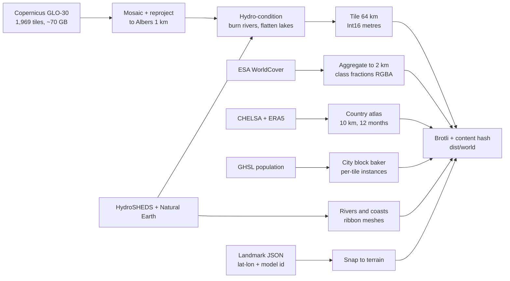
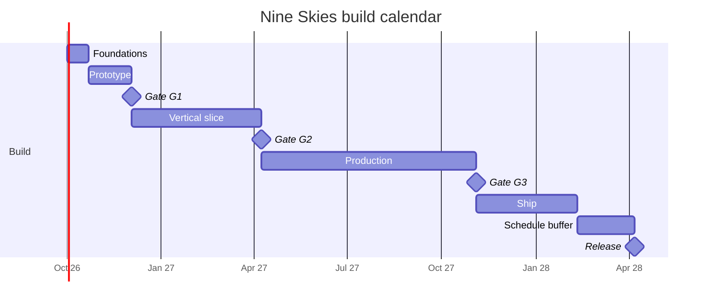
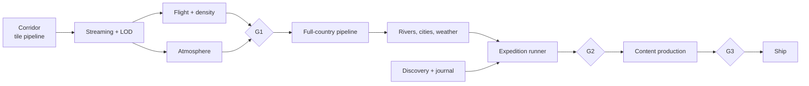

# Nine Skies — Build Plan

2026-09-20 · @Someone

Companion to *Nine Skies — Game Design Document*. The GDD says what the game is; this says how it gets built, in what order, at what cost, and what has to be true before each stage is allowed to continue. Where this plan overrides a GDD decision it says so explicitly and gives the reason.

## Assumptions

These drive every number below. Change them and the calendar moves; the sequencing does not.

| Assumption | Value | Notes |
| --- | --- | --- |
| Team | 2.5 engineers, 1 technical artist, 1 writer-designer (0.6 FTE), contract audio, contract reviewer | Engineering effort is quoted in engineer-weeks so it rescales |
| Start | October 2026 | Design is frozen as of the 20 September 2026 decisions |
| Reference floor device | **Apple Silicon Mac (M1, 8-core GPU), Chrome** — decided 20 September 2026 | The 30 fps target is meaningless without a named device. Two things follow that the old Iris Xe floor did not imply: every Mac is HiDPI, so the budget's "1080p" line is now the *logical* resolution and a default 1512×982 at 2× is 5.9 Mpx, nearly three times it; and Intel Macs are outside this floor, being a different machine entirely. Measured headroom on an M3 is 34× the whole current frame (F30) |
| Reference ceiling | RTX 3060 class, 1440p, 60 fps | The GDD's discrete-GPU target |
| Distribution | Web build free, Steam build paid | See *Open questions*; this is a recommendation, not a decision |
| Total engineering | ~107 engineer-weeks of feature work | Against ~178 engineer-weeks of capacity across the calendar — the gap is integration, bug work, release engineering and holidays. Plus ~40 artist-weeks and ~20 writer-weeks in parallel |
| Calendar | ~18 months to release, ~Q2 2028 | Includes a 12 % schedule buffer, not a content buffer |

## Decisions made here

The GDD leaves these open or implies something the build cannot use as written. Each is decided now because it is expensive to change after the prototype.

| # | Decision | Why |
| --- | --- | --- |
| D1 | **Projection: Albers Equal Area Conic**, central meridian 105°E, standard parallels 25°N / 47°N (the Chinese national standard) | "Honest scale" is an equal-area claim. Shape distortion at 1 km sampling is invisible at flight height; area error would not be — Xinjiang has to *be* bigger |
| D2 | **Tile payload: raw Int16 metres + Brotli, not 16-bit PNG** (changes the GDD pipeline diagram) | Browsers silently truncate 16-bit PNG to 8-bit through `createImageBitmap`; recovering the full range needs a JS decoder on every tile. Raw Int16 over Brotli transport compression is smaller *and* costs zero decode. Int16 in metres spans Turpan (−154 m) to Everest (8,849 m) exactly |
| D3 | **Terrain mesh: one shared grid geometry, displaced by vertex texture fetch; flat normals from screen-space derivatives in the fragment shader** | No per-tile CPU mesh building, no normal baking, and `dFdx/dFdy` on world position gives exactly the faceted low-poly look the art direction asks for, for free |
| D4 | **Heightmaps live in R16I texture arrays; terrain draws instanced** | Reduces terrain to ~4 draw calls (one per LOD level) instead of ~120. This is what buys the integrated-GPU target. Integer textures cannot be hardware-filtered, which costs nothing here — vertices land exactly on samples, and the ground elevation the HUD and collision need is interpolated CPU-side from the decompressed tile |
| D5 | **Floating origin**, rebased when the camera passes 4 km from origin | At 1:8 the world is 650 km wide in game units; float32 gives ~6 cm of precision out there, which reads as camera jitter in the cockpit-free view |
| D6 | **Horizontal compression and vertical exaggeration are runtime uniforms, never baked into data, and are set as a pair** | The drama test (apparent exaggeration A ∈ {4, 6, 9}) is a playtest, and a playtest needs a live toggle, not three data builds. They are set together through `scaleFor` because only their product is visible: vary one alone and you are silently varying the other question too (F14). Compression itself turned out to be unplayable — see D16 |
| D7 | **Two data tiers: per-tile (elevation, land cover, city instances) and country-wide atlas (climate, wind)** | Climate and wind vary over hundreds of kilometres. Tiling them multiplies file count for no fidelity. One 10 km atlas loaded once serves both the shader and the simulation |
| D8 | **Climate from CHELSA V2.1 (temperature, precipitation) and ERA5 (wind), not WorldClim** | WorldClim v2 is CC BY-SA 4.0; baked climate textures are plausibly adapted material, which would put a share-alike obligation on shipped assets. CHELSA (CC BY 4.0) and ERA5 (Copernicus licence) carry attribution only |
| D9 | **Vectors from Natural Earth (public domain) plus HydroSHEDS, not OSM** | OSM is ODbL. Natural Earth coasts, lakes and city points at 10 m scale are more than enough at 1 km terrain resolution, and carry no share-alike |
| D10 | **No national boundary geometry ships at all** | The GDD says no border lines in the 3D world and no contested-border detail in the overlay. The cheapest way to guarantee that is to never have the layer. The soft world edge is computed from a land/ocean mask and a distance field, not from a border |
| D11 | **Content and expeditions are data, validated in CI** | 230 cards and 9 routes are a content problem, not an engineering one. If authoring needs an engineer, the content volume risk becomes a schedule risk |
| D12 | **Atmosphere: analytic single-scattering approximation with per-region parameters, not a precomputed LUT** | Bruneton-style tables are expensive to evaluate and hard to art-direct. Nine hand-tuned parameter sets blended by region weight is cheaper and matches "hard clean blue over Tibet" more directly |
| D13 | **Desktop wrapper: Electron, not Tauri** | Tauri uses the system webview, so macOS gets WebKit and a different WebGL driver path. For a GPU-bound game the pinned Chromium/ANGLE is worth the binary size |
| D14 | **Region blend weights are one value, shared by terrain shader, atmosphere, audio and weather tables** | One source of truth means the music crossfade and the sky tint cross the Sichuan/plateau boundary on the same frame |
| D15 | **The horizon beyond the streamed tiles is a per-azimuth ridge line marched from one coarse country-wide heightfield, not a pre-built impostor mesh** | A silhouette *is* the maximum elevation angle along each sight line, so marching for it is both exactly right and cheap: 6k triangles, one draw call, 0.6 ms a frame amortised. Extending the tile pyramid instead needs hole-punching and fights the depth buffer for ground the haze eats anyway. The same 930 kB field is what the map overlay draws, so the wall you fly at and the wall on the map cannot disagree |
| D16 | **Horizontal compression is an engineering parameter, fixed at 1:8, and is not playtested** | With the apparent exaggeration held, the render transform is a uniform `1/c` on both the scene and the camera, so the candidates are the same flight to within float noise — measured at 0.005 of one grey level over a 90-second flight (F15). It is chosen on float precision against tile counts and streaming radius, and the trip-length question asked in its name is a cruise-speed question |
| D18 | **An expedition ships an altitude floor beside its speed profile, and the margin the player gets is built *into* that floor, not added on top of it** | D17's replay flies full up-elevator, which proves a route is possible and describes a flight nobody would take — thirty-five unbroken minutes of climb arriving two kilometres above Lhasa. What a route can actually offer is the gap between that and the minimum altitude the rest of it still works from, and that gap *is* the hand-off budget in different units: one metre of clearance is one second of player, and on Expedition 1 the whole of it is 5.9 minutes of level flight or 18 seconds of nose-down (F19). The margin goes inside the floor because floor-plus-margin is not a trajectory — climb rate falls with altitude, so an aircraft holding station above a rising floor slides back onto it and 300 m asked for that way arrives as 136 (F20). Computing the floor at authoring time makes "can the autopilot give the stick back here?" and "can it take the route back?" table lookups instead of open questions |
| D17 | **A route is not data until an autopilot has flown it over the ground.** Every expedition route is replayed against the built terrain, at its own per-leg speeds, and fails if the aircraft is ever lower than the ground | D11 makes routes data validated in CI, and the validation it meant was schema-shaped: waypoints in bounds, beats in order. The thing that actually makes a route wrong is invisible to that. Expedition 1 has been in the GDD since the first draft, was checked at its destination (F16), and flies into a mountain at its midpoint (F17). The check costs a second per route and it is the only one that would have caught it |
| D19 | **A route is validated in both directions: it has to be able to get over the ground *and* back down onto its destination** | D17 asks whether the aircraft clears; D18 asks how low it may be while still clearing. Both are about staying up, and between them they used up all the attention. Expedition 1 passes both and still cannot arrive: there is no altitude at all from which it can be landed until thirty-one kilometres out, because a 5,223 m ridge sits ninety-three kilometres from a city at 3,652 m and cruise crosses those ninety-three in forty-three seconds (F21). The check is the *band* — arrival ceiling minus altitude floor — and a route whose band closes is broken in a way no autopilot, no hand-off and no speed mode can rescue. It belongs next to the clearance replay, because it costs the same second and catches the half D17 cannot see |
| D20 | **The altitude floor tapers to the arrival height at the threshold, rather than holding its terrain margin to the last kilometre** | Without it no route can land anywhere, including on flat ground at sea level: the floor at the destination is `ground + clearance`, nothing legal is below it, and the shortfall the gate reports *is the margin* (F22). Dropping the margin does not help — the floor becomes bare interpolated ground and the diving probe goes through it between samples — so both escapes are closed and the model has to change. The taper length is not free: too short reports an impossible descent as a floor and too long gives away margin over real terrain. The rate that sets it is not 18 m/s but the asymptote of a four-second pitch lag, which costs a fixed 72 m at sea level and 104 m into Lhasa — pay it and a route lands, skip it and the floor outruns the aircraft (F23). Eight of the nine expeditions want a landing, so this is what unblocks them |
| D21 | **The ground under each authored route is committed beside it as a route section; the corridor is never a CI artefact** | The corridor cannot be one: 9.8 MB for Expedition 1, ~70 GB for the phase 2 country grid, both built from 14 GB of rasters. But the flown check never reads two dimensions — `profileAlong` has already reduced the world to 2,932 ground samples under one line before the first flight, and every number in F17–F23 is a function of those. The section is 22 kB, does not grow when the corridor does, and carries the waypoints and leg lengths it was cut from so a route edited without a re-cut fails by name. Stored to a decimetre because whole metres move Expedition 1's arrival by 3.2 m — six times the rounding, compounded by the floor search and the arrival bisection — which would print 1,584 where the findings say 1,588 (F24) |
| D22 | **The pipeline commits the projection reference table the engine checks itself against, and each side verifies the half it can reach** | `projectAlbers` is a second implementation of the projection `grid.py` owns, and the two drift silently. The check needs PROJ's answer and the TypeScript answer, which are never in the same process: PROJ is behind rasterio, the engine is in a browser, and CI runs them as separate jobs. The only place they had met was a built manifest, so the check ran nowhere but the author's machine. A committed table makes it two halves that both run: Python re-derives it from PROJ, TypeScript reads it with no Python and no world. Forty-two points chosen for where a projection goes wrong — both standard parallels, the central meridian, the country's corners — rather than for where the game goes (F25) |
| D23 | **A route section is signed by the machine that cut it, and a section that does not verify is refused rather than flown** | D21 gave the committed ground every staleness check a machine without a world can run, and all of them ask whether the file still describes *this route*. None asked where its 2,932 elevations came from, and CI cannot recompute one of them — that needs 14 GB of rasters. So the file carries the answer: Ed25519 over the cut, the public half committed beside the sections, verified by every reader. The claim is deliberately narrow — these elevations came out of a corridor cut on a machine holding the key — and it is not proof they are real ground, which is what the probes are for and why one of them now runs against the section with no world. What it buys is that the only way to change the ground under a route is to cut it from a world again (F26) |
| D24 | **Every source raster carries a digest recorded against the mirror's own ETag, and a world is built only from tiles that still match it** | `acquire` verified a download by its byte count, which is the property a wrong tile is most likely to share with a right one — every GLO-30 cell in a latitude band compresses to roughly the same length. The expectation was that a digest could only ever be trust-on-first-use; it is not. S3 serves the object's MD5 as its ETag on every request, including the HEAD this stage already made on every tile of every run and then discarded, so the publisher hands over a checksum for free. All 331 tiles of the corridor agree with what the mirror serves today. The check sits at mosaic as well as at fetch, because a tile can rot on disk long after it arrived and the warp is the last moment its bytes are still identifiable as tiles (F27) |
| D25 | **The frame budget is measured with GPU timer queries at committed stations, at a forced 1080p, and every capture states its own resolution** | Workstream B is costed in milliseconds and nothing in the repository measured one: the HUD counts frames, vsync caps them, and the recorded "65–120 fps" is equally consistent with terrain spending 1 ms of its eight and with it spending 7.9. Three things had to be true before a number meant anything, and none was obvious. The capture has to *own* the frame **and the canvas** — with the game loop running underneath it, `terrain.update` restores the visibility it switches off and the first capture reported 6.21 ms to clear an empty screen, and the app's own `resize` handler would move every remaining station off 1080p while the report went on claiming 1080p. The estimator has to be the **minimum**, because contention only ever adds: the median of fifteen timings of an empty 1080p frame was 3.51 ms and the minimum of the same fifteen was 0.50. And the instrument check has to scale **pixels**, not passes — on a tile-based deferred GPU sixteen full-screen passes cost under three times one, so a repeat-the-pass fit blamed the timer for reporting something true. 1080p is forced because the budget is written for it and this display is Retina, which would inflate every fragment cost by 2.9× against a budget it never agreed to. The stations are committed rather than chosen at run time: a capture is only worth taking if it can be compared to the last one. And a capture refuses to start, aborts between stations when animation frames stop arriving fast enough to measure with, and gives up on a five-minute deadline whatever the cause — a throttled window turns forty seconds into twenty minutes that look exactly like a hang, and whichever way it ends it hands back the loop and the canvas it took (F30) |
| D26 | **A destination in a valley is approached at its own pace, authored on the arrival and reachable no other way** | Lhasa sits at 3,650 m behind a 5,220 m ridge forty-five kilometres out, and the aircraft must therefore shed 1,870 m in 45 km. At plateau cruise those 45 km last seventeen seconds. Measured, the two obvious levers both fail: slowing the whole final leg to `low` costs thirteen minutes and saturates at 1,095 m above the city, and rerouting down the Yarlung Tsangpo — via Nyingchi, via Tsetang, via Qamdo — costs four to fourteen minutes and does worse. What works is a fourth pace over the last 45 km, and it is worth being exact about what it is: it flies at `low`'s indicated airspeed, because `low` is already just above stall and there is no slower way to fly a light single, and takes half the ground per minute. So the thing that changes is the horizontal compression, locally halved — a real cost against the scale pillar, paid in one place, at the end, against an alternative that was not a faster descent but not arriving. It is kept narrow on purpose: `approach` is not in `SPEED_MODES` and cannot be written on a waypoint, only reached through `arrival.approach_km`, and it splits the final leg rather than adding a waypoint, so the route's geometry — and the committed section and signature over it — never move (F31) |

## Repository & toolchain

```
nine-skies/
  pipeline/     Python 3.12 + GDAL/rasterio; offline, produces /dist/world
  engine/       TypeScript + three.js; terrain, atmosphere, streaming, flight
  game/         TypeScript; HUD, journal, map, expedition runner, challenges
  content/      YAML cards, expedition routes, challenge defs, locale files
  tools/        Route editor, landmark placer, card previewer (web, dev-only)
  app/          Vite app shell, service worker, save layer
  desktop/      Electron wrapper, Steam integration
  test/         Golden data tests, sim unit tests, budget-proxy tests
```

TypeScript strict throughout; Vitest for units; Playwright for the scripted flight replays. Pipeline outputs are content-hashed and immutable so the CDN and service worker can cache them forever. One command (`make world CORRIDOR=sea-to-sky`) rebuilds any subset of the world from source rasters, because a pipeline nobody can re-run is a pipeline nobody will fix.

## Workstream A — Data pipeline

The pipeline is the spine: nothing in the game can be looked at until tiles exist, and every "honesty rule" in the GDD is a pipeline stage rather than a promise.



**Stages and what each one guarantees**

1. **Acquire.** Copernicus GLO-30 from the AWS Open Data mirror over lon 73–135°E, lat 18–54°N: 2,232 one-degree cells, of which **1,969 exist** as files — the other 263 are open ocean and simply absent from the bucket. ~70 GB, one-time, cached outside the repo. The bucket serves anonymous HTTPS, so this stage needs no AWS CLI and no credentials. The phase 0 corridor is a 331-file, **13.9 GB** subset of the same set.
2. **Mosaic and reproject** to Albers 1 km. Output grid **6,721 × 4,417 = 29.7 M samples** (105 × 69 tiles of 64 km, plus the shared edge sample). The plan's original 5,200 × 5,500 was two true facts about China that are not the bounding box of a projected boundary — see finding F10. Resampling is **mean plus 0.25 of (max − mean)** rather than cubic: a 30× reduction makes cubic an aliased point sample, a plain mean shaves every ridge, and a plain maximum lifts the valley floors this game flies down. Same idea as stage 5, different weight.
3. **Hydro-condition.** This is where "rivers are carved, not painted" becomes real:
   - Burn HydroSHEDS centrelines 2 cells wide, depth scaled by stream order.
   - **Enforce monotonic non-increasing elevation downstream** along each polyline. Without this the Yangtze visibly runs uphill in places where 1 km resampling clips a meander.
   - Flatten named lakes to a table of real surface elevations (Qinghai 3,196 m, Namtso 4,718 m, Poyang 13 m, …) rather than to the DEM minimum, which is noisy.
4. **Tile.** 64 km tiles at 65 × 65 samples (shared edge row/column so neighbours match exactly, which is why the grid is a sample grid and carries one sample more than it has cells). 105 × 69 = 7,245 tiles, of which ~4,400 contain land and ship.
5. **Horizon field.** One country-wide 8 km Int16 raster, 841 × 553 = 930 kB raw, reduced from the 1 km grid with a **silhouette bias** — cell mean plus 0.6 of (max − mean). The bias is the stage's guarantee: a plain mean shaves the crests off and the Himalaya arrive as a hump, a plain maximum inflates flat ground and fills the Sichuan Basin in behind its own rim. Consumed by the horizon impostor (D15) and the map overlay, which is why it is one artefact and not two.
6. **Hero areas** at 90 m: Guilin, Zhangjiajie, Three Gorges, Everest/Rongbuk, Tiger Leaping Gorge. 11.52 km tiles at 129 × 129, ~550 tiles total.
7. **Land cover** aggregated to 2 km as class *fractions* (tree, crop, grass/shrub, bare/sand, snow/ice) packed RGBA — fractions, not a dominant class, so the loess-to-steppe gradient blends instead of banding.
8. **Climate atlas** at 10 km: 12 months × mean temperature and precipitation, one country-wide texture set, ~6 MB. **Wind atlas** at 25 km from ERA5 monthly means, ~2 MB.
9. **City baker.** GHSL built-up + population → clustered blocks with footprint, height and night brightness, emitted as per-tile instance buffers. Ships as geometry data, not as a population raster, because the raster would be 28 M cells to produce a few hundred thousand boxes.
10. **Map textures.** The hypsometric country map, the elevation-step layer (with the colour-blind-safe hatch pattern in a second channel), the climate-zone and density layers, and the Heihe–Tengchong line — all generated here so the overlay and the world can never disagree.

**Golden tests, run in CI on every pipeline change**

| Probe | Expected | Tolerance |
| --- | --- | --- |
| Everest summit | the summit the source gives, not lost | **see F12** — GLO-30 reads 8,737.8 m at native 30 m, so ±40 m against the 8,849 m survey is unpassable at any resolution; this probe must move to the 90 m hero grid and widen |
| Turpan / Ayding Lake | −154 m | ±15 m |
| Qinghai Lake surface | 3,196 m, flat across the polygon | ±2 m, std dev < 1 m |
| Yangtze profile, source → mouth | Monotonic non-increasing | 0 violations |
| Lhasa | 3,650 m | ±30 m |
| Land-area ratio west/east of the Heihe–Tengchong line | 57 / 43 | ±1 pt |

Only two of the six — Lhasa and the Yangtze profile — can run against the corridor build in phase 0; Turpan, Qinghai Lake, Everest and the area ratio need the full-country build and first run in phase 2. Once all six pass, the georeferencing, the projection, the hydro-conditioning and the area claim are correct. If any fails, the world is wrong and no amount of shader work will fix it.

**Shipped world budget:** elevation ~30 MB, horizon field <1 MB, hero areas ~9 MB, land cover ~10 MB, atlases ~8 MB, cities ~6 MB, vectors ~4 MB → **~67 MB total**, of which the critical path to first flight is ~15 MB (app bundle, atlases, the local tile ring, regional audio). The 15 s / 20 Mbit target has roughly 2× headroom.

**Effort:** 14 engineer-weeks, front-loaded — the corridor subset must be done in the first three weeks.

## Workstream B — Runtime engine

**Streaming.** A quadtree over the tile grid; a worker pool fetches and decompresses; an LRU evicts beyond ~2× view distance. Tiles are uploaded into R16I texture arrays (256 layers each, ~2.2 MB per L0 array) so a tile becoming resident is a `texSubImage3D`, not a mesh build.

**LOD.** Four levels of the shared grid — 65², 33², 17², 9² — selected by distance, plus vertical skirts at tile edges to hide the seams. Beyond the streamed radius, the horizon impostor (D15): three distance shells of ridge line marched from the coarse country field, drawn back to front with the depth buffer off so the terrain simply paints over them.

**Impostor reach.** Near field ~380 km at full LOD, impostor to 1,200 km. Both numbers are measured rather than chosen (prototype findings F1, F2): the plateau first clears the horizon with the wall 1,312 km off, and below about 300 km of near field the reveal stops happening at all.

**Atmosphere.** Analytic Rayleigh + Mie with nine parameter sets (density, tint, sun colour, Mie anisotropy), blended by the shared region weights (D14). Height fog drives the humidity look; the plateau's parameter set has near-zero haze so the horizon sharpens exactly where the air density drops.

**Cities.** Instanced boxes from the baked buffers, emissive at night with brightness from the population field. The Heihe–Tengchong line needs no special code: it is what the data does.

**Weather.** Particles plus post-processing plus a wind force on the aircraft. Never geometry. Region + month selects a weighted table; the roll uses a seed derived from (expedition, month, leg) so a replay is reproducible and a narration beat about a dust storm cannot fire into clear sky.

**Frame budget, reference floor device, 1080p (33.3 ms)**

| Cost | Budget |
| --- | --- |
| Terrain (≤ 4 draw calls, ≤ 1.2 M tris) | 8 ms |
| Sky, atmosphere, post | 6 ms |
| Cities (instanced) | 3 ms |
| Weather particles | 2 ms |
| UI and HUD | 2 ms |
| CPU sim, streaming, culling (decode off-thread) | 4 ms |
| Headroom | 8 ms |

Memory target 900 MB, hard ceiling 1.5 GB.

**Effort:** 30 engineer-weeks. The largest single block and the one most likely to slip.

## Workstream C — Simulation

Arcade flight over a real atmosphere. The GDD's demand that the plateau be arithmetic rather than a scripted event is met literally:

- **Density.** `ρ(h) = 1.225 · (1 − 2.25577e−5 · h)^4.2559`, `σ = ρ/ρ₀`.
- **Piston power.** Gagg–Farrar: `P/P₀ = 1.132σ − 0.132`. At 4,500 m that is **59 %** of sea-level power; at Turpan's −154 m it is **102 %**.
- **Boost lockout** when `σ < 0.70`, which falls at **3,564 m** — the GDD's "above 3,500 m" emerges from the formula rather than being checked against an altitude constant.
- **Temperature.** `T = T_ground(lat, lon, month)` from the climate atlas, minus `6.5 °C` per 1,000 m of height above ground. Harbin in January and Turpan in July come out of the data, and the HUD number always matches the card.
- **Humidity** from monthly precipitation, driving haze milkiness and the rain-on-canopy effects.
- **Lift** `∝ v²ρ`, auto-coordinated turn, no stall, terrain contact bounces with a camera shake.

**Vehicles.** Plane (default), balloon (drifts on the wind atlas, steers only by altitude — this is why the balloon is a teaching tool and the glider is not), glider (constant sink plus weak slope lift; no thermals).

**Unit tests:** density and power at nine altitudes against a reference table; the composed temperature at six known city/month pairs; balloon drift over a month of Gobi wind against the ERA5 mean.

**Effort:** 10 engineer-weeks.

## Workstream D — Game systems

| System | Build note | Weeks |
| --- | --- | --- |
| HUD | Altitude, ground elevation, temperature, humidity, density bar, Beijing clock + local solar time in the overlay. Scales with the text-size setting | 3 |
| Discovery trigger | Uniform spatial grid over the ~150 point triggers, polled at 4 Hz, per-entry radius, single-card queue with cooldown, seen-set persisted | 4 |
| Map overlay | Baked country textures plus route/pin vectors plus a live elevation profile sampled from the resident tile cache over the last 200 km | 5 |
| Journal / Atlas | Card reader, per-region counts, soft hints, twelve comparison spreads as a full-screen post-expedition beat rather than a menu | 5 |
| Expedition runner | Route polyline, per-leg speed mode, **per-leg altitude floor** so hand-off and rejoin can answer "is there room?" rather than assume it (D18), **an arrival height the route has been shown to reach** (D19), **location-triggered beats** so detours cannot desync narration, resume-at-last-beat | 5 |
| Challenges | Six objective primitives (land-in-radius, gate sequence, reach-before-time, hold-altitude, stay-on-instruments, follow-line) cover all twelve. Instant retry, timer off by default | 3 |
| Progression, save, profiles | IndexedDB, versioned schema, 3 local profiles, autosave every 15 s and on every beat | 3 |
| Comfort and accessibility | Horizon lock, FOV slider, camera smoothing, text scaling, colour-blind-safe map, no strobing, metric default with imperial toggle | 3 |
| Input | Keyboard+mouse and gamepad behind one abstraction from day one | 2 |

**Effort:** 33 engineer-weeks across the workstream.

## Workstream E — Content

Content is the volume risk, so it gets tooling before it gets volume.

**Card schema** (YAML, one file per entry, validated in CI):

```
id, type, names {zh, en, pinyin}, trigger {kind, lat, lon, radius_km},
one_liner (≤ 25 words), read_more (80–120 words), figure {value, unit, label},
illustration_id, sources [], region, locale_keys
```

CI rejects a card that breaks a word count, sits outside the China bbox, duplicates a trigger within 3 km, or carries no source note. **The fact-check pass is a generated printable sheet**, one page per region, with every claim beside its source — the reviewer never opens the game or the repo.

**Expeditions and challenges** are data in the same way: waypoints, per-leg speed, fixed month and start hour, beats with trigger points and radii. Expeditions 2–9 are therefore authoring work, not engineering work, which is what makes the production phase estimable at all.

**Volume plan:** 9 regions → 40 hero landmarks → 12 comparison spreads → 30 cities → 12 weather → 25 food → 20 people → 80 points of interest, authored in that order. The points of interest are last because they are the flexible pool the descope ladder draws from.

**Localisation.** ICU MessageFormat, keys extracted from the content bundle at build time. English complete at G3; Simplified Chinese and Spanish in the ship phase. Chinese characters plus English on place names regardless of UI language, pinyin behind the setting.

**Effort:** 8 engineer-weeks of tooling, ~20 writer-weeks, ~40 artist-weeks (palettes, 40 hero models, 80 markers, card illustrations).

## Workstream F — Audio

Nine ambient beds, nine music cues, a weather layer set. Crossfaded by the same region weights the shader uses (D14). Regional instruments used sparingly per the GDD. Contracted, delivered over roughly ten weeks in the production phase. No voice in v1.

**Effort:** 2 engineer-weeks of integration, plus the contract.

## Workstream G — Platform & release

Web build on a CDN with immutable hashed assets and a service worker so a returning player is airborne in seconds. Electron wrapper for Steam with the world data bundled locally rather than streamed. Anonymous telemetry: expedition starts and completions, dwell time per region, beat skip rate, device tier and median frame time — enough to tune narration and to know whether the floor device is actually holding 30 fps in the wild.

**Effort:** 10 engineer-weeks.

## Phases, gates & calendar



| Phase | Weeks | Contents | Exit gate |
| --- | --- | --- | --- |
| **0 — Foundations** | 3 | Repo, CI, app shell, input, camera, floating origin, debug HUD; pipeline environment and the Shanghai–Lhasa corridor tiles | The two corridor golden probes pass; a placeholder aircraft flies over real terrain |
| **1 — Prototype** | 6 | Corridor terrain streaming, LOD, flight model, density and temperature, minimal HUD, one palette gradient, live drama and compression toggles | **G1** |
| **2 — Vertical slice** | 18 | Full country at low LOD, rivers and lakes, cities, atmosphere, weather for three regions, discovery system, journal skeleton, map overlay, expedition runner, Expedition 1 authored end to end, comfort settings | **G2** |
| **3 — Production** | 30 | Regions 4–9, expeditions 2–9, 12 challenges, ~230 cards, 40 hero models, 12 comparison spreads, seasons and time of day, audio, balloon and glider, progression and rewards | **G3** |
| **4 — Ship** | 14 | Fact-check pass, accessibility pass, zh-Hans and es, performance hardening on the floor device, Electron/Steam build, store page, closed beta, release | Release |
| *Schedule buffer* | 8 | 12 % of the 71 working weeks, held at the end rather than spread thin | — |

**G1 — does 3D earn its cost?** *(the GDD's go/no-go)* Ten players with no flight-sim experience fly the corridor for twelve minutes at each of **A = 4, 6 and 9** — apparent exaggeration, compression fixed at 1:8 — order randomised. Pass requires: **≥ 6 of 10 remark on the climb, the thin air or the plane going heavy without being prompted**; **median boredom onset falls outside the twelve minutes at every drama setting** *(redrafted 20 September 2026 — the original read "after the plateau edge", which is 17.4 minutes past the end of the session; wording not yet signed off)*; and one drama setting wins the preference ranking clearly. A fail triggers the Godot evaluation, two weeks budgeted; a muddy result extends the prototype by two weeks rather than proceeding.

**Decided 20 September 2026: twelve minutes stands and the criterion moved.** The paragraph below is why. **Twelve minutes of Expedition 1 ends 17.4 minutes before the plateau edge.** The protocol's second pass criterion is that median boredom onset falls *after* it; the wall is crossed at minute 29.4 of 35.5, so a twelve-minute session cannot contain it and every participant's answer falls before it whatever they feel. The criterion is not hard to pass, it is unpassable, and a gate scored on an event that cannot occur is the same failure as a check that silently skips (F28). What twelve minutes does contain is the climb — 2,806 m of it, ending at 4,006 m over ground 69 m above the sea — so the first criterion is served by the same session that makes the second impossible, which is why the protocol reads as very nearly right. The earliest twelve-minute session that reaches the wall starts at km 900, and by then the player begins at 4,747 m: **the session that contains the climb and the session that contains the wall are different sessions.** The third criterion is weakened rather than broken — the eastern window has 1,094 m of local relief to exaggerate against the wall's 2,804 m, so A = 4 against A = 9 is a 683 m spread in apparent relief where it would be 1,753 m across the wall. Ask `npm run content:sessions` for any length; the remedies and their prices are in *Open questions*.

The compression ratio is deliberately **not** in this protocol. It was, and it could not have produced a result: with A held the three candidates are the same flight frame for frame (F15), so a cohort ranking them would have ranked noise and the gate would have recorded a decision it never made. The trip-length comparison the GDD asks for in compression's name — 40 minutes against 17 — is a **cruise speed** question, and twelve minutes of a twenty-five-minute route is not enough of one to judge it; it moves to G2, where a whole leg is flown — and where it arrives already bounded, because the climb budget caps cruise at 135 km/min (F16).

**G2 — is one expedition a good half hour?** Ten external players, no China knowledge, one complete Expedition 1. Pass requires: **≥ 7 of 10 name at least three distinct landscapes or places they passed, in the order they were flown** *(redrafted 20 September 2026 — the original asked for a sketched three-step profile with a flat-topped plateau, which is a landform this route does not cross; wording not yet signed off)*; ≥ 70 % finish the expedition without quitting; ≥ 30 fps sustained on the floor device; and the full-screen comparison spread is read rather than dismissed by a majority.

**Decided 20 September 2026: the lesson changed rather than the route, and the criterion followed it.** The paragraph below is why. **Its first criterion asked for a flat top this route never crosses.** Seven of ten sketching "the plateau drawn as a flat top rather than a peak" is a claim about what the cohort saw, and beyond its own rim Expedition 1 is the *least* flat thing in the flight: 40 km of level ground at its best against 390 km before the wall, standard deviation 557 m against 460, and 122 reversals of half a kilometre or more across 1,071 km. That is not a routing error — Shanghai to Lhasa crosses the dissected eastern margin of Tibet, the Hengduan and the Nyainqêntanglha, and the flat Changtang is north and west of the line. The route is honest and the criterion is asking after a landform somewhere else. The three steps have their own imbalance: **58 % of the trip is spent below 500 m and 19 % above 2,000**, and a sketch is weighted by minutes rather than kilometres (F29). `npm run content:teaches` prints it for every expedition. Which of the lesson, the routing and the criterion moves is a writing decision, in *Open questions*.

**G2 flies a thirty-five minute expedition the player mostly watches.** Its second criterion is that ≥ 70 % finish without quitting, and the route affords 5.9 minutes of hands-off flying out of 35 (F19) — so a cohort that takes the stick to look at something will be flown back onto the line rather than left on their own detour, and the protocol has to say which, because the two are different experiments. **It is also thirty-six and a half minutes, not twenty-five.** Its protocol flies one complete Expedition 1, and at a single cruise speed the aircraft does not complete it at all — it is inside a ridge at the midpoint (F17). The authored speed profile fixes that at the cost of ten minutes (F18), so the gate's "is one expedition a good half hour?" is being asked of thirty-five minutes. If that is the wrong question, the answer is one line of the authored file and it needs deciding before the cohort is booked, not after.

**G3 — content complete.** All cards pass CI validation, all nine expeditions playable start to finish, fact-check sheet signed off, no open crash or progression bugs.

## Critical path



Everything hangs off the pipeline, so the corridor subset is the single most schedule-critical deliverable in the project and gets the senior engineer in week one. Content authoring, art and audio run alongside from G2 onward and are not on the critical path — they are on the *volume* path, which is what the descope ladder protects.

Work that can start early and should: the content schema and card tooling (before G1, so the writer is never blocked), the comfort settings (cheap, and motion sickness discovered at G2 is a redesign), the input abstraction.

## Test & verification plan

| Layer | Method | Runs |
| --- | --- | --- |
| Pipeline | Six golden elevation/hydrology probes, plus a checksum on the tile manifest and a digest per source raster checked against the mirror's ETag (D24). Where a route flies over a probe's coordinates, that probe also runs against the committed section — with no world, in CI (D23) | Every pipeline commit |
| Simulation | Unit tests on density, power, temperature composition, balloon drift | Every commit |
| Content | Schema, word counts, coordinate bounds, duplicate triggers, source presence. What a route teaches and what a session contains are reported rather than gated — `content:teaches`, `content:sessions` — because the fix for a disagreement is a writing decision (F28, F29) | Every commit |
| Performance | **Budget proxies in CI** — draw calls, triangles, texture memory, resident tile count on a scripted replay of three routes; fail on regression | Every commit |
| Performance (real) | GPU timer queries per pass at seven committed stations, forced 1080p, on the named floor device (D25, `__ns.frameCost()`). Every capture reports its own resolution and refuses to be read as a measurement if the instrument check fails | Every milestone |
| Expedition integrity | Automated autopilot replay of all nine routes: assert the aircraft is never lower than the ground (D17, built in phase 1 for Sea to Sky), that the hand-off budget the route advertises is one it actually has (D18), that the altitude band between floor and arrival ceiling stays open the whole way so the route can be arrived at and not just survived (D19), and that every beat fires exactly once and in order. The first and third run at content validation rather than nightly — `validateRoute`, two flights and a floor, about three seconds a route | Every commit — the ground is committed with the route (D21) and signed by the machine that cut it (D23) |
| Player | G1 and G2 protocols above; a third informal pass mid-production | At gates |

CI deliberately does **not** claim to measure frame rate — headless software rasterisation would produce a number that is precise and meaningless. It measures the things that cause frame rate to regress, and real timings are taken on real hardware at milestones.

## Risk register

Design risks live in the GDD. These are the build's own, each with a trip-wire rather than a hope.

| Risk | Trip-wire | Response |
| --- | --- | --- |
| ~~WebGL2 vertex texture fetch is slow on the floor device's driver~~ **retired** | Week 2 spike: displaced grid under 4 ms at L0. **Measured: 0.10–0.13 ms on an Apple M3, thirty-six times inside it** (F30) — and the floor is now a Mac, so the Iris Xe driver this risk was about is not in scope. Confirm on an M1 at the next milestone | ~~Fall back to worker-built CPU meshes, +3 engineer-weeks~~ — not triggered |
| Browser cannot hold the plateau view distance | G1 frame capture over Namtso below 30 fps after the impostor ring is in | Cut in this order: impostor shells, then LOD detail, then the near radius — and never the near radius below ~300 km. Measured (F2): at 90 km the plateau is not smaller but gone, so the old mitigation would have deleted the moment it was protecting. Godot fallback only after all three |
| Pipeline reruns become too slow to iterate | Full-country rebuild exceeds 6 hours | Per-region incremental rebuild with a dependency cache; budgeted as 1 engineer-week in phase 2 |
| Content slips (the GDD's own high-likelihood risk) | Eight weeks before G3, fewer than 70 % of cards are written | Trigger descope rungs 1–2; hero landmarks and comparison spreads are never the thing that slips |
| Climate/vector licensing forces a source change late | Legal review not closed by end of phase 1 | D8 and D9 already pick permissive sources; the pipeline abstracts the climate reader so a swap is a day |
| Memory ceiling breached on long free-flight sessions | Resident heap above 1.2 GB after 40 minutes | LRU tightening and tile array recycling; a soak test enters nightly CI at G2 |
| A route does not show the thing its own file says it teaches | `npm run content:teaches` puts the claimed lesson next to the measured shape and step shares | Change the lesson, the routing, or the gate criterion — and say which, because all three are cheap to leave ambiguous and none is cheap to discover at a gate. Expedition 1 is the case: it claims the three steps and spends 58 % of itself over one of them (F29). Not a build failure; a route that crosses honest ground is not broken by a sentence above it |
| A gate is scored on something its protocol cannot produce | Any pass criterion naming a moment of the route that a session of the protocol's own length does not reach | Measure it with `npm run content:sessions` before the cohort is booked. G1 was written this way and nobody noticed for four weeks: its boredom criterion needs minute 29.4 of a twelve-minute session (F28). The same question has to be asked of G2 and of every expedition protocol after it, which is why the tool is committed rather than the answer |
| Motion sickness in the chase camera | Any G1 participant stops early for discomfort | Comfort pass moves from phase 4 to phase 2 immediately |
| An authored route turns out not to be flyable | The clearance replay (D17) fails for any route, or is skipped because no ground is committed for it | Fix the route, not the check. The replay runs on every route at authoring time and on every commit in CI — `npm run content:validate` — over the section committed beside the route (D21), and a route that has never been flown over real ground is not authored yet. A skip is an exit code: an expedition with neither world nor section fails rather than printing a green tick |
| The engine's projection drifts from the pipeline's | `projectAlbers` and PROJ disagree at any point in `pipeline/reference/albers.json` | Caught on every commit from both sides (D22): the Python suite re-derives the table from PROJ, the TypeScript suite checks the engine against the committed copy. Neither needs a built world. A disagreement is the engine's to fix unless the pipeline's constants moved, in which case `make reference` and a finding explaining why |
| A committed section stops describing the route it was cut from | A waypoint moves, or the projection changes, and the ground in `content/sections/` is now under a different line | Caught without a world: the section carries its waypoints and leg lengths, and the gate names the waypoint that moved. Re-cut with `make sections`, which `make world` already ends with. The route is not checked in the meantime — a stale section is refused, never flown (F24) |
| A section's ground is not what the pipeline would produce | The gate on a machine with a world reports drift between the section and the corridor | Re-cut. That comparison only runs where both exist, which is the machine that can fix it. Everywhere else the file is refused unless it verifies against the committed cutting key (D23), so the ground cannot be changed except by cutting it from a world again — and one station of it, Lhasa, is checked against a published elevation with no world at all (F26) |
| The cutting key is lost, or a second machine starts building worlds | `make sections` on a machine with a world reports no cutting key | Copy the private half across; never generate a second pair, which would invalidate every committed section at once. `make cut-key` refuses to overwrite either half for that reason. If the key is genuinely lost it is a new pair plus a re-cut of every section from a built world, which is an afternoon and not a disaster (F26) |
| A source raster is intact but wrong | The MD5 of an arriving tile disagrees with the ETag the mirror served, or a tile on disk disagrees with `pipeline/sources/cop30.json` at build time | Discarded and retried on download; on a build, nothing is built at all and the tile is named. Both digests are recorded per tile — MD5 because it is the one the mirror publishes and therefore the only one checkable against anybody but us, SHA-256 because MD5 is worthless against a chosen collision and that weakness should not propagate. Re-record with `make sources` only when the corpus is meant to have changed (F27) |
| A route is flyable but cannot be arrived at | The band between the altitude floor and the arrival ceiling (D19) closes anywhere along the route | It is a route change and never a policy one — nothing the autopilot does moves it. Move the destination to somewhere the line can reach, author the arrival as a flypast at a height the route does demonstrably reach, or accept the trip time that lands it. Expedition 1 is the case: its band is closed for 2,900 of 2,931 km, the whole policy knob is worth 371 m of a 1,588 m deficit, and what lands it is seventy-four minutes against a thirty-five minute band (F21) |
| An approach taper gives away terrain margin an author did not know about | A route that lands passes closer to the ground on the way in than the clearance it authored — necessarily, since it cannot be 300 m up at the threshold (D20) | Not preventable and not a defect: it is what landing is. The gate prints the margin the lowest legal line actually keeps, so the number is in front of the author every run. A route that wants its full margin over everything arrives above it, which is a flypast (F23) |
| A route is flyable but has no room in it, so the autopilot can never hand off | The route's hand-off budget (D18) falls below ~3 minutes of level flight | Raise the start altitude, slow a flat leg, or accept it and write the narration to a route the player watches rather than flies. Expedition 1 is at 5.9 minutes today and is the tightest of the nine by construction — it has the most climbing to do |
| Floating-origin bugs surface late as visual jitter | Any camera or terrain jitter visible at the map's far corners | Rebase implemented in phase 0, not retrofitted — this is why D5 is a foundation task |

## Descope ladder

Pulled in this order, top first, when a gate is at risk. Each rung names what it buys.

1. Challenges 12 → 6 — 4 engineer-weeks, 3 design weeks
2. Points of interest 80 → 40 (total ~190 entries) — 6 writer-weeks, hero landmarks untouched
3. Spanish moves post-launch — 3 weeks of the ship phase
4. Expeditions 8 and 9 become free-flight prompts reusing the same cards — 5 writer-weeks, 2 engineer-weeks
5. Glider cut; balloon stays — 2 engineer-weeks *(the balloon teaches the wind field; the glider teaches nothing)*
6. Hero models 40 → 25, the remainder become lighter markers — 10 artist-weeks
7. Steam wrapper moves to a post-launch update; launch web-only — 6 engineer-weeks

**Never cut:** the nine regions, the air-density mechanic, 1 km real elevation, and the twelve comparison spreads. The first three are the game; the fourth is where its thesis is actually stated.

## Open questions

- [ ] **Drama — how exaggerated should the relief look?** `A = compression × exaggeration` is the only thing terrain shape depends on, and it is the one scale question a player can actually answer. A ∈ {4, 6, 9} at 1:8, built and keyed to `V`; measurement favours **A ≈ 6**, i.e. 0.75× vertical, not the GDD's original 1.5× (F14). Decided at G1 by the playtest.
- [x] ~~**Pacing — how fast should cruise be?**~~ — **answered, and not with a number.** No single cruise speed flies Expedition 1: measured against the ground it clears at 73 km/min and not above, which is a 32-minute trip, so the GDD's fifteen-to-thirty-five minute band and the terrain have no speed in common (F17). What flies is a speed *profile*, now authored in `content/expeditions/sea-to-sky.yaml`: `low / low / cruise / cruise`, 35.5 minutes, clearing the worst ground by 333 m (F18). `CRUISE_CANDIDATES` ∈ {80, 130, 190} stays as a free-flight toggle, but it is no longer a gate question — what a G2 cohort would rank is a profile, and there is only one that flies.
- [x] **Is a thirty-five minute Expedition 1 the right expedition?** — **answered, 20 September 2026: keep the climb, and arrive at Lhasa.** Both prices are paid knowingly. The climb stays, so the trip does not drop to 25.2 minutes and the hand-off budget stays at 5.9 minutes rather than 16.1. The route now arrives — 264 m over the city against an authored 300 — bought with a fourth pace over its last 45 km for 1.2 minutes, which is cheaper than the seventy-four minutes F21 priced because F21 was pricing a slower *route* rather than a shorter *approach* (F31). Expedition 1 is **36.7 minutes**: 1.7 past the GDD's own maximum where it was 0.5 past, and that overrun is now the open question rather than the route. What follows is the argument the decision was taken against, kept because the prices in it are all still real. ~~The profile costs half a minute more than the GDD's own maximum, and spends 76 % of the trip east of Chongqing because that is where the climb has to be bought. Starting the expedition at 4,000 m instead of 1,200 m gets it to 25.2 minutes and deletes the climb, which the build's own tests call the lesson. One line of the authored file either way — a writing decision, and the last open question G2 depends on (F18). **It now has a second price on it.** The climb is also what consumes the route's altitude margin: starting at 4,000 m nearly triples the hand-off budget, 5.9 minutes to 16.1, and that gain can be taken as player freedom *or* as the ten minutes off the trip, not both (F19). Keeping the climb is a real answer — it just has to be authored knowing that a two-minute hand-off is safe anywhere on the route and a six-minute one is not offered in the six minutes before the plateau rim. **And a third price, which is the pacing rather than the start:** the same cruise number sets how far above the ground the player spends the first two thirds of the trip. At 130 km/min the floor over the Hubei plain is 3,588 m and the flight is 4.4 km up; at 73 it is the ground itself and the flight is 1.4 km up, for sixty-nine minutes. A thirty-five minute Sea to Sky is a four-kilometre-high one (F20). **And a fourth, which is the ending:** the same number decides whether the expedition can land at all. At 130 km/min the route is 1,088 m too high to come down to 500 m over Lhasa and the whole policy knob is worth 371 of them; an approach waypoint flown low plus a cruise of 70 km/min lands it, for seventy-four minutes. Sea to Sky either ends in a flypast or is not thirty-five minutes long (F21).~~
- [x] ~~**Compression ratio**~~ — **closed, and not by a playtest**. With A held it is a change of units: same flight, same distances, same pixels (F15). Fixed at 1:8 on engineering grounds (D16).
- [x] **What twelve minutes does G1 fly?** — **answered, 20 September 2026: twelve minutes, from the start.** Which settles the session and therefore moves the criterion, because those were always the two halves of one question: twelve minutes from Shanghai contains the climb and cannot contain the wall, so a criterion scored on the plateau edge is scored on an event the cohort will not reach. The second criterion is redrafted below as *median boredom onset falls outside the twelve minutes at every drama setting* — an event inside the session, which is the only kind a twelve-minute session can score. **The wording is a draft and wants signing off before the cohort is booked.** What follows is the argument. ~~As written the protocol cannot score its own second criterion, because the plateau edge is 17.4 minutes past the end of the session (F28). Four remedies, each with a price. *Lengthen the session* to thirty minutes and it contains climb and wall both, at 90 minutes of flying per participant against the current 36 — which is a different study and probably G2's. *Run two twelve-minute segments per drama setting*, one from the start and one from km 900, for 72 minutes per participant and a cohort that has seen the reveal without earning it. *Drop the boredom criterion to G2*, which already flies the whole expedition, and let G1 ask only whether the climb and the thin air land. *Or move Expedition 1's climb*, which is the decision already open above and would change where the wall falls in the trip. This is a protocol decision and it needs making before the cohort is booked, not after.~~
- [x] **Does Expedition 1 teach the three steps, or does something else?** — **answered, 20 September 2026: the lesson changes.** Not to the wall, and not by rerouting. The expedition is for *seeing this part of China from the air, as immersively as it can be shown*, and the file now says so: `teaches: What this part of China looks like from the air, end to end`. That makes the route correct as flown — it was always honest ground, and it was the claim above it that was wrong — and it moves the cost onto G2, whose first criterion was a geography quiz and now has to measure whether a journey registered. Redrafted below. **The wording is a draft and wants signing off before the cohort is booked.** What follows is the measurement that forced it. ~~Its file claims `teaches: The three steps, and why the west is sparse`, and measured against the ground it crosses it spends 58 % of itself over the third step, 19 % over the first, and shows a "plateau" less flat than the eastern plain (F29). Three ways out, and they are not equivalent. *Change the lesson* to what the route does teach, which is the wall — the one thing this line shows better than any other, and the GDD's own reason for starting at Shanghai. *Reroute north* through the Changtang so the flat top is actually crossed, which is a different expedition and a longer one. *Move the flat-top criterion to whichever of the nine expeditions crosses the Changtang*, which costs nothing but has to be decided before G2's protocol is written. The contrast line — `Low, wet and crowded to high, dry and empty` — is delivered either way; it is only the *three steps* half of the claim that the ground does not support.~~
- [ ] **Is the GDD's fifteen-to-thirty-five minute band the right band?** Expedition 1 is 36.7 minutes, and every minute of that has been measured: the route does not clear below 73 km/min (F17), the climb is 32 of those minutes and cannot be bought anywhere but the eastern plain (F16, F18), and the arrival costs 1.2 (F31). The band is the only one of those numbers that was never measured — it is a GDD assertion about attention span. So either it moves to forty, or Expedition 1 stops being the flagship expedition, or one of the three measured costs is reopened. G2 is the gate that can actually answer it, and its protocol should be written to collect the answer rather than to assume it.
- [ ] **Commercial model.** The GDD wants a link anyone can open; a Steam release wants something to sell. Recommendation: one codebase, the web build gated to Expeditions 1 and 2 as a free demo, the Electron build the full game. This needs deciding before phase 2 because it changes the save layer and the content bundling.
- [ ] **Team shape.** This plan assumes 2.5 engineers. At 1.5 the calendar goes to roughly 28 months and rungs 1–3 of the ladder should be taken up front rather than under pressure.
- [x] ~~**Floor device confirmation.**~~ — **answered, 20 September 2026: the floor is a Mac.** Which retires the Iris Xe question rather than answering it, and with it the D3 trip-wire: on an M3 everything currently drawn costs 0.98 ms of the 33.3 ms frame, and the weakest Apple Silicon is a small multiple of an M3, not a twenty-seven-fold one (F30). Two consequences worth carrying rather than filing. **The budget's resolution line needs re-reading**: Macs are HiDPI, and at a default 1512×982 at 2× the frame is 5.9 Mpx against 1080p's 2.07, which at the measured 0.347 ms/megapixel is 2.3 ms on an M3 rather than 0.98 — still far inside, and no longer the same number. **And an M1 has not been captured**; `__ns.frameCost()` on the weakest Mac in scope is the remaining measurement, and it is one command.
- [ ] **Licence review** of CHELSA/ERA5, HydroSHEDS, GHSL and Copernicus for a commercial release — close by end of phase 1.
- [ ] **Audio contractor** booked by the start of phase 3; nine beds and nine cues is a long lead time for one person.
- [ ] **Geography reviewer** identified by G2 so the fact-check sheet has a reader when it is generated, not three months later.

## Immediate next actions

- [x] Stand up the repo, CI and app shell (week 1) — **done**: npm workspaces, three CI jobs (typecheck/tests/content/build, draw-call budget, pipeline suite), app shell flying
- [x] **Spike D3/D4 — displaced grid and texture arrays on the floor device** (week 2, blocks the terrain architecture) — **done, and the trip-wire was never close**: 0.10–0.13 ms at L0 against 4 ms, terrain 0.19–0.43 ms against its 8 ms line, and everything currently drawn 0.98 ms of the 33.3 ms frame, on an Apple M3 at a forced 1080p with a validated instrument (F30). With the floor decided as a Mac, that is a floor-family measurement rather than a development-machine one. What is left is a confirming capture on an M1 and a re-read of the budget's resolution line, both listed above
- [x] Pull Copernicus GLO-30 for the Shanghai–Lhasa corridor and get the two corridor golden probes passing (weeks 1–3) — **done**: 331 tiles / 13.9 GB, 1,155 tiles cut, Lhasa 3,651.9 m and the Yangtze profile both pass
- [x] Implement the flight model and density curve against the unit-test table (week 3, independent of terrain) — **done**: ISA density and the Gagg–Farrar piston lapse, 56 tests across aircraft, atmosphere and flight
- [x] Write the card schema and validator so authoring can start before G1 (week 3) — **done**: 13 schema tests, `npm run content:validate` green, fact-check sheet generated from the cards
- [x] Build the G1 A/B instrument itself (week 4) — **done**: two independent toggles, drama on `V` and compression on `C`, the scale pair derived rather than set, and the chase camera and haze moved into real units so neither confounds the comparison (F15)
- [x] Add the cruise-speed toggle for the pacing question (week 4) — **done**: `P` cycles {80, 130, 190} km/min, the HUD names the trip length each implies and warns when the selected pacing cannot complete Expedition 1, and all three are characterised in tests (F16)
- [x] Fly Expedition 1 over its own terrain before anyone authors it (week 4) — **done, and it does not clear**: `flyRoute` plus a corridor replay that pins every number, `TERRAIN_LIMITED_CRUISE_KM_PER_MIN = 92`, and a HUD that now warns at the default condition (F17)
- [x] **Make Expedition 1 flyable** (week 4) — **done, by authoring the speed profile**: the route is data with a speed per leg, schema-validated in CI, and flown over the built corridor by a test that reads the file. `low / low / cruise / cruise`, 35.5 min, 333 m of clearance (F18). The other three remedies — more climb, a reroute, a longer trip — stay open and are now optional
- [x] **Ask what Expedition 1 has left over** (week 4) — **done, and it is six minutes**: the altitude floor a route demands (`altitudeFloorM`, `climbFloor`), the hand-off budget that is the same quantity in seconds (`longestHoldS`), and the price of altitude on the HUD (`climbRecoveryRatio`). 3,588 m of floor over farmland 32 m above the sea; 18 seconds of nose-down is the whole margin (F19)
- [x] **Decide whether Expedition 1 keeps its climb or its twenty-five minutes** — **decided 20 September 2026: the climb.** So the trip stays long, the hand-off budget stays at 5.9 minutes, and the climb stays the lesson the build's own tests call it (F18, F19)
- [x] **Build the autopilot against the floor rather than against full up-elevator** (week 4, D18) — **done, and it changes almost nothing**: `followFloor` tracks a floor built with the clearance it is meant to keep, and comes within 90 m of the full-climb proof for 2,700 km. Expedition 1 admits one flight; the "altitude plan" is a choice between 5,832 m and 5,867 m (F20)
- [x] **Ask whether Expedition 1 can be arrived at, not just survived** (week 4, D19) — **done, and it cannot**: `arrivalCeilingM`, `approachBand` and `arrivalShortfallM`, the mirror of the altitude floor. The band is closed for 2,900 of 2,931 km and opens thirty-one kilometres out, 208 m wide, with the aircraft 1,300 m above the top of it (F21). It also found that `climbFloor` had never sampled its own destination, so every floor ever built was pinned over its last stride
- [x] **Decide what Expedition 1's ending is** — **decided 20 September 2026: it arrives at Lhasa.** None of the three options F21 priced is what happened, and the reason is worth keeping: F21 priced a slower *route* at seventy-four minutes, and what was needed was a shorter *approach*. 45 km at a fourth pace, 1.2 minutes, `arrives 264 m up against an authored 300` where the gate had printed `NO ARRIVAL AUTHORED` on every run since F22 (D26, F31)
- [x] **Run both halves of the route check at content validation** (week 4, D19) — **done, and it found that no route can land**: `validateRoute` in the engine, the corridor readers moved from `test/route/` to `tools/` so authoring can reach them, an `arrival` block in the expedition schema, and `make routes`. Expedition 1's three findings now print as one line of `npm run content:validate`. The `landing` kind was cut before shipping because it cannot pass on any ground (F22)
- [x] **Taper the altitude floor to the arrival height** (week 4, D20) — **done, and it found a second error on the way**: the clearance is a profile now, capped at what the remaining flying time can still shed, and a route can land. The number that wanted measuring was the descent rate, which is an asymptote rather than a rate — the four-second pitch lag costs a fixed 72 m at sea level and 104 m into Lhasa, and the first version gave all of it away (F23). `PITCH_TAU_S` moved to `aircraft.ts`, where a planner can reach it. Expedition 1 is unchanged at 1,588 m, which is F21's claim surviving a test of it
- [x] **Make the route gate unskippable in CI** (G2, D17/D19) — **done, and not by shipping the corridor**: the corridor cannot be a CI artefact at any phase, but the 2,932 ground samples the check actually reads can be, and are (D21). The gate now fails rather than warns when an expedition has no ground, `--require-world` is retired, and the finding suites that assert F17–F23 to the metre came off the skip list with it: 289 of 299 TypeScript tests run on a fresh clone, against 236 of 284 (F24)
- [x] **Commit the projection reference so the check runs on a fresh clone** (D22) — **done, and split in half on purpose**: the pipeline writes 42 points PROJ has answered for, its own suite re-derives them, and the engine suite reads the file with no Python and no world. Two of the three tests turned out never to have needed a manifest at all — they were inside a `skipIf` written for the test beside them. 294 of 302 TypeScript tests and 49 Python tests on a fresh clone; the eight still skipped are all about the world itself (F25)
- [x] **Teach CI that a section's numbers came from the pipeline** (D21) — **done, and the guess was right but incomplete**: the cut is signed and a section that does not verify is refused rather than flown, so a hand-edited array stops being a silent pass (D23). The signature says where the numbers came from and cannot say they are real, so the other half is a golden probe — Lhasa, against the committed file, the first probe ever to run without a world. Underneath both sat a gap nobody had recorded: the heightfield SHA a section carries was copied from the corridor manifest and had never been compared to `heights.bin`, so the stamp was a claim about a claim. It is measured now (F26)
- [x] **Record a digest per source raster at fetch time** — **done, and the part that needed looking up had a better answer than expected**: S3 serves an object's MD5 as its ETag, on the same HEAD `acquire` was already making and discarding, so the digests are corroborated by the publisher rather than trusted on first sight. All 331 tiles, 13.9 GB, match what the mirror serves today. The build now refuses tiles that do not match the record — one flipped bit in one 38.5 MB tile, byte count unchanged, is caught by name — and a section names the raster set behind it inside its signature, so the chain from ETag to committed elevation has no gap (D24, F27)
- [x] **Ask what a playtest session actually contains** (G1) — **done, and G1 cannot score its own second criterion**: `tools/session.ts` flies a session rather than slicing a track, because a player dropped in partway starts wherever the operator puts them and 1,200 m in front of the Hengduan is a crash and not a shorter Expedition 1. `TrackSample` carries seconds now, which is what makes a protocol written in minutes answerable at all. The wall `steepestRise` finds with no hint is the one F17 measured by hand, 36.7 m/km west of Chengdu (F28)
- [x] **Ask whether each route teaches what its file claims** (G2) — **done, and Expedition 1 does not**: `tools/teaches.ts` measures time over each of China's three steps and the shape of each section, cut at the route's own wall rather than at authored names. 58 / 24 / 19 across the steps, and the part beyond the rim is the least flat thing in the flight. `npm run content:teaches` (F29)
- [x] **Decide what Expedition 1 teaches** — **decided 20 September 2026: the lesson, which was the free one.** `teaches: What this part of China looks like from the air, end to end`. The route was always honest ground; it was the sentence above it that was wrong, and G2's first criterion moves with it (F29)
- [x] **Decide what twelve minutes G1 flies** — **decided 20 September 2026: twelve minutes from the start, and the criterion moves rather than the session.** 36 minutes per participant, the cheapest of the four remedies F28 priced (F28)
- [ ] **Capture the frame at the floor device's real resolution** — the budget is costed at 1080p (2.07 Mpx) and a fullscreen Mac draws 5.94, because `setPixelRatio` asks for `devicePixelRatio` 2. One command, `__ns.frameCost(20, [3024, 1964], ["wall-rim"])`, and it needs a window that is actually being drawn: the pane this was attempted in throttles to 1 Hz and the capture's own guard refused it (F32). Two things then follow — restating the budget in megapixels rather than a resolution name, and deciding whether `setPixelRatio` is capped
- [ ] Recruit the G1 playtest cohort (week 4 — ten people with no flight-sim experience takes longer to find than it sounds) — **unblocked, 20 September 2026**: twelve minutes at each of three drama settings, so thirty-six minutes of flying per participant plus the questionnaire. The only thing still outstanding is sign-off on the redrafted boredom criterion, which changes what the questionnaire asks but not who is recruited or for how long
