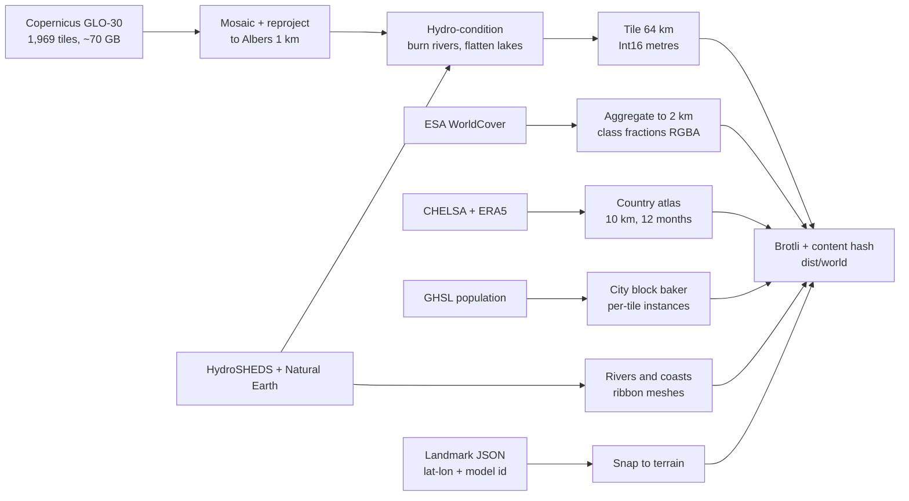
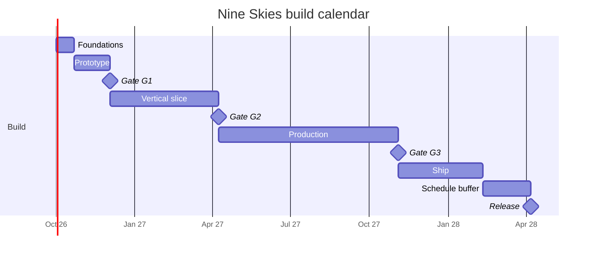
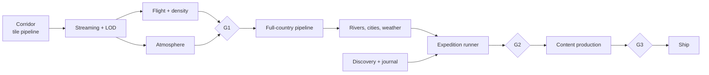

# Nine Skies — Build Plan

2026-09-20 · @Someone

Companion to *Nine Skies — Game Design Document*. The GDD says what the game is; this says how it gets built, in what order, at what cost, and what has to be true before each stage is allowed to continue. Where this plan overrides a GDD decision it says so explicitly and gives the reason.

## Assumptions

These drive every number below. Change them and the calendar moves; the sequencing does not.

| Assumption | Value | Notes |
| --- | --- | --- |
| Team | 2.5 engineers, 1 technical artist, 1 writer-designer (0.6 FTE), contract audio, contract reviewer | Engineering effort is quoted in engineer-weeks so it rescales |
| Start | October 2026 | Design is frozen as of the 20 September 2026 decisions |
| Reference floor device | Intel Iris Xe laptop (11th-gen), 1080p, Chrome | The 30 fps target is meaningless without a named device |
| Reference ceiling | RTX 3060 class, 1440p, 60 fps | The GDD's discrete-GPU target |
| Distribution | Web build free, Steam build paid | See *Open questions*; this is a recommendation, not a decision |
| Total engineering | ~107 engineer-weeks of feature work | Against ~178 engineer-weeks of capacity across the calendar — the gap is integration, bug work, release engineering and holidays. Plus ~40 artist-weeks and ~20 writer-weeks in parallel |
| Calendar | ~18 months to release, ~Q2 2028 | Includes a 12 % schedule buffer, not a content buffer |

## Decisions made here

The GDD leaves these open or implies something the build cannot use as written. Each is decided now because it is expensive to change after the prototype.

| # | Decision | Why |
| --- | --- | --- |
| D1 | **Projection: Albers Equal Area Conic**, central meridian 105°E, standard parallels 25°N / 47°N (the Chinese national standard) | "Honest scale" is an equal-area claim. Shape distortion at 1 km sampling is invisible at flight height; area error would not be — Xinjiang has to *be* bigger |
| D2 | **Tile payload: raw Int16 metres + Brotli, not 16-bit PNG** (changes the GDD pipeline diagram) | Browsers silently truncate 16-bit PNG to 8-bit through `createImageBitmap`; recovering the full range needs a JS decoder on every tile. Raw Int16 over Brotli transport compression is smaller *and* costs zero decode. Int16 in metres spans Turpan (−154 m) to Everest (8,849 m) exactly |
| D3 | **Terrain mesh: one shared grid geometry, displaced by vertex texture fetch; flat normals from screen-space derivatives in the fragment shader** | No per-tile CPU mesh building, no normal baking, and `dFdx/dFdy` on world position gives exactly the faceted low-poly look the art direction asks for, for free |
| D4 | **Heightmaps live in R16I texture arrays; terrain draws instanced** | Reduces terrain to ~4 draw calls (one per LOD level) instead of ~120. This is what buys the integrated-GPU target. Integer textures cannot be hardware-filtered, which costs nothing here — vertices land exactly on samples, and the ground elevation the HUD and collision need is interpolated CPU-side from the decompressed tile |
| D5 | **Floating origin**, rebased when the camera passes 4 km from origin | At 1:8 the world is 650 km wide in game units; float32 gives ~6 cm of precision out there, which reads as camera jitter in the cockpit-free view |
| D6 | **Horizontal compression and vertical exaggeration are runtime uniforms, never baked into data, and are set as a pair** | The drama test (apparent exaggeration A ∈ {4, 6, 9}) is a playtest, and a playtest needs a live toggle, not three data builds. They are set together through `scaleFor` because only their product is visible: vary one alone and you are silently varying the other question too (F14). Compression itself turned out to be unplayable — see D16 |
| D7 | **Two data tiers: per-tile (elevation, land cover, city instances) and country-wide atlas (climate, wind)** | Climate and wind vary over hundreds of kilometres. Tiling them multiplies file count for no fidelity. One 10 km atlas loaded once serves both the shader and the simulation |
| D8 | **Climate from CHELSA V2.1 (temperature, precipitation) and ERA5 (wind), not WorldClim** | WorldClim v2 is CC BY-SA 4.0; baked climate textures are plausibly adapted material, which would put a share-alike obligation on shipped assets. CHELSA (CC BY 4.0) and ERA5 (Copernicus licence) carry attribution only |
| D9 | **Vectors from Natural Earth (public domain) plus HydroSHEDS, not OSM** | OSM is ODbL. Natural Earth coasts, lakes and city points at 10 m scale are more than enough at 1 km terrain resolution, and carry no share-alike |
| D10 | **No national boundary geometry ships at all** | The GDD says no border lines in the 3D world and no contested-border detail in the overlay. The cheapest way to guarantee that is to never have the layer. The soft world edge is computed from a land/ocean mask and a distance field, not from a border |
| D11 | **Content and expeditions are data, validated in CI** | 230 cards and 9 routes are a content problem, not an engineering one. If authoring needs an engineer, the content volume risk becomes a schedule risk |
| D12 | **Atmosphere: analytic single-scattering approximation with per-region parameters, not a precomputed LUT** | Bruneton-style tables are expensive to evaluate and hard to art-direct. Nine hand-tuned parameter sets blended by region weight is cheaper and matches "hard clean blue over Tibet" more directly |
| D13 | **Desktop wrapper: Electron, not Tauri** | Tauri uses the system webview, so macOS gets WebKit and a different WebGL driver path. For a GPU-bound game the pinned Chromium/ANGLE is worth the binary size |
| D14 | **Region blend weights are one value, shared by terrain shader, atmosphere, audio and weather tables** | One source of truth means the music crossfade and the sky tint cross the Sichuan/plateau boundary on the same frame |
| D15 | **The horizon beyond the streamed tiles is a per-azimuth ridge line marched from one coarse country-wide heightfield, not a pre-built impostor mesh** | A silhouette *is* the maximum elevation angle along each sight line, so marching for it is both exactly right and cheap: 6k triangles, one draw call, 0.6 ms a frame amortised. Extending the tile pyramid instead needs hole-punching and fights the depth buffer for ground the haze eats anyway. The same 930 kB field is what the map overlay draws, so the wall you fly at and the wall on the map cannot disagree |
| D16 | **Horizontal compression is an engineering parameter, fixed at 1:8, and is not playtested** | With the apparent exaggeration held, the render transform is a uniform `1/c` on both the scene and the camera, so the candidates are the same flight to within float noise — measured at 0.005 of one grey level over a 90-second flight (F15). It is chosen on float precision against tile counts and streaming radius, and the trip-length question asked in its name is a cruise-speed question |
| D18 | **An expedition ships an altitude floor beside its speed profile, and the player's freedom is the margin above it** | D17's replay flies full up-elevator, which proves a route is possible and describes a flight nobody would take — thirty-five unbroken minutes of climb arriving two kilometres above Lhasa. What a route can actually offer is the gap between that and the minimum altitude the rest of it still works from. That gap *is* the hand-off budget, in different units: on Expedition 1 it is 5.9 minutes of level flight or 18 seconds of nose-down (F19). Computing it at authoring time makes "can the autopilot give the stick back here?" and "can it take the route back?" table lookups instead of open questions |
| D17 | **A route is not data until an autopilot has flown it over the ground.** Every expedition route is replayed against the built terrain, at its own per-leg speeds, and fails if the aircraft is ever lower than the ground | D11 makes routes data validated in CI, and the validation it meant was schema-shaped: waypoints in bounds, beats in order. The thing that actually makes a route wrong is invisible to that. Expedition 1 has been in the GDD since the first draft, was checked at its destination (F16), and flies into a mountain at its midpoint (F17). The check costs a second per route and it is the only one that would have caught it |

## Repository & toolchain

```
nine-skies/
  pipeline/     Python 3.12 + GDAL/rasterio; offline, produces /dist/world
  engine/       TypeScript + three.js; terrain, atmosphere, streaming, flight
  game/         TypeScript; HUD, journal, map, expedition runner, challenges
  content/      YAML cards, expedition routes, challenge defs, locale files
  tools/        Route editor, landmark placer, card previewer (web, dev-only)
  app/          Vite app shell, service worker, save layer
  desktop/      Electron wrapper, Steam integration
  test/         Golden data tests, sim unit tests, budget-proxy tests
```

TypeScript strict throughout; Vitest for units; Playwright for the scripted flight replays. Pipeline outputs are content-hashed and immutable so the CDN and service worker can cache them forever. One command (`make world CORRIDOR=sea-to-sky`) rebuilds any subset of the world from source rasters, because a pipeline nobody can re-run is a pipeline nobody will fix.

## Workstream A — Data pipeline

The pipeline is the spine: nothing in the game can be looked at until tiles exist, and every "honesty rule" in the GDD is a pipeline stage rather than a promise.



**Stages and what each one guarantees**

1. **Acquire.** Copernicus GLO-30 from the AWS Open Data mirror over lon 73–135°E, lat 18–54°N: 2,232 one-degree cells, of which **1,969 exist** as files — the other 263 are open ocean and simply absent from the bucket. ~70 GB, one-time, cached outside the repo. The bucket serves anonymous HTTPS, so this stage needs no AWS CLI and no credentials. The phase 0 corridor is a 331-file, **13.9 GB** subset of the same set.
2. **Mosaic and reproject** to Albers 1 km. Output grid **6,721 × 4,417 = 29.7 M samples** (105 × 69 tiles of 64 km, plus the shared edge sample). The plan's original 5,200 × 5,500 was two true facts about China that are not the bounding box of a projected boundary — see finding F10. Resampling is **mean plus 0.25 of (max − mean)** rather than cubic: a 30× reduction makes cubic an aliased point sample, a plain mean shaves every ridge, and a plain maximum lifts the valley floors this game flies down. Same idea as stage 5, different weight.
3. **Hydro-condition.** This is where "rivers are carved, not painted" becomes real:
   - Burn HydroSHEDS centrelines 2 cells wide, depth scaled by stream order.
   - **Enforce monotonic non-increasing elevation downstream** along each polyline. Without this the Yangtze visibly runs uphill in places where 1 km resampling clips a meander.
   - Flatten named lakes to a table of real surface elevations (Qinghai 3,196 m, Namtso 4,718 m, Poyang 13 m, …) rather than to the DEM minimum, which is noisy.
4. **Tile.** 64 km tiles at 65 × 65 samples (shared edge row/column so neighbours match exactly, which is why the grid is a sample grid and carries one sample more than it has cells). 105 × 69 = 7,245 tiles, of which ~4,400 contain land and ship.
5. **Horizon field.** One country-wide 8 km Int16 raster, 841 × 553 = 930 kB raw, reduced from the 1 km grid with a **silhouette bias** — cell mean plus 0.6 of (max − mean). The bias is the stage's guarantee: a plain mean shaves the crests off and the Himalaya arrive as a hump, a plain maximum inflates flat ground and fills the Sichuan Basin in behind its own rim. Consumed by the horizon impostor (D15) and the map overlay, which is why it is one artefact and not two.
6. **Hero areas** at 90 m: Guilin, Zhangjiajie, Three Gorges, Everest/Rongbuk, Tiger Leaping Gorge. 11.52 km tiles at 129 × 129, ~550 tiles total.
7. **Land cover** aggregated to 2 km as class *fractions* (tree, crop, grass/shrub, bare/sand, snow/ice) packed RGBA — fractions, not a dominant class, so the loess-to-steppe gradient blends instead of banding.
8. **Climate atlas** at 10 km: 12 months × mean temperature and precipitation, one country-wide texture set, ~6 MB. **Wind atlas** at 25 km from ERA5 monthly means, ~2 MB.
9. **City baker.** GHSL built-up + population → clustered blocks with footprint, height and night brightness, emitted as per-tile instance buffers. Ships as geometry data, not as a population raster, because the raster would be 28 M cells to produce a few hundred thousand boxes.
10. **Map textures.** The hypsometric country map, the elevation-step layer (with the colour-blind-safe hatch pattern in a second channel), the climate-zone and density layers, and the Heihe–Tengchong line — all generated here so the overlay and the world can never disagree.

**Golden tests, run in CI on every pipeline change**

| Probe | Expected | Tolerance |
| --- | --- | --- |
| Everest summit | the summit the source gives, not lost | **see F12** — GLO-30 reads 8,737.8 m at native 30 m, so ±40 m against the 8,849 m survey is unpassable at any resolution; this probe must move to the 90 m hero grid and widen |
| Turpan / Ayding Lake | −154 m | ±15 m |
| Qinghai Lake surface | 3,196 m, flat across the polygon | ±2 m, std dev < 1 m |
| Yangtze profile, source → mouth | Monotonic non-increasing | 0 violations |
| Lhasa | 3,650 m | ±30 m |
| Land-area ratio west/east of the Heihe–Tengchong line | 57 / 43 | ±1 pt |

Only two of the six — Lhasa and the Yangtze profile — can run against the corridor build in phase 0; Turpan, Qinghai Lake, Everest and the area ratio need the full-country build and first run in phase 2. Once all six pass, the georeferencing, the projection, the hydro-conditioning and the area claim are correct. If any fails, the world is wrong and no amount of shader work will fix it.

**Shipped world budget:** elevation ~30 MB, horizon field <1 MB, hero areas ~9 MB, land cover ~10 MB, atlases ~8 MB, cities ~6 MB, vectors ~4 MB → **~67 MB total**, of which the critical path to first flight is ~15 MB (app bundle, atlases, the local tile ring, regional audio). The 15 s / 20 Mbit target has roughly 2× headroom.

**Effort:** 14 engineer-weeks, front-loaded — the corridor subset must be done in the first three weeks.

## Workstream B — Runtime engine

**Streaming.** A quadtree over the tile grid; a worker pool fetches and decompresses; an LRU evicts beyond ~2× view distance. Tiles are uploaded into R16I texture arrays (256 layers each, ~2.2 MB per L0 array) so a tile becoming resident is a `texSubImage3D`, not a mesh build.

**LOD.** Four levels of the shared grid — 65², 33², 17², 9² — selected by distance, plus vertical skirts at tile edges to hide the seams. Beyond the streamed radius, the horizon impostor (D15): three distance shells of ridge line marched from the coarse country field, drawn back to front with the depth buffer off so the terrain simply paints over them.

**Impostor reach.** Near field ~380 km at full LOD, impostor to 1,200 km. Both numbers are measured rather than chosen (prototype findings F1, F2): the plateau first clears the horizon with the wall 1,312 km off, and below about 300 km of near field the reveal stops happening at all.

**Atmosphere.** Analytic Rayleigh + Mie with nine parameter sets (density, tint, sun colour, Mie anisotropy), blended by the shared region weights (D14). Height fog drives the humidity look; the plateau's parameter set has near-zero haze so the horizon sharpens exactly where the air density drops.

**Cities.** Instanced boxes from the baked buffers, emissive at night with brightness from the population field. The Heihe–Tengchong line needs no special code: it is what the data does.

**Weather.** Particles plus post-processing plus a wind force on the aircraft. Never geometry. Region + month selects a weighted table; the roll uses a seed derived from (expedition, month, leg) so a replay is reproducible and a narration beat about a dust storm cannot fire into clear sky.

**Frame budget, reference floor device, 1080p (33.3 ms)**

| Cost | Budget |
| --- | --- |
| Terrain (≤ 4 draw calls, ≤ 1.2 M tris) | 8 ms |
| Sky, atmosphere, post | 6 ms |
| Cities (instanced) | 3 ms |
| Weather particles | 2 ms |
| UI and HUD | 2 ms |
| CPU sim, streaming, culling (decode off-thread) | 4 ms |
| Headroom | 8 ms |

Memory target 900 MB, hard ceiling 1.5 GB.

**Effort:** 30 engineer-weeks. The largest single block and the one most likely to slip.

## Workstream C — Simulation

Arcade flight over a real atmosphere. The GDD's demand that the plateau be arithmetic rather than a scripted event is met literally:

- **Density.** `ρ(h) = 1.225 · (1 − 2.25577e−5 · h)^4.2559`, `σ = ρ/ρ₀`.
- **Piston power.** Gagg–Farrar: `P/P₀ = 1.132σ − 0.132`. At 4,500 m that is **59 %** of sea-level power; at Turpan's −154 m it is **102 %**.
- **Boost lockout** when `σ < 0.70`, which falls at **3,564 m** — the GDD's "above 3,500 m" emerges from the formula rather than being checked against an altitude constant.
- **Temperature.** `T = T_ground(lat, lon, month)` from the climate atlas, minus `6.5 °C` per 1,000 m of height above ground. Harbin in January and Turpan in July come out of the data, and the HUD number always matches the card.
- **Humidity** from monthly precipitation, driving haze milkiness and the rain-on-canopy effects.
- **Lift** `∝ v²ρ`, auto-coordinated turn, no stall, terrain contact bounces with a camera shake.

**Vehicles.** Plane (default), balloon (drifts on the wind atlas, steers only by altitude — this is why the balloon is a teaching tool and the glider is not), glider (constant sink plus weak slope lift; no thermals).

**Unit tests:** density and power at nine altitudes against a reference table; the composed temperature at six known city/month pairs; balloon drift over a month of Gobi wind against the ERA5 mean.

**Effort:** 10 engineer-weeks.

## Workstream D — Game systems

| System | Build note | Weeks |
| --- | --- | --- |
| HUD | Altitude, ground elevation, temperature, humidity, density bar, Beijing clock + local solar time in the overlay. Scales with the text-size setting | 3 |
| Discovery trigger | Uniform spatial grid over the ~150 point triggers, polled at 4 Hz, per-entry radius, single-card queue with cooldown, seen-set persisted | 4 |
| Map overlay | Baked country textures plus route/pin vectors plus a live elevation profile sampled from the resident tile cache over the last 200 km | 5 |
| Journal / Atlas | Card reader, per-region counts, soft hints, twelve comparison spreads as a full-screen post-expedition beat rather than a menu | 5 |
| Expedition runner | Route polyline, per-leg speed mode, **per-leg altitude floor** so hand-off and rejoin can answer "is there room?" rather than assume it (D18), **location-triggered beats** so detours cannot desync narration, resume-at-last-beat | 5 |
| Challenges | Six objective primitives (land-in-radius, gate sequence, reach-before-time, hold-altitude, stay-on-instruments, follow-line) cover all twelve. Instant retry, timer off by default | 3 |
| Progression, save, profiles | IndexedDB, versioned schema, 3 local profiles, autosave every 15 s and on every beat | 3 |
| Comfort and accessibility | Horizon lock, FOV slider, camera smoothing, text scaling, colour-blind-safe map, no strobing, metric default with imperial toggle | 3 |
| Input | Keyboard+mouse and gamepad behind one abstraction from day one | 2 |

**Effort:** 33 engineer-weeks across the workstream.

## Workstream E — Content

Content is the volume risk, so it gets tooling before it gets volume.

**Card schema** (YAML, one file per entry, validated in CI):

```
id, type, names {zh, en, pinyin}, trigger {kind, lat, lon, radius_km},
one_liner (≤ 25 words), read_more (80–120 words), figure {value, unit, label},
illustration_id, sources [], region, locale_keys
```

CI rejects a card that breaks a word count, sits outside the China bbox, duplicates a trigger within 3 km, or carries no source note. **The fact-check pass is a generated printable sheet**, one page per region, with every claim beside its source — the reviewer never opens the game or the repo.

**Expeditions and challenges** are data in the same way: waypoints, per-leg speed, fixed month and start hour, beats with trigger points and radii. Expeditions 2–9 are therefore authoring work, not engineering work, which is what makes the production phase estimable at all.

**Volume plan:** 9 regions → 40 hero landmarks → 12 comparison spreads → 30 cities → 12 weather → 25 food → 20 people → 80 points of interest, authored in that order. The points of interest are last because they are the flexible pool the descope ladder draws from.

**Localisation.** ICU MessageFormat, keys extracted from the content bundle at build time. English complete at G3; Simplified Chinese and Spanish in the ship phase. Chinese characters plus English on place names regardless of UI language, pinyin behind the setting.

**Effort:** 8 engineer-weeks of tooling, ~20 writer-weeks, ~40 artist-weeks (palettes, 40 hero models, 80 markers, card illustrations).

## Workstream F — Audio

Nine ambient beds, nine music cues, a weather layer set. Crossfaded by the same region weights the shader uses (D14). Regional instruments used sparingly per the GDD. Contracted, delivered over roughly ten weeks in the production phase. No voice in v1.

**Effort:** 2 engineer-weeks of integration, plus the contract.

## Workstream G — Platform & release

Web build on a CDN with immutable hashed assets and a service worker so a returning player is airborne in seconds. Electron wrapper for Steam with the world data bundled locally rather than streamed. Anonymous telemetry: expedition starts and completions, dwell time per region, beat skip rate, device tier and median frame time — enough to tune narration and to know whether the floor device is actually holding 30 fps in the wild.

**Effort:** 10 engineer-weeks.

## Phases, gates & calendar



| Phase | Weeks | Contents | Exit gate |
| --- | --- | --- | --- |
| **0 — Foundations** | 3 | Repo, CI, app shell, input, camera, floating origin, debug HUD; pipeline environment and the Shanghai–Lhasa corridor tiles | The two corridor golden probes pass; a placeholder aircraft flies over real terrain |
| **1 — Prototype** | 6 | Corridor terrain streaming, LOD, flight model, density and temperature, minimal HUD, one palette gradient, live drama and compression toggles | **G1** |
| **2 — Vertical slice** | 18 | Full country at low LOD, rivers and lakes, cities, atmosphere, weather for three regions, discovery system, journal skeleton, map overlay, expedition runner, Expedition 1 authored end to end, comfort settings | **G2** |
| **3 — Production** | 30 | Regions 4–9, expeditions 2–9, 12 challenges, ~230 cards, 40 hero models, 12 comparison spreads, seasons and time of day, audio, balloon and glider, progression and rewards | **G3** |
| **4 — Ship** | 14 | Fact-check pass, accessibility pass, zh-Hans and es, performance hardening on the floor device, Electron/Steam build, store page, closed beta, release | Release |
| *Schedule buffer* | 8 | 12 % of the 71 working weeks, held at the end rather than spread thin | — |

**G1 — does 3D earn its cost?** *(the GDD's go/no-go)* Ten players with no flight-sim experience fly the corridor for twelve minutes at each of **A = 4, 6 and 9** — apparent exaggeration, compression fixed at 1:8 — order randomised. Pass requires: **≥ 6 of 10 remark on the climb, the thin air or the plane going heavy without being prompted**; median boredom onset falls *after* the plateau edge rather than before; and one drama setting wins the preference ranking clearly. A fail triggers the Godot evaluation, two weeks budgeted; a muddy result extends the prototype by two weeks rather than proceeding.

The compression ratio is deliberately **not** in this protocol. It was, and it could not have produced a result: with A held the three candidates are the same flight frame for frame (F15), so a cohort ranking them would have ranked noise and the gate would have recorded a decision it never made. The trip-length comparison the GDD asks for in compression's name — 40 minutes against 17 — is a **cruise speed** question, and twelve minutes of a twenty-five-minute route is not enough of one to judge it; it moves to G2, where a whole leg is flown — and where it arrives already bounded, because the climb budget caps cruise at 135 km/min (F16).

**G2 — is one expedition a good half hour?** Ten external players, no China knowledge, one complete Expedition 1. Pass requires: **≥ 7 of 10 sketch an east-to-west profile with three steps, west higher, and the plateau drawn as a flat top rather than a peak**; ≥ 70 % finish the expedition without quitting; ≥ 30 fps sustained on the floor device; and the full-screen comparison spread is read rather than dismissed by a majority.

**G2 flies a thirty-five minute expedition the player mostly watches.** Its second criterion is that ≥ 70 % finish without quitting, and the route affords 5.9 minutes of hands-off flying out of 35 (F19) — so a cohort that takes the stick to look at something will be flown back onto the line rather than left on their own detour, and the protocol has to say which, because the two are different experiments. **It is also thirty-five minutes, not twenty-five.** Its protocol flies one complete Expedition 1, and at a single cruise speed the aircraft does not complete it at all — it is inside a ridge at the midpoint (F17). The authored speed profile fixes that at the cost of ten minutes (F18), so the gate's "is one expedition a good half hour?" is being asked of thirty-five minutes. If that is the wrong question, the answer is one line of the authored file and it needs deciding before the cohort is booked, not after.

**G3 — content complete.** All cards pass CI validation, all nine expeditions playable start to finish, fact-check sheet signed off, no open crash or progression bugs.

## Critical path



Everything hangs off the pipeline, so the corridor subset is the single most schedule-critical deliverable in the project and gets the senior engineer in week one. Content authoring, art and audio run alongside from G2 onward and are not on the critical path — they are on the *volume* path, which is what the descope ladder protects.

Work that can start early and should: the content schema and card tooling (before G1, so the writer is never blocked), the comfort settings (cheap, and motion sickness discovered at G2 is a redesign), the input abstraction.

## Test & verification plan

| Layer | Method | Runs |
| --- | --- | --- |
| Pipeline | Six golden elevation/hydrology probes, plus a checksum on the tile manifest | Every pipeline commit |
| Simulation | Unit tests on density, power, temperature composition, balloon drift | Every commit |
| Content | Schema, word counts, coordinate bounds, duplicate triggers, source presence | Every commit |
| Performance | **Budget proxies in CI** — draw calls, triangles, texture memory, resident tile count on a scripted replay of three routes; fail on regression | Every commit |
| Performance (real) | Manual frame-time capture on the named floor device, fixed 5-minute replay | Every milestone |
| Expedition integrity | Automated autopilot replay of all nine routes: assert the aircraft is never lower than the ground (D17, built in phase 1 for Sea to Sky), that the hand-off budget the route advertises is one it actually has (D18), and that every beat fires exactly once and in order | Nightly |
| Player | G1 and G2 protocols above; a third informal pass mid-production | At gates |

CI deliberately does **not** claim to measure frame rate — headless software rasterisation would produce a number that is precise and meaningless. It measures the things that cause frame rate to regress, and real timings are taken on real hardware at milestones.

## Risk register

Design risks live in the GDD. These are the build's own, each with a trip-wire rather than a hope.

| Risk | Trip-wire | Response |
| --- | --- | --- |
| WebGL2 vertex texture fetch is slow on the floor device's driver | Week 2 spike: displaced grid under 4 ms at L0 | Fall back to worker-built CPU meshes, +3 engineer-weeks, decided before any dependent work |
| Browser cannot hold the plateau view distance | G1 frame capture over Namtso below 30 fps after the impostor ring is in | Cut in this order: impostor shells, then LOD detail, then the near radius — and never the near radius below ~300 km. Measured (F2): at 90 km the plateau is not smaller but gone, so the old mitigation would have deleted the moment it was protecting. Godot fallback only after all three |
| Pipeline reruns become too slow to iterate | Full-country rebuild exceeds 6 hours | Per-region incremental rebuild with a dependency cache; budgeted as 1 engineer-week in phase 2 |
| Content slips (the GDD's own high-likelihood risk) | Eight weeks before G3, fewer than 70 % of cards are written | Trigger descope rungs 1–2; hero landmarks and comparison spreads are never the thing that slips |
| Climate/vector licensing forces a source change late | Legal review not closed by end of phase 1 | D8 and D9 already pick permissive sources; the pipeline abstracts the climate reader so a swap is a day |
| Memory ceiling breached on long free-flight sessions | Resident heap above 1.2 GB after 40 minutes | LRU tightening and tile array recycling; a soak test enters nightly CI at G2 |
| Motion sickness in the chase camera | Any G1 participant stops early for discomfort | Comfort pass moves from phase 4 to phase 2 immediately |
| An authored route turns out not to be flyable | The clearance replay (D17) fails for any route, or is skipped because no corridor is built | Fix the route, not the check. The replay runs on every route at authoring time; a route that has never been flown over real ground is not authored yet |
| A route is flyable but has no room in it, so the autopilot can never hand off | The route's hand-off budget (D18) falls below ~3 minutes of level flight | Raise the start altitude, slow a flat leg, or accept it and write the narration to a route the player watches rather than flies. Expedition 1 is at 5.9 minutes today and is the tightest of the nine by construction — it has the most climbing to do |
| Floating-origin bugs surface late as visual jitter | Any camera or terrain jitter visible at the map's far corners | Rebase implemented in phase 0, not retrofitted — this is why D5 is a foundation task |

## Descope ladder

Pulled in this order, top first, when a gate is at risk. Each rung names what it buys.

1. Challenges 12 → 6 — 4 engineer-weeks, 3 design weeks
2. Points of interest 80 → 40 (total ~190 entries) — 6 writer-weeks, hero landmarks untouched
3. Spanish moves post-launch — 3 weeks of the ship phase
4. Expeditions 8 and 9 become free-flight prompts reusing the same cards — 5 writer-weeks, 2 engineer-weeks
5. Glider cut; balloon stays — 2 engineer-weeks *(the balloon teaches the wind field; the glider teaches nothing)*
6. Hero models 40 → 25, the remainder become lighter markers — 10 artist-weeks
7. Steam wrapper moves to a post-launch update; launch web-only — 6 engineer-weeks

**Never cut:** the nine regions, the air-density mechanic, 1 km real elevation, and the twelve comparison spreads. The first three are the game; the fourth is where its thesis is actually stated.

## Open questions

- [ ] **Drama — how exaggerated should the relief look?** `A = compression × exaggeration` is the only thing terrain shape depends on, and it is the one scale question a player can actually answer. A ∈ {4, 6, 9} at 1:8, built and keyed to `V`; measurement favours **A ≈ 6**, i.e. 0.75× vertical, not the GDD's original 1.5× (F14). Decided at G1 by the playtest.
- [x] ~~**Pacing — how fast should cruise be?**~~ — **answered, and not with a number.** No single cruise speed flies Expedition 1: measured against the ground it clears at 73 km/min and not above, which is a 32-minute trip, so the GDD's fifteen-to-thirty-five minute band and the terrain have no speed in common (F17). What flies is a speed *profile*, now authored in `content/expeditions/sea-to-sky.yaml`: `low / low / cruise / cruise`, 35.5 minutes, clearing the worst ground by 333 m (F18). `CRUISE_CANDIDATES` ∈ {80, 130, 190} stays as a free-flight toggle, but it is no longer a gate question — what a G2 cohort would rank is a profile, and there is only one that flies.
- [ ] **Is a thirty-five minute Expedition 1 the right expedition?** The profile costs half a minute more than the GDD's own maximum, and spends 76 % of the trip east of Chongqing because that is where the climb has to be bought. Starting the expedition at 4,000 m instead of 1,200 m gets it to 25.2 minutes and deletes the climb, which the build's own tests call the lesson. One line of the authored file either way — a writing decision, and the last open question G2 depends on (F18). **It now has a second price on it.** The climb is also what consumes the route's altitude margin: starting at 4,000 m nearly triples the hand-off budget, 5.9 minutes to 16.1, and that gain can be taken as player freedom *or* as the ten minutes off the trip, not both (F19). Keeping the climb is a real answer — it just has to be authored knowing that a two-minute hand-off is safe anywhere on the route and a six-minute one is not offered in the six minutes before the plateau rim.
- [x] ~~**Compression ratio**~~ — **closed, and not by a playtest**. With A held it is a change of units: same flight, same distances, same pixels (F15). Fixed at 1:8 on engineering grounds (D16).
- [ ] **Commercial model.** The GDD wants a link anyone can open; a Steam release wants something to sell. Recommendation: one codebase, the web build gated to Expeditions 1 and 2 as a free demo, the Electron build the full game. This needs deciding before phase 2 because it changes the save layer and the content bundling.
- [ ] **Team shape.** This plan assumes 2.5 engineers. At 1.5 the calendar goes to roughly 28 months and rungs 1–3 of the ladder should be taken up front rather than under pressure.
- [ ] **Floor device confirmation.** Is Apple Silicon in scope as a floor, or only as a ceiling? M-series integrated graphics are several times an Intel Iris Xe; picking the wrong floor either wastes optimisation or misses the target.
- [ ] **Licence review** of CHELSA/ERA5, HydroSHEDS, GHSL and Copernicus for a commercial release — close by end of phase 1.
- [ ] **Audio contractor** booked by the start of phase 3; nine beds and nine cues is a long lead time for one person.
- [ ] **Geography reviewer** identified by G2 so the fact-check sheet has a reader when it is generated, not three months later.

## Immediate next actions

- [x] Stand up the repo, CI and app shell (week 1) — **done**: npm workspaces, three CI jobs (typecheck/tests/content/build, draw-call budget, pipeline suite), app shell flying
- [ ] Spike D3/D4 — displaced grid and texture arrays on the floor device (week 2, blocks the terrain architecture) — **half done**: both are implemented and hold budget in CI (R16I `isampler2DArray`, instanced LOD buckets with skirts), but the spike's actual question is frame time **on the Iris Xe**, and that has only been measured on the development machine. Until it is, the 4 ms L0 trip-wire is a guess
- [x] Pull Copernicus GLO-30 for the Shanghai–Lhasa corridor and get the two corridor golden probes passing (weeks 1–3) — **done**: 331 tiles / 13.9 GB, 1,155 tiles cut, Lhasa 3,651.9 m and the Yangtze profile both pass
- [x] Implement the flight model and density curve against the unit-test table (week 3, independent of terrain) — **done**: ISA density and the Gagg–Farrar piston lapse, 56 tests across aircraft, atmosphere and flight
- [x] Write the card schema and validator so authoring can start before G1 (week 3) — **done**: 13 schema tests, `npm run content:validate` green, fact-check sheet generated from the cards
- [x] Build the G1 A/B instrument itself (week 4) — **done**: two independent toggles, drama on `V` and compression on `C`, the scale pair derived rather than set, and the chase camera and haze moved into real units so neither confounds the comparison (F15)
- [x] Add the cruise-speed toggle for the pacing question (week 4) — **done**: `P` cycles {80, 130, 190} km/min, the HUD names the trip length each implies and warns when the selected pacing cannot complete Expedition 1, and all three are characterised in tests (F16)
- [x] Fly Expedition 1 over its own terrain before anyone authors it (week 4) — **done, and it does not clear**: `flyRoute` plus a corridor replay that pins every number, `TERRAIN_LIMITED_CRUISE_KM_PER_MIN = 92`, and a HUD that now warns at the default condition (F17)
- [x] **Make Expedition 1 flyable** (week 4) — **done, by authoring the speed profile**: the route is data with a speed per leg, schema-validated in CI, and flown over the built corridor by a test that reads the file. `low / low / cruise / cruise`, 35.5 min, 333 m of clearance (F18). The other three remedies — more climb, a reroute, a longer trip — stay open and are now optional
- [x] **Ask what Expedition 1 has left over** (week 4) — **done, and it is six minutes**: the altitude floor a route demands (`altitudeFloorM`, `climbFloor`), the hand-off budget that is the same quantity in seconds (`longestHoldS`), and the price of altitude on the HUD (`climbRecoveryRatio`). 3,588 m of floor over farmland 32 m above the sea; 18 seconds of nose-down is the whole margin (F19)
- [ ] Decide whether Expedition 1 keeps its climb or its twenty-five minutes — one line of `content/expeditions/sea-to-sky.yaml` (F18, F19). A writing call; G2 measures whichever it is, and the answer also sets how much of the flight the player gets
- [ ] Build the expedition runner against the floor rather than against full up-elevator (phase 2, D18) — the replay currently guarantees a policy the game will not fly
- [ ] Recruit the G1 playtest cohort (week 4 — ten people with no flight-sim experience takes longer to find than it sounds)
