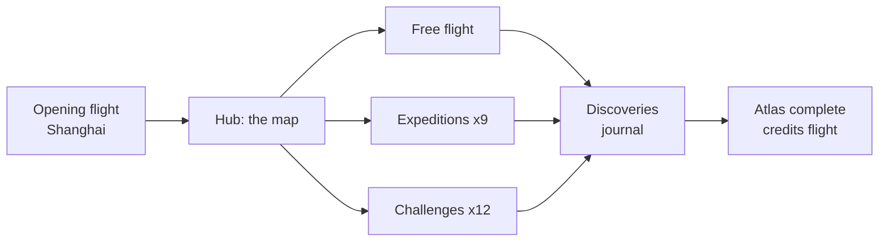
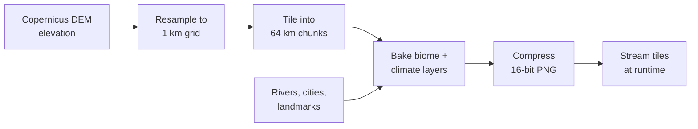

# Nine Skies — Game Design Document

2026-09-19 · @Someone

## Vision & pillars

Nine Skies is a relaxed 3D flying game in which players cross a geographically faithful China and feel, rather than read, how different its regions are. You pilot a small aircraft over real terrain built from elevation data: the Tibetan Plateau is a 4,000 m wall, the Turpan Depression is a hole below sea level, and the karst towers of Guangxi rise around you at eye level. Air, weather, colour and even how the plane handles change with where you are.

The thesis: most people picture China as one place. The game makes the plane climb for ten minutes and run out of air, then drops you into a monsoon half an hour later. Nobody forgets that.

**Design pillars**

1. **Geography is the content.** Every mechanic exists to make a real geographic difference visible or physical. If a feature doesn't teach something about place, cut it.
2. **Contrast over coverage.** The game is built around pairs of extremes (cold/hot, high/low, wet/dry, dense/empty), not a checklist of provinces.
3. **Show, then name.** The player sees the salt flat or the terraced hillside first; the label and fact arrive after, briefly.
4. **Calm, not punishing.** No fuel gauge anxiety, no crashes with consequences. The only pressure is curiosity.
5. **Honest scale.** Distances are compressed but proportions are true. Xinjiang must feel bigger than Iran; the plateau must take a long time to cross.

## Audience & experience goals

The target player is a curious adult with no flight-sim experience and little prior knowledge of China: someone who plays Flower, Journey, A Short Hike or Microsoft Flight Simulator in sightseeing mode. Sessions run 15 to 40 minutes; one expedition fits a lunch break, free flight fills an evening.

Tone is nature-documentary calm with light humour in the journal entries. No politics, no score pressure, no timers outside optional challenges.

After a few hours a player should be able to say, from memory:

- China is about the size of Europe, and the west is mostly empty mountain and desert.
- The east is low, wet and crowded; the west is high, dry and sparse. The line between them (the Heihe–Tengchong line) is where the plane climbs.
- Tibet is a plateau, not just mountains: flat ground at 4,500 m for hours.
- Harbin and Hainan are in the same country and could not be less alike.
- Rice south, wheat north, and the reason is rainfall.
- Name eight to ten landmarks they have flown over and place them roughly on a map.

Success metric for the design: a player who finishes three expeditions can sketch China's elevation profile from east to west without looking it up.

| Player type | What they want | What the game gives them |
| --- | --- | --- |
| Sightseer | Beauty, calm, a place to unwind | Free flight, painterly biomes, ambient music per region |
| Learner | Facts that stick | Journal, HUD numbers tied to sensation, expedition narration |
| Completionist | Something to finish | 9 expeditions, \~230 discoveries, 12 challenges |
| Traveller | Places they might visit | Real cities, airports and routes; "you are here" map overlay |

## Visual approach

Decision: 3D low-poly flight with a 2D map overlay. Elevation and atmosphere are the game's subject, and a top-down view flattens exactly the thing we want players to feel.

| Criterion | 3D low-poly | 2D top-down |
| --- | --- | --- |
| Conveys elevation | Ground rises to meet you; plateau is a wall | Colour band on a map; already the thing people ignore |
| Conveys atmosphere | Haze, thin blue sky, monsoon walls, dust | Weather icons or tinted overlays |
| Sense of scale | Long crossings feel long; horizon shows emptiness | Distance is a number |
| Navigation clarity | Weak without help | Excellent |
| Build cost | High: terrain pipeline, LOD, shaders | Low |
| Runs on low-end devices | Needs care (target 30 fps on integrated GPU) | Trivially |
| Emotional pull | High | Low |

The 2D strengths come back as an overlay: a toggleable minimap and full-screen map showing position, route, discovered landmarks and the elevation profile of the current leg. Players get the orientation of a map without losing the body-sense of flight.

**Art direction**

- Low-poly terrain with flat shading and a strong regional palette; no photo textures. Think Alto's Odyssey meets a Chinese landscape scroll.
- Vertical scale of 0.75x on terrain so mountains read at game speed without becoming cartoons. Compressing horizontally by 1:8 already exaggerates relief eightfold, so the vertical is trimmed rather than stretched — at the 1.5x this document first specified, a third of the Shanghai–Lhasa route renders past 60° and the result is spikes (prototype finding F14).
- Atmospheric scattering is the main tool: warm dusty haze in the north, milky humidity in Sichuan, hard clean blue over Tibet, grey-green mist over karst country.
- Cities as clusters of simple blocks with warm night lighting; the eastern seaboard glows, the west is dark.
- Rivers as bright ribbons; the Yangtze and Yellow River are always visible from altitude.
- Camera: third-person chase by default, with a free orbit and a cockpit-free first person for low flying.
- Typography and journal cards use a restrained ink-and-paper look; Chinese place names shown in characters and English, with pinyin as a setting.

## The world

The map is all of mainland China plus Hainan and Taiwan's coastline as a horizon, built from real elevation data at roughly 1 km resolution and rendered as one continuous streamed world. Horizontal scale is compressed 1:8 so a Shanghai–Lhasa crossing takes about 25 minutes at cruise; vertical scale is 0.75x, which with the horizontal compression leaves relief reading about six times real. Proportions between regions stay true.

The country is organised as the three great steps of Chinese physical geography, which is also how the difficulty and mood of the game rise from east to west.

| Step | Typical elevation | Regions | What the player feels |
| --- | --- | --- | --- |
| First step (east) | 0–500 m | North China Plain, Yangtze delta, southeast coast, Pearl River delta, northeast plain | Flat, green or grey, dense city glow, humid; easy relaxed flying |
| Second step (middle) | 1,000–2,000 m | Loess Plateau, Inner Mongolian steppe, Sichuan Basin (a low bowl inside the step), Yunnan–Guizhou Plateau, Tarim and Junggar basins | Terrain breaks up: gorges, terraces, dunes; engine still fine |
| Third step (west) | 4,000–5,000 m | Qinghai–Tibet Plateau, Kunlun, Himalaya | Flat but very high; thin air, sluggish plane, cold, empty, vast |

**The nine regions** (the "nine skies"), each with its own palette, weather set, ambient soundscape and music cue:

| Region | Signature terrain | Palette | Dominant weather |
| --- | --- | --- | --- |
| Northeast (Dongbei) | Flat black-soil plain, Changbai forest, frozen rivers | Snow white, dark pine, pale gold | Deep cold, clear skies, ice fog |
| North China Plain & Loess | Flat farmland, then yellow gullied loess with cave homes | Dust yellow, ochre, brown | Dust haze, spring sandstorms |
| Inner Mongolia & Gobi | Grassland fading to stony desert | Sage green to grey-tan | Wind, dust, huge skies |
| Xinjiang | Taklamakan dunes ringed by Tian Shan and Kunlun snow; Turpan below sea level | Orange, white peaks, oasis green dots | Dry heat, sandstorms, blinding sun |
| Qinghai–Tibet Plateau | Endless high flatland, salt lakes, then Himalayan wall | Deep blue sky, tan, turquoise lakes, white | Thin air, cold, sudden hail, hard light |
| Sichuan Basin & Hengduan | Foggy bowl, then parallel north–south gorges | Misty green, red sandstone | Low cloud, drizzle, humidity |
| Yunnan–Guizhou | Terraces, karst, deep valleys, tropical edge | Emerald, red earth, mist | Mild, monsoon showers |
| Southeast & Guangxi karst | Limestone towers, rice, rivers, hills to the coast | Jade green, limestone grey, river blue | Monsoon rain walls, typhoons on the coast |
| Yangtze & East coast | River delta, lakes, megacities | Grey-blue water, city light | Haze, humidity, summer heat |

**Rivers and lines that matter**

- Yangtze: Tibet source, Three Gorges, Wuhan, Shanghai. The game's spine; every expedition crosses it.
- Yellow River: the great northern bend through Inner Mongolia and the loess.
- Heihe–Tengchong line: an invisible but felt diagonal. East of it the ground glows with cities at night; west of it, almost nothing. The map overlay can toggle it on.
- Great Wall as a low-poly ribbon along northern ridgelines.
- The Grand Canal from Hangzhou to Beijing as a visible straight waterway across the plain.

**Landmarks** are hand-placed on top of the data terrain: Everest base camp, Namtso Lake, Zhangjiajie pillars, Guilin karst, Huangshan, Three Gorges Dam, Harbin ice city, Kashgar old town, Dunhuang dunes and grottoes, Yuanyang terraces, Jiuzhaigou lakes, Tiger Leaping Gorge, Hong Kong harbour, Shanghai skyline. Target: 40 hero landmarks with custom models, 80 lighter points of interest.

**Fidelity: how the landscape is reconstructed**

Every layer of the world is driven by a real dataset; hand-authoring is limited to the hero landmarks. The rendering is stylised, but every mountain, river and empty stretch is where it really is and as big, relative to its neighbours, as it really is.

| Layer | Source | Resolution in game | What it controls |
| --- | --- | --- | --- |
| Elevation | Copernicus DEM 30 m or SRTM | 1 km base; 90 m or better in hero areas (Guilin, Zhangjiajie, Three Gorges, Everest, Tiger Leaping Gorge) | Terrain shape, air density, HUD altitude and temperature |
| Water | HydroSHEDS rivers; Natural Earth / OSM coasts and lakes | Vector, carved into terrain | Rivers in their real valleys, lakes at their real elevation, coastline |
| Land cover | ESA WorldCover (cropland, forest, grassland, bare, snow, built-up) | 10 m, sampled per tile | Palette and ground detail: loess yellow, dune orange, terrace green, black-soil farmland |
| Climate | WorldClim monthly normals (temperature, rainfall); ERA5 monthly wind | \~1 km grid | Haze density, sky colour, humidity, weather tables, seasons, balloon drift and dust-storm push |
| Population | GHSL or WorldPop raster | \~1 km grid | City block placement, night lighting, the Heihe–Tengchong line |
| Landmarks | Hand-modelled, placed at real coordinates | 40 hero models, 80 lighter markers | Recognisable places on top of the data terrain |

Rules that keep it honest:

- One global horizontal compression factor and one vertical scale (0.75x); no per-region tweaking, so proportions between regions stay true. Only their product is visible in the terrain, and it is that product — about 6 — which G1 decides.
- Rivers are carved, not painted, so the Yangtze sits in its valley and follows its real bends.
- Colour comes from land cover plus elevation plus slope, never from a hand-painted map.
- Air density, temperature and humidity are computed from the elevation and climate grids; the plateau's thin air is arithmetic, not a scripted event.
- The only invented geometry is the low-poly simplification itself and the hero landmark models.

What is lost: texture-level realism and anything smaller than the sample size, such as individual buildings, small streams and field boundaries. What is kept: the shape, scale and placement of everything that matters at flying height.

**Distances and timing**

At the starting 1:8 compression, cruise covers about 130 real kilometres a minute, so an expedition fits a lunch break and the whole country crosses in under an hour. Boost doubles that; low speed is about a third of cruise and is for a few minutes in a gorge, not for crossing anything.

| Trip | Real distance | At cruise | With boost |
| --- | --- | --- | --- |
| Sea to Sky (Shanghai → Lhasa via Wuhan, Chongqing, Chengdu) | \~3,200 km | \~25 min | \~13 min |
| Ice to Coconuts (Harbin → Sanya via Beijing, Shanghai, Guangzhou) | \~4,000 km | \~31 min | \~16 min |
| The Silk Road (Xi'an → Kashgar) | \~3,000 km | \~23 min | \~12 min |
| Full east–west crossing (coast to Pamirs) | \~5,200 km | \~40 min | \~20 min |
| Full north–south (Mohe → Sanya) | \~5,500 km | \~42 min | \~21 min |

The compression test moves these: at 1:5 Sea to Sky is about 40 minutes, at 1:12 about 17. Working bounds: 25 minutes is the ceiling for a narrated trip, 15 the floor below which the plateau stops feeling vast.

Whole game: nine expeditions total roughly 4.5 hours, the twelve challenges about one hour, and filling the atlas in free flight another 6 to 10 hours, so 12 to 15 hours to see everything, with the core thesis delivered inside the first 30 minutes.

## Core mechanics

Every mechanic answers one question: how does the player's body learn what the map says?

**Flight model.** Arcade-simple: pitch, roll, throttle, an auto-coordinated turn. No stalls, no crashes; flying into terrain bounces you up with a soft camera shake. Three speeds: cruise (for crossing), low (for gorges and sightseeing) and boost (for skipping dull stretches). The default vehicle is a light piston aircraft, which matters because piston engines genuinely suffer at altitude. A hot-air balloon is available from the start as an alternative for free flight: slow, silent, drifts with the regional wind, no boost; expeditions and challenges stay plane-only so their pacing holds.

**Altitude and air density.** Engine power falls with air density, so above 3,500 m the plane climbs slowly, turns wide and feels heavy. Over the plateau you cannot boost. The HUD thermometer drops about 6.5 °C per 1,000 m climbed, the sky colour deepens, and the horizon sharpens as haze thins. Descending into Turpan the opposite happens: the plane feels eager, the air shimmers, the thermometer climbs past 40 °C.

**Weather.** Regional weather tables with seasonal weighting, not global random. Effects are visual and light on handling: monsoon rain reduces visibility and drums on the canopy; a Gobi dust storm turns the world orange and pushes the plane sideways; plateau hail arrives from a clear sky; Harbin cold frosts the screen edges and slows the throttle response. Weather always has a short journal line explaining why it happens there.

**Seasons and time of day.** Both are authored, not simulated, because they are teaching tools. Each expedition fixes the month that makes its contrast loudest: Ice to Coconuts is January (Harbin at -25 °C, Sanya at 25 °C, same day), Sea to Sky is late autumn for thick Sichuan fog and a clear plateau, Mother River is August when the Yellow River runs fat with silt, The Roof is May with thawed lakes and white peaks. Free flight keeps a month picker, defaulting to the real current date. The day cycle runs in about 45 minutes so an expedition can take off at dawn and land at dusk; expeditions script their start hour (karst at dawn for mist, The Line entirely at night), and free flight adds a draggable clock and a sun-freeze for sightseers. Two lessons hide in time itself and the game exploits both: China runs on one time zone, so on the Silk Road the HUD clock reads 09:30 in Kashgar while the sky is still dark, with a card explaining why; and latitude changes day length, so Ice to Coconuts leaves Harbin in early dusk and reaches Sanya in afternoon light at the same clock hour. Winter freezes the Songhua and browns the south; July floods the Yangtze and greens the steppe. Weather keys off month and region, so the season choice cascades into everything else.

**HUD.** Minimal, always on: altitude above sea level, ground elevation, temperature, humidity, air density as a small bar. Numbers are there to confirm what the player already feels, not to be read first.

| Sensation | Mechanic | HUD confirmation |
| --- | --- | --- |
| "This is high" | Sluggish climb, no boost, deep blue sky | Altitude 4,800 m, temp -4 °C, density bar low |
| "This is a hole" | Eager engine, heat shimmer | Ground elevation -154 m, temp 42 °C |
| "This is wet" | Milky haze, rain, low cloud deck | Humidity 90 % |
| "This is empty" | Minutes of nothing, no city glow at night | Map overlay: nearest city 400 km |
| "This is crowded" | Continuous city blocks, light everywhere | Map overlay: 8 cities within 100 km |

**Discovery trigger.** Flying within range of a landmark or entering a region raises a small card: name in characters and English (pinyin if enabled), one sentence, optional "read more" that pauses flight. Cards never stack; a queue holds them until the player is ready.

**Map overlay.** M key or tap: current position, elevation profile of the last 200 km flown, discovered points, expedition route. A second layer toggles climate zones, population density and the two great rivers.

## Game modes & structure

The game opens with a two-minute guided flight out of Shanghai, then unlocks everything. There is no gating by skill; structure comes from what the player chooses to finish.

Everything feeds the journal; the journal is the progression.

**Free flight.** Pick any start point, month, hour and vehicle (plane or balloon; glider once unlocked). Fly. Discoveries fill the journal as you find them. Waypoints can be set on the map for a lazy autopilot that still lets you look around.

**Expeditions.** Nine curated journeys of 15–35 minutes, each built on one contrast. Light narration as text cards (voice is in the backlog) at six to ten beats per trip. Autopilot is on by default so players can look; taking the stick at any time is allowed. Finishing one unlocks a journal chapter and a postcard.

**Challenges.** Twelve short optional skill tests that reuse geography as the obstacle: land at a 4,411 m airport, thread a gorge at low speed, cross a dust storm on instruments, race the sunset along the Great Wall. These are for players who want a little bite; they are never required.

**Journal / Atlas.** The collection layer. Regions, landmarks, weather events, cities, foods and peoples are entries with a card each, readable at any time. A comparison spread opens full-screen at the end of the expedition that links its pair (Shanghai–Lhasa after Sea to Sky), or in free flight once both regions' entries are complete; it places the two side by side (temperature curves, elevation, rainfall, a dish, an automatic snapshot of the plane in each). The comparison spreads are where the game's thesis lands explicitly.

**Progression and rewards**

| Milestone | Reward |
| --- | --- |
| First discovery in each of the nine regions | Region music unlocked in free flight |
| Each expedition | Postcard, journal chapter, a livery in that region's palette, and the option to replay it in any month |
| 50 discoveries | Glider: silent, slow, for sightseeing |
| All nine expeditions | Season scrub: change the month live while flying in free flight |
| Atlas complete | Credits flight: one continuous automated east-to-west crossing at dawn |

**Session shape.** A typical evening: one expedition (30 min), a few minutes of free flight poking at something seen on the way, a look at the journal. The game saves position continuously; quitting mid-air is fine.

## Expedition catalogue

Each expedition is one contrast made physical. Listed in the suggested order; the first eight can be flown in any order, and 9 unlocks after any three.

| # | Name | Route | Contrast | What it teaches | Signature moment |
| --- | --- | --- | --- | --- | --- |
| 1 | Sea to Sky | Shanghai → Wuhan → Chongqing → Chengdu → Lhasa | Low, wet, crowded → high, dry, empty | The three steps; why the west is sparse | Leaving the Sichuan fog and the plateau rising like a wall ahead |
| 2 | Ice to Coconuts | Harbin → Beijing → Shanghai → Guangzhou → Sanya | Cold to tropical along one meridian | Latitude span; rice/wheat line; monsoon | Windscreen frost melting somewhere over the Yangtze |
| 3 | The Silk Road | Xi'an → Lanzhou → Jiayuguan → Dunhuang → Turpan → Kashgar | Loess to desert; oasis chain | Why the route exists; Hexi Corridor; Turpan below sea level | Dropping into Turpan as the thermometer passes 40 °C |
| 4 | Mother River | Yellow River source (Qinghai) → the Great Bend → Loess → Kaifeng → Bohai | Clear mountain stream to silt-yellow river | Loess erosion; "China's sorrow"; the elevated riverbed | Watching the water turn yellow over the loess |
| 5 | Three Gorges | Yichang → the gorges → Chongqing, low and slow | Narrow and vertical vs the plain | Yangtze as highway; the dam; Sichuan Basin as a bowl | Threading Qutang Gorge at low altitude |
| 6 | Karst Country | Guilin → Yangshuo → Guizhou → Yunnan terraces | Limestone towers, then terraced mountains | Karst formation; ethnic minority regions; rice terraces | Flying between the Li River towers at dawn |
| 7 | The Roof | Xining → Qinghai Lake → Golmud → Namtso → Everest base camp | Salt lake, plateau, then the Himalaya | Plateau vs mountain; thin air; permafrost railway | Plateau flat for a quarter of an hour, then Everest |
| 8 | Steppe and Sand | Hohhot → grassland → Gobi → Badain Jaran dunes → Jiayuguan | Grass fades to stone fades to sand | Desertification gradient; Mongolian herding; Great Wall's end | The last stretch of Wall vanishing into desert |
| 9 | The Line | A diagonal flight along the Heihe–Tengchong line at night | Light east, dark west | 94 % of people on 43 % of land | Cities on your left, nothing on your right, for half an hour |

Expedition 9 is the capstone and unlocks only after any three other expeditions are finished; it should only feel meaningful once the player knows what the dark side of the line holds.

Run time target is 15–35 minutes each with autopilot: long routes fly at cruise, short ones (Three Gorges, Karst Country) mostly at low speed. A player who takes the stick and detours can double it. Narration budget: six to ten cards per expedition, each under 40 words, plus one longer "read more" per card.

## Discoveries & content

Content is short, concrete and tied to something the player can see from the plane. Every entry follows one rule: the first sentence must be understandable without reading anything else.

**Entry types and volume targets**

| Type | Count | Example | Trigger |
| --- | --- | --- | --- |
| Region | 9 | Qinghai–Tibet Plateau | Crossing the region boundary |
| Hero landmark | 40 | Zhangjiajie pillars | Within 15 km |
| Point of interest | 80 | A specific loess cave village | Within 5 km |
| City | 30 | Chongqing | Overflight |
| Weather event | 12 | Gobi dust storm | Experiencing it |
| Food | 25 | Lanzhou beef noodles | Overflying the city that owns it |
| People & culture | 20 | Uyghur, Tibetan, Miao, Mongol, Hakka… | Region entry or landmark |
| Comparison spread | 12 | Harbin vs Sanya | End of the linking expedition, or both regions complete |

**Card format.** Name in characters and English, pinyin if enabled; one sentence of 25 words or fewer; a small illustration in the game's palette; a "read more" of 80–120 words; one number (elevation, temperature, population, age). Cards never lecture; the tone is a knowledgeable friend in the passenger seat.

**Comparison spreads** are the payoff. Each places two entries on one page with the same measures: elevation, January and July mean temperature, annual rainfall, population density, a dish, a landscape sketch. Twelve pairs, for example Harbin/Sanya, Turpan/Lhasa, Shanghai/Kashgar, Sichuan Basin/Loess Plateau, Guilin/Gobi.

**Sourcing and accuracy.** Facts are drawn from standard references (national statistics, geographic surveys, encyclopaedic sources) and each card carries a source note in the credits. Elevation and temperature figures come from the terrain data and climate normals used in the simulation, so the card matches what the HUD showed. A fact-check pass by a China-geography reviewer is a milestone in the roadmap.

**Languages.** English first; Simplified Chinese and Spanish as launch-window additions. Place names on discovery cards and the map always show Chinese characters plus English, regardless of UI language; a setting adds pinyin for a trilingual display.

**Audio.** One ambient bed and one music cue per region (nine each), plus weather sounds. Regional instruments used lightly: erhu in the east, morin khuur on the steppe, dungchen on the plateau, lusheng in the southwest. No narration voice in the first release; text cards keep localisation cheap.

## Technical design

Recommended stack: browser-first with three.js and WebGL 2, so the prototype and the shipped game share one codebase and anyone can open a link. A desktop wrapper (Electron or Tauri) comes later for Steam. Godot is the fallback if browser performance proves insufficient for the plateau's long view distances.

**Terrain pipeline**

- Source data as in the Fidelity table: Copernicus DEM 30 m (SRTM as fallback) for elevation; HydroSHEDS rivers with Natural Earth / OSM coasts, lakes and cities; ESA WorldCover land cover; WorldClim normals for temperature and rainfall; ERA5 monthly winds; a GHSL or WorldPop population raster for night lighting.
- China spans roughly 5,200 km east–west and 5,500 km north–south; at 1 km resolution that is about 28 million height samples, which compresses to under 60 MB as 16-bit tiles. Only tiles within view distance are loaded.
- Biome and climate are baked per tile as small textures the shader reads, so palette, haze colour and humidity are data-driven rather than hand-painted.
- Landmarks are a JSON list of lat/lon, model id and card id, placed on the terrain at load.

**Rendering**

- Chunked LOD terrain: four levels, flat-shaded low-poly, with a far-distance impostor ring so the plateau horizon reads as endless.
- Atmospheric scattering shader with per-region parameters (haze density, tint, sun colour), blended across region boundaries.
- Cities as instanced boxes driven by the population raster; emissive at night.
- Weather as particle systems and post-processing, never geometry.

**Performance targets**

| Target | Value |
| --- | --- |
| Frame rate, integrated GPU laptop | 30 fps at 1080p |
| Frame rate, discrete GPU | 60 fps at 1440p |
| Initial load | Under 15 s on 20 Mbit/s |
| View distance | 120 km at cruise, 40 km at low level |
| Memory | Under 1.5 GB |

**Platforms.** Web (desktop browsers) first; Steam via desktop wrapper second; mobile is out of scope for version 1 because of the terrain streaming budget, though the arcade flight model would port.

**Save and telemetry.** Local save of position, journal and settings; optional cloud sync. Anonymous telemetry on which expeditions are finished and where players linger, to tune narration beats.

## Scope & roadmap

Build in three stages, each one playable and each one testing the thesis before more content is added.

| Stage | Goal | Contents | Proves |
| --- | --- | --- | --- |
| Prototype | Does flying over real terrain feel like anything? | Real elevation for the Sea to Sky corridor only (Shanghai–Lhasa strip), arcade flight, air-density effect, HUD, one biome palette gradient, no cards | That elevation and thin air are felt, not just seen |
| Vertical slice | Is one expedition a good half hour? | Full China terrain at low LOD, Expedition 1 complete with cards, three regions polished (East coast, Sichuan, Plateau), journal skeleton, map overlay, weather for those regions | The loop: fly, discover, read, compare |
| Full game | Ship | All nine regions, nine expeditions, 12 challenges, \~230 discoveries, 12 comparison spreads, seasons, audio, localisation, Steam build | The atlas |

**Milestones**

- [ ] Prototype: single-corridor terrain flying in the browser, testing 1:5, 1:8 and 1:12 horizontal compression
- [ ] Prototype review: does the plateau climb land emotionally? Go/no-go on 3D
- [ ] Vertical slice: Expedition 1 playable end to end
- [ ] External playtest with 10 players who know little about China; measure the sketch-the-elevation test
- [ ] Content production: regions 4–9, expeditions 2–9
- [ ] Fact-check pass by a China-geography reviewer
- [ ] Comfort and accessibility pass (camera, colour, text size, units)
- [ ] Audio and localisation
- [ ] Steam wrapper and store page
- [ ] Release

**Cut list for version 1** (kept in the backlog, not the plan): voice narration, mobile, multiplayer or shared flights, photo mode with sharing, Hong Kong, Macau and Taiwan as flyable detail beyond coastline, historical layers (Tang dynasty map, treaty ports), custom aircraft.

**What can shrink if needed.** Expeditions 8 and 9 fold into free flight prompts; challenges drop from 12 to 6; discoveries drop to 150 with hero landmarks intact. Regions and the air-density mechanic never shrink: they are the game.

## Player journey review

Walking the game end to end as a first-time player turned up the gaps below. Small ones are folded into their sections above; the rest are decided here.

**First five minutes.** The opening flight teaches the three inputs one at a time: look around, then pitch, then throttle, each with a single on-screen prompt, and ends with the map overlay opening once by itself so the player knows M exists. Keyboard and mouse or a gamepad from day one; touch waits for mobile. A pause menu (resume, map, journal, settings, quit) is reachable at any moment, including mid-card.

**Comfort and settings.** A horizon-locked camera option, a field-of-view slider and camera smoothing, because chase-camera flight is a known motion-sickness trigger. Text size scales the cards and HUD. Map layers are colour-blind safe: the elevation steps differ in pattern as well as hue. Units default to metric because the thesis is written in metres, with an imperial toggle for players who think in feet. Sun glare and lightning never strobe.

**Getting around.** In free flight the player can jump to any map pin with a three-second fade rather than fly back across the country; a return-to-map button is always one press away. The edge of the world is soft: beyond the coast or a land border the terrain fades into haze, autopilot banks gently back, and a single card names what lies beyond ("Mongolia begins here"). No walls, and no border lines drawn in the 3D world.

**When an expedition goes off-script.** Narration beats trigger by location, not by timer, so detours cannot break the story. Taking the stick pauses autopilot; "resume" flies back to the route from wherever the player is. Quitting mid-expedition saves at the last beat and resumes there. Any card can be dismissed; every expedition can be replayed, and after the first completion in any month.

**Finding what was missed.** The journal shows per-region counts ("Xinjiang 6 of 14") and a soft hint for each missing entry ("somewhere along the Tian Shan"), never an exact pin. Discovered points are pinned on the map.

**Vehicles.** The balloon drifts with the monthly wind field and steers only by changing altitude, which makes crossing the plateau a different kind of slow. The glider sinks gently and gets small lift over sunlit slopes; no soaring simulation. Vehicles are chosen at the map, not swapped in the air.

**Challenges.** Failure costs nothing: an instant retry from the start of the challenge. Each is done or not done; no medals or leaderboards, and the timer is off by default with a toggle for players who want it.

**After the atlas.** Nothing stays gated once everything is found. Replaying expeditions in another month is the main long-tail activity (Ice to Coconuts in July is a different lesson). Up to three local profiles so a household can share one install.

**Time on the HUD.** The clock shows Beijing time, which is the point; the map overlay adds local solar time beside it so the Kashgar surprise can be understood on the spot.

## Risks & open questions

| Risk | Likelihood | Impact | Mitigation |
| --- | --- | --- | --- |
| Real terrain at game scale is boring: long flat stretches over the plain or plateau | High | High | Boost speed, autopilot with narration, waypoint skipping; treat emptiness as a beat with its own card rather than dead time |
| Browser performance can't hold the plateau's view distance | Medium | High | Impostor horizon ring; Godot fallback decided at prototype review |
| Facts wrong or politically sensitive (borders, place names, minority regions) | Medium | High | Reviewer pass; neutral geographic framing; follow UN-style naming; avoid contested-border detail in the map overlay |
| Low-poly style reads as childish to adults | Low | Medium | Reference Alto's Odyssey and Journey, not mobile casual; restrained palette, no cartoon faces |
| Content volume (230 entries) slips | High | Medium | Hero landmarks and regions first; points of interest are the flexible pool |
| Players never open the journal, so the thesis stays implicit | Medium | Medium | Comparison spreads pop as full-screen moments after expeditions, not as a menu |

**Decisions, 20 September 2026**

- Horizontal compression: test 1:5, 1:8 and 1:12 in the prototype before choosing
- Vehicle: plane is the default; hot-air balloon offered as a free-flight option
- Expedition 9 (The Line) unlocks after three other expeditions
- Place names: Chinese characters + English always; pinyin added via a setting
- Hong Kong, Macau and Taiwan: coastline only in version 1
- Name: Nine Skies confirmed
