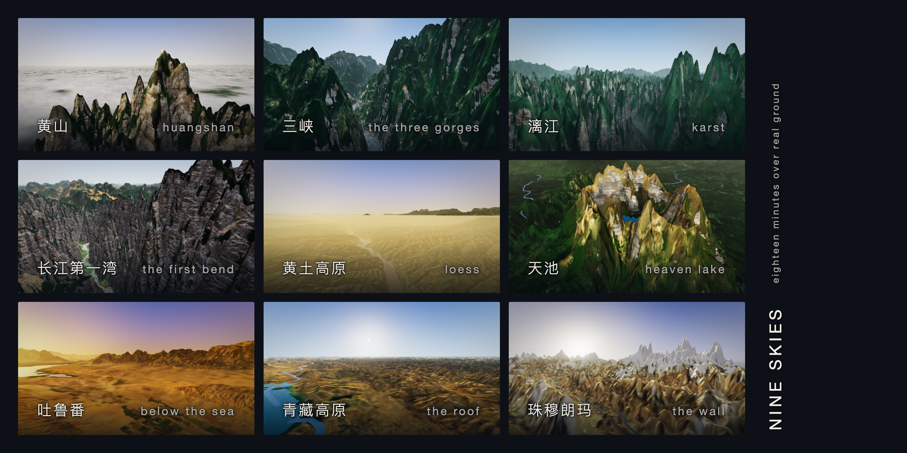

# Nine Skies



Eighteen minutes over real ground: nine scenes of China, two minutes each,
flown over open elevation data, from Huangshan's granite above the clouds
to the face of Everest. You can steer, speed up or slow down, or do nothing
at all. After eighteen minutes it is over.

It is a public research project, and the question it asks is written on the
front of it: *can eighteen minutes over real ground give someone who has
never been to China a true picture of what it looks like?* The film records
nothing about its viewers; the answer is collected in public, through this
repository's discussions, and written up in [the findings](docs/findings.md).

[The design](Nine%20Skies%20%E2%80%94%20Game%20Design%20Document.md) says what
the film is and [the plan](Nine%20Skies%20%E2%80%94%20Build%20Plan.md) how it is
built and where each stage stands.

## Watching it

Four inputs, and none of them required: faster, slower, a direction, and
auto, which the film returns to by itself after a few seconds.

| | Keyboard | Touch |
| --- | --- | --- |
| Faster, slower | `W`/`S` or the up and down arrows | the `+` and `−` buttons |
| Direction | `A`/`D` or the left and right arrows | drag on the picture |
| Auto | `Space` | the AUTO badge |

The player bar pauses, jumps to a chapter, and links to the credits.
Phones play in landscape.

## Running it

```bash
npm install
npm run dev
```

With no world built, the film flies a stand-in landscape and says so. The
real one is built from 67 GB of Copernicus GLO-30 held outside the
repository; `make help` lists the pipeline's steps, and `make world
CORRIDOR=china` runs them (about six minutes once the source is fetched).
Then:

```bash
make colour    # the ground's colour: the 2016 Sentinel-2 mosaic, the archive's median in the south, and 10 m along the rails (fetches ~52 GB once, after `make scenes`)
make rock      # the walls' rock: four scanned cliff faces from Poly Haven, CC0 (fetches ~28 MB once)
make relief    # the ground's relief below its grid, and at 31 m along the rails, from the GLO-30 already on disk (after `make scenes`)
make scenes    # a pack per scene into dist-film/, 1,030.3 MB
make rails     # every rail flown over the world: docs/rails-report.md
make stations  # the frame-cost stations: app/public/capture-stations.json
npm run check  # typecheck, tests, and the content gate
```

In the dev server the console has `__ns`: `__ns.hold(i, seconds)` holds a
scene, `await __ns.settled()` waits for its ground to land,
`await __ns.still(name, 1280, 720)` writes a still to
`docs/stills/`, and `__ns.frameCost()` asks the GPU what a frame costs.
`npm run cover` draws the cover, the nine stills as nine cards, from
`tools/cover.html` with a headless Chrome: `app/public/cover.png`, and the
postcards in `docs/cover-postcards.png`.
`?frametime` shows the frame time by wall clock, for a phone.

## What the repository holds

| Path | What it is |
| --- | --- |
| `content/scenes/` | The nine scenes: rail, hour, look, captions, one YAML file each |
| `content/sound.yaml` | The sound, when it is found: licensed recordings and their credits |
| `engine/src/film/` | Timeline, rails, the camera's altitude, scene packs |
| `engine/src/look/` | Sun, sky, shadows, clouds, the grade |
| `engine/src/terrain/` | Streamed tiles, the hero grids, water, the horizon |
| `app/` | The shell: canvas, title cards, captions, player bar, credits page |
| `pipeline/` | Python: from the Copernicus source to the published world |
| `tools/` | Reports and cutters that need the world: rails, stations, packs |
| `docs/` | Findings, stills, reports; the version-1 record is kept beside them |

## Deploying

The site is static. The packs cannot be cut on GitHub, since the world is
not in the repository, so the machine with the world uploads them to the
`packs` release (`make release-packs`), and the Deploy workflow, run by
hand, builds the site from them and publishes it to GitHub Pages. It
refuses packs cut for another index than the committed one, and a film
that fails the launch gate (`npm run content:validate -- --complete`),
which today it does: there is no sound yet.

## Licences

The code is MIT (`LICENSE`). The elevation is Copernicus WorldDEM-30 under
its own licence, the ground's colour is EOX's Sentinel-2 cloudless 2016
mosaic under CC BY 4.0 and, in the four southern scenes, Copernicus
Sentinel-2 data from 2018 to 2025, and the rivers and lakes are Natural Earth; what each asks
of anyone who redistributes the film is in [`NOTICE.md`](NOTICE.md) and on
the credits page.
